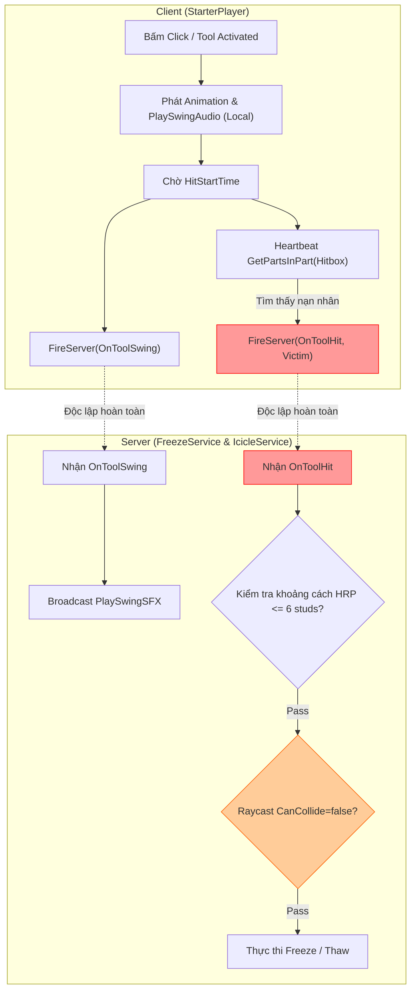

Searched for "EconomyConfig"
Searched for "ShopConfig"
Searched for "PlayerStateConfig"
Searched for "InventoryConfig"
Viewed InventoryConfig.lua:1-10
Searched for "ViewportConfig"
Searched for "SyncPlayerData"
Searched for "task.wait"
Viewed PlayerDataController.lua:100-150
Viewed HighlightController.lua:170-210
Viewed HighlightController.lua:210-315
Searched for ":Init("
Searched for ":Start("
Searched for "function\s+[a-zA-Z]*[àáạảãâầấậẩẫăằắặẳẵèéẹẻẽêềếệểễìíịỉĩòóọỏõôồốộổỗơờớợởỡùúụủũưừứựửữỳýỵỷỹđ]"
Viewed HotbarController.lua:40-100
Searched for "Color3.fromRGB"
Viewed HotbarController.lua:240-300
Viewed HotbarController.lua:301-420
Viewed HotbarController.lua:421-480
Searched for ":Connect("
Searched for "Connect"
Viewed SpectateController.lua:550-644
Viewed HighlightController.lua:50-169
Viewed DataConfig.lua:1-34
Viewed GameModeConfig.lua:1-137

# 📊 BÁO CÁO TỔNG QUAN RÀ SOÁT TOÀN BỘ SRC

**Dự án**: SuperFrozenState (FrozenState)  
**Vai trò**: Senior Roblox System & Security Auditor  
**Phạm vi kiểm toán**: Toàn bộ thư mục `src/` (`ServerScriptService`, `StarterPlayer`, `ReplicatedStorage`)  
**Nguyên tắc**: 100% Khách quan, Trực diện, Không nói giảm nói tránh (Zero Litotes), Tuân thủ Quy ước kiến trúc và Bảo mật Server Authority.

---

## 1. BẢNG ĐÁNH GIÁ MỨC ĐỘ RỦI RO

| Mức độ | Số lượng | Mô tả tóm tắt |
| :--- | :---: | :--- |
| 🔴 **CRITICAL** (Lỗ hổng bảo mật/Exploit) | **4** | Bypass Swing để kích hoạt Kill-Aura 360°, Raycast xuyên thấu vật cản CanCollide=false, Race Condition gây mất dữ liệu khi Disconnect/Shutdown, DDoS Server qua RemoteEvent không có Rate-Limit. |
| 🟠 **HIGH** (Lỗi kiến trúc/Race Condition/Leak) | **5** | Lệch pha Cooldown 25% giữa Client và Server, Polling loop mù quáng `task.wait(0.05)`, 16/24 Controller phá vỡ Lifecycle chuẩn, Admin CLI dùng API chat cũ, Rò rỉ RAM do lẫn lộn kiểu dữ liệu Key. |
| 🟡 **MEDIUM** (Hardcode/Thiếu nhất quán) | **3** | Không tuân thủ Centralized Config (vừa import vừa fallback magic value), Vi phạm nghiêm trọng quy ước PascalCase, Tồn tại file rỗng và schema legacy gây phình to DataStore. |
| 🟢 **LOW** (Code thừa/Format/Tối ưu nhỏ) | **2** | Mâu thuẫn tiền tố Admin Command (`//` vs `/`), Quét O(N) `Workspace:GetChildren()` gây micro-stutter trên Client. |

---

## 2. CHI TIẾT CÁC ĐIỂM YẾU & NGUY CƠ BẢO MẬT (Xếp theo độ ưu tiên)

### 🔴 NHÓM CRITICAL (LỖ HỔNG BẢO MẬT & NGUY CƠ KHAI THÁC)

---

#### 1. Lỗ hổng Kill-Aura 360° & Đòn đánh không cần Vung kiếm (Bypass Swing Check)
- **Vị trí**: [`FreezeService.lua:479-566`](file:///c:/Users/thuyl/OneDrive/Dokumente/THIEN_ANH_FOLDER/SuperFrozenState/FrozenState/src/ServerScriptService/Services/FreezeService.lua#L479-L566)
- **Mức độ**: `CRITICAL`
- **Hiện trạng & Vấn đề**: 
  - Handler [`HandleToolHit`](file:///c:/Users/thuyl/OneDrive/Dokumente/THIEN_ANH_FOLDER/SuperFrozenState/FrozenState/src/ServerScriptService/Services/FreezeService.lua#L479) trên Server hoàn toàn độc lập với [`OnToolSwing`](file:///c:/Users/thuyl/OneDrive/Dokumente/THIEN_ANH_FOLDER/SuperFrozenState/FrozenState/src/ServerScriptService/Services/IcicleService.lua#L143). Server chỉ kiểm tra: (1) Attacker có Tool trong Character, (2) Khoảng cách HRP $\le 6$ studs, (3) Raycast đường thẳng.
  - Server **không hề kiểm tra xem Attacker có vừa vung kiếm hay không**, cũng **không kiểm tra góc nhìn (LookVector / FOV)** của Attacker so với Victim.
- **Kịch bản khai thác / Hậu quả thực tế**:
  - Hacker không cần trang bị tool ra tay, không cần chạy animation hay phát âm thanh vung kiếm. Hacker chỉ cần đứng yên (hoặc quay lưng $180^\circ$) và inject script liên tục gửi `OnToolHit:FireServer(TargetPlayer)`.
  - Trong phạm vi 6 studs, hacker có thể freeze/thaw toàn bộ người chơi xung quanh ngay tức thì (Kill-Aura / Back-hit Exploit) mà không hề có bất kỳ dấu hiệu vung kiếm nào.
- **Đề xuất giải pháp chuẩn**:
  - Gộp quy trình tấn công thành chuỗi trạng thái có xác thực (Stateful Attack Verification):
    1. Khi Client bấm chuột, Client gửi `OnToolSwing`.
    2. Server ghi nhận `AttackTimestamp` và mở cửa sổ hợp lệ `[Now + HitStartTime, Now + HitEndTime]`.
    3. Khi `OnToolHit` gửi lên, Server kiểm tra thời điểm nhận gói tin có nằm trong cửa sổ trên hay không.
    4. Bắt buộc kiểm tra Dot Product giữa `AttackerHRP.CFrame.LookVector` và vector hướng tới Victim: `(TargetHRP.Position - AttackerHRP.Position).Unit:Dot(AttackerHRP.CFrame.LookVector) > 0.3` (chỉ cho phép đánh trúng khi đang hướng mặt về phía mục tiêu).

---

#### 2. Raycast Line-of-Sight hổng lỗ chân lông (Bypass xuyên vật cản CanCollide = false)
- **Vị trí**: [`FreezeService.lua:530-538`](file:///c:/Users/thuyl/OneDrive/Dokumente/THIEN_ANH_FOLDER/SuperFrozenState/FrozenState/src/ServerScriptService/Services/FreezeService.lua#L530-L538)
- **Mức độ**: `CRITICAL`
- **Hiện trạng & Vấn đề**:
  - Đoạn code Raycast kiểm tra vật cản giữa Attacker và Target:
    ```lua
    local RayResult = workspace:Raycast(AttackerHRP.Position, RayDirection, RayParams)
    if RayResult and RayResult.Instance and RayResult.Instance.CanCollide then
        return
    end
    ```
  - Logic chỉ chặn đòn đánh nếu vật cản có thuộc tính `CanCollide == true`.
  - Trong khi đó, tại dòng 129 của chính file này, toàn bộ Part của khối băng `IceBlock` đều được set `Part.CanCollide = false`! Hơn nữa, trong map có rất nhiều chi tiết trang trí, cửa sổ kính mờ, hàng rào lưới, trigger zone, thác nước, hoặc Part tàng hình được thiết lập `CanCollide = false`.
- **Kịch bản khai thác / Hậu quả thực tế**:
  - Nếu có 1 người chơi khác đang bị đóng băng đứng chắn ngay trước mặt mục tiêu, Raycast của Attacker sẽ **bắn xuyên thẳng qua khối băng của người đứng giữa** để hit trúng người phía sau.
  - Người chơi có thể chém xuyên qua các vách kính, cửa sổ trang trí hoặc các kết cấu map không có va chạm vật lý để freeze đối thủ mà đối thủ không thể phòng thủ (Wallhack Melee).
- **Đề xuất giải pháp chuẩn**:
  - Thiết lập `RaycastParams.CollisionGroup` chuyên dụng cho việc kiểm tra tầm nhìn (`CombatRaycast`), hoặc whitelist cụ thể chỉ bỏ qua Character của Attacker, Character của Target và `IceBlock` gắn trên người Target.
  - Không dựa vào `CanCollide` để xác định vật cản tầm nhìn; thay vào đó sử dụng Tag (`TagConfig.Tags.Penetrable`) hoặc kiểm tra `Material` / `Transparency < 1`.

---

#### 3. Mất dữ liệu khi Disconnect / Server Shutdown (PlayerRemoving Race Condition & Missing BindToClose)
- **Vị trí**: [`DataService.lua:147-164`](file:///c:/Users/thuyl/OneDrive/Dokumente/THIEN_ANH_FOLDER/SuperFrozenState/FrozenState/src/ServerScriptService/Services/DataService.lua#L147-L164), [`SessionService.lua:417-455`](file:///c:/Users/thuyl/OneDrive/Dokumente/THIEN_ANH_FOLDER/SuperFrozenState/FrozenState/src/ServerScriptService/Services/SessionService.lua#L417-L455), [`MatchService.lua:267-309`](file:///c:/Users/thuyl/OneDrive/Dokumente/THIEN_ANH_FOLDER/SuperFrozenState/FrozenState/src/ServerScriptService/Services/MatchService.lua#L267-L309)
- **Mức độ**: `CRITICAL`
- **Hiện trạng & Vấn đề**:
  - Khi người chơi thoát game: Engine phát `Players.PlayerRemoving`. Thứ tự kích hoạt giữa `DataService`, `SessionService`, `MatchService`, `QuestService` là **không xác định (Indeterminate Event Order)**.
  - Nếu `DataService` chạy trước: Nó chạy callback và gọi `Profile:Release()` ngay lập tức, gán `ActiveProfiles[Player] = nil`. Ngay sau đó, `SessionService` phát hiện người đó thoát làm team bị wipe -> kích hoạt `MatchEndSignal` -> `MatchService` chạy `DistributeRewards` để trao tiền thắng trận và tăng `TotalWins`. Lúc này `DataService.AddMoney(Player)` và `DataService.IncrementStat(Player)` nhận `ActiveProfiles[Player] == nil` -> **toàn bộ phần thưởng ván đấu bị hủy bỏ âm thầm**!
  - **Thiếu `game:BindToClose` trong `DataService`**: Khi Developer tắt server để cập nhật hoặc server bị crash/shutdown, `Players.PlayerRemoving` không được kích hoạt tin cậy cho từng player. Trong khi đó, `QuestService` lưu `PlayTime` và `_matchProgress` trong RAM và chỉ flush qua `BeforeProfileReleaseCallbacks`. Do `DataService` không đăng ký `game:BindToClose`, toàn bộ tiến trình này bị mất sạch.
- **Kịch bản khai thác / Hậu quả thực tế**:
  - Người chơi gánh team đến giây cuối cùng, nếu bị rớt mạng hoặc bấm thoát đúng lúc hết giờ, họ sẽ mất toàn bộ tiền thưởng và chiến thắng của trận đó.
  - Mỗi lần Server restart, toàn bộ người chơi trong server bị rollback thời gian chơi (`PlayTime`) và tiến trình Quest chưa hoàn thành của ngày hôm đó.
- **Đề xuất giải pháp chuẩn**:
  - Đăng ký `game:BindToClose` trong `DataService.lua`: Chạy vòng lặp duyệt qua toàn bộ player còn lại, gọi tuần tự `BeforeProfileReleaseCallbacks` rồi mới release profile.
  - Trong `PlayerRemoving`, đưa việc release profile vào `task.defer` hoặc chỉ giải phóng sau khi `SessionService` và `MatchService` đã xử lý xong kết quả trận đấu.

---

#### 4. Nguy cơ Tấn công Từ chối Dịch vụ qua RemoteEvent Spam (Missing Rate-Limit / Debounce)
- **Vị trí**: 
  - [`DataService.lua:801-809`](file:///c:/Users/thuyl/OneDrive/Dokumente/THIEN_ANH_FOLDER/SuperFrozenState/FrozenState/src/ServerScriptService/Services/DataService.lua#L801-L809) (`SaveSetting`)
  - [`MatchService.lua:820-872`](file:///c:/Users/thuyl/OneDrive/Dokumente/THIEN_ANH_FOLDER/SuperFrozenState/FrozenState/src/ServerScriptService/Services/MatchService.lua#L820-L872) (`RequestSpectateTarget`)
  - [`MatchService.lua:758-763`](file:///c:/Users/thuyl/OneDrive/Dokumente/THIEN_ANH_FOLDER/SuperFrozenState/FrozenState/src/ServerScriptService/Services/MatchService.lua#L758-L763) (`FinishGameLoading`)
- **Mức độ**: `CRITICAL`
- **Hiện trạng & Vấn đề**:
  - `SaveSetting`, `RequestSpectateTarget`, `FinishGameLoading` hoàn toàn **không có bất kỳ cơ chế rate-limit hay debounce nào** trên Server (khác với `SetAfkState` có `_LastAfkToggleTimes`).
  - Đối với `RequestSpectateTarget`, việc liên tục thay đổi `SpectatorPlayer.ReplicationFocus` ép buộc engine mạng của Roblox phải tính toán lại Streaming Enabled focus cho client đó hàng ngàn lần.
  - Đối với `SaveSetting`, hacker có thể gửi gói tin liên tục để ép Server ghi đè bảng Settings trong bộ nhớ RAM hàng ngàn lần mỗi giây.
- **Kịch bản khai thác / Hậu quả thực tế**:
  - Hacker chạy vòng lặp `while true do SaveSetting:FireServer({ Key = "MasterVolume", Value = math.random(0,100) }) task.wait() end`.
  - Băng thông Server bị nghẽn (Network Queue Exhaustion), độ trễ (Ping) của toàn bộ người chơi khác vọt lên hàng ngàn ms, dẫn đến rớt kết nối diện rộng (Server Crash / Network DoS).
- **Đề xuất giải pháp chuẩn**:
  - Xây dựng một `RateLimiter` module dùng chung cho tất cả RemoteEvent trên Server.
  - Áp dụng token-bucket hoặc timestamp check: Mỗi người chơi chỉ được gửi tối đa 1 request `SaveSetting` mỗi 2 giây, và tối đa 1 request `RequestSpectateTarget` mỗi 0.5 giây. Nếu vượt ngưỡng -> drop gói tin hoặc kick nếu tái phạm nhiều lần.

---

### 🟠 NHÓM HIGH (LỖI KIẾN TRÚC, RACE CONDITION & MEMORY LEAK)

---

#### 5. Lệch pha Cooldown 25% giữa Client và Server (Exploit tốc độ đánh)
- **Vị trí**: 
  - Client: [`IcicleScript.client.lua:28`](file:///c:/Users/thuyl/OneDrive/Dokumente/THIEN_ANH_FOLDER/SuperFrozenState/FrozenState/src/ReplicatedStorage/Shared/Tools/IcicleScript.client.lua#L28) (`COOLDOWN = 1.0`)
  - Server Swing: [`IcicleService.lua:160`](file:///c:/Users/thuyl/OneDrive/Dokumente/THIEN_ANH_FOLDER/SuperFrozenState/FrozenState/src/ServerScriptService/Services/IcicleService.lua#L160) (`Cooldown - 0.05 = 0.95`)
  - Server Hit: [`FreezeService.lua:500`](file:///c:/Users/thuyl/OneDrive/Dokumente/THIEN_ANH_FOLDER/SuperFrozenState/FrozenState/src/ServerScriptService/Services/FreezeService.lua#L500) (`HitDebounceWindow = 0.8`)
- **Mức độ**: `HIGH`
- **Hiện trạng & Vấn đề**:
  - Ba file đang sử dụng 3 khoảng thời gian hồi chiêu khác nhau cho cùng một hành vi vung kiếm: Client tự khóa 1.0 giây; Server Swing cho phép 0.95 giây; nhưng Server Hit lại chỉ yêu cầu 0.8 giây!
- **Kịch bản khai thác / Hậu quả thực tế**:
  - Người chơi chân chính bấm chuột bị giới hạn 1 đòn/giây.
  - Hacker can thiệp client-side script hoặc bypass hoàn toàn client script để gửi `OnToolHit` mỗi 0.8 giây. Server chấp nhận 100% đòn đánh này vì `Now - Session.SwingStart >= 0.8`. Hacker đạt tốc độ ra đòn nhanh hơn **25%** so với người chơi hợp lệ.
- **Đề xuất giải pháp chuẩn**:
  - Sử dụng duy nhất một giá trị `GameConfig.Tool.IcicleCooldown` làm chân lý duy nhất. `HitDebounceWindow` trên Server phải bằng `GameConfig.Tool.IcicleCooldown - NetworkTolerance` (ví dụ: $1.0 - 0.1 = 0.9$ giây), đồng bộ tuyệt đối giữa Swing và Hit.

---

#### 6. Lạm dụng Polling Loop `task.wait(0.05)` thay vì Signal/Event-Driven
- **Vị trí**: [`PlayerDataController.lua:117-119, 136-138`](file:///c:/Users/thuyl/OneDrive/Dokumente/THIEN_ANH_FOLDER/SuperFrozenState/FrozenState/src/StarterPlayer/StarterPlayerScripts/Controllers/PlayerDataController.lua#L117-L119)
- **Mức độ**: `HIGH`
- **Hiện trạng & Vấn đề**:
  - Trong [`PlayerDataController`](file:///c:/Users/thuyl/OneDrive/Dokumente/THIEN_ANH_FOLDER/SuperFrozenState/FrozenState/src/StarterPlayer/StarterPlayerScripts/Controllers/PlayerDataController.lua):
    ```lua
    while not _isDataLoaded and (os.clock() - StartTime < Timeout) do
        task.wait(0.05)
    end
    ```
  - Code sử dụng vòng lặp thăm dò (polling loop) cưỡng bức với `task.wait(0.05)`, trong khi chính file này đã khởi tạo sẵn `_dataLoadedBindable = Instance.new("BindableEvent")`.
- **Kịch bản khai thác / Hậu quả thực tế**:
  - Lãng phí chu kỳ CPU của task scheduler trên Client.
  - Khi dữ liệu được tải về, luồng gọi `WaitForData` bị trễ ngẫu nhiên từ 0 đến 50ms chỉ vì đang bị kẹt trong khoảng `task.wait(0.05)`, làm chậm tốc độ render ban đầu của UI.
- **Đề xuất giải pháp chuẩn**:
  - Xóa bỏ hoàn toàn vòng lặp `while`. Sử dụng `_dataLoadedBindable.Event:Wait()` kết hợp với `task.delay` để xử lý timeout một cách chuẩn xác theo mô hình Event-Driven.

---

#### 7. Bất đồng nhất Kiến trúc Lifecycle (16/24 Controller thiếu hàm `Start()`)
- **Vị trí**: `StarterPlayer/StarterPlayerScripts/Controllers/` và [`Main.client.lua:41-90`](file:///c:/Users/thuyl/OneDrive/Dokumente/THIEN_ANH_FOLDER/SuperFrozenState/FrozenState/src/StarterPlayer/StarterPlayerScripts/Controllers/Main.client.lua#L41-L90)
- **Mức độ**: `HIGH`
- **Hiện trạng & Vấn đề**:
  - Framework định ra 2 giai đoạn: `Init()` (nội bộ, setup GUI) và `Start()` (kết nối lắng nghe, giao tiếp chéo).
  - Tuy nhiên, **chỉ có 8/24 Controller có hàm `Start()`**. Có tới **16 Controller** dồn toàn bộ logic kết nối Remote, lắng nghe tín hiệu và giao tiếp chéo vào ngay trong `Init()`.
- **Kịch bản khai thác / Hậu quả thực tế**:
  - Phá vỡ nguyên tắc Fault Isolation. Nếu Controller đứng trước trong danh sách (như `HighlightController` hay `ScoreBoardController`) trong lúc `Init()` phát tín hiệu hoặc truy vấn đến một Controller đứng sau chưa kịp `Init()`, game sẽ sập với lỗi `attempt to call a nil value`.
- **Đề xuất giải pháp chuẩn**:
  - Bắt buộc 100% Controller phải có đầy đủ cả 2 lifecycle methods `Init()` và `Start()`.
  - Toàn bộ các kết nối `RemoteEvent.OnClientEvent`, `Button.Activated`, `Signal:Connect` phải được chuyển triệt để từ `Init()` sang `Start()`.

---

#### 8. Phụ thuộc API Chat cũ (`Player.Chatted`) trong Admin CLI
- **Vị trí**: [`AdminService.lua:429-440`](file:///c:/Users/thuyl/OneDrive/Dokumente/THIEN_ANH_FOLDER/SuperFrozenState/FrozenState/src/ServerScriptService/Services/AdminService.lua#L429-L440)
- **Mức độ**: `HIGH`
- **Hiện trạng & Vấn đề**:
  - `AdminService` lắng nghe lệnh thông qua `Player.Chatted`.
  - Trên nền tảng Roblox hiện đại, các place mới mặc định kích hoạt hệ thống `TextChatService`. Khi đó, sự kiện `Player.Chatted` trên Server có thể bị vô hiệu hóa hoặc bị engine chặn lại trước khi tới Server Script.
- **Kịch bản khai thác / Hậu quả thực tế**:
  - Hệ thống Admin CLI hoàn toàn "bất động" trên môi trường Live Game nếu place sử dụng TextChatService. Admin không thể ban, kick hay điều chỉnh thông số khi có sự cố.
- **Đề xuất giải pháp chuẩn**:
  - Sử dụng `TextChatService` để tạo các `TextChatCommand` tương ứng, hoặc hook vào `TextChatService.OnIncomingMessageCallback` để xử lý lệnh admin chuẩn hiện đại.

---

#### 9. Rò rỉ Bộ nhớ do Lẫn lộn Kiểu dữ liệu Key trong RAM Cache (Instance vs UserId)
- **Vị trí**: [`QuestService.lua:23-29, 31-32`](file:///c:/Users/thuyl/OneDrive/Dokumente/THIEN_ANH_FOLDER/SuperFrozenState/FrozenState/src/ServerScriptService/Services/QuestService.lua#L23-L32), [`ShopService.lua:20, 23`](file:///c:/Users/thuyl/OneDrive/Dokumente/THIEN_ANH_FOLDER/SuperFrozenState/FrozenState/src/ServerScriptService/Services/ShopService.lua#L20-L23)
- **Mức độ**: `HIGH`
- **Hiện trạng & Vấn đề**:
  - Trong `QuestService`: `_sessionStart`, `_lastPlayTimeSync`, `_matchProgress` dùng key là Instance `Player` (`{ [Player] = ... }`), nhưng `_ResetLocks`, `_ClaimLocks` lại dùng key là number `UserId` (`{ [UserId] = ... }`).
  - Trong `ShopService`: `_GamePassCache` dùng key là `Player`, còn `_BuyLocks` dùng `UserId`.
- **Kịch bản khai thác / Hậu quả thực tế**:
  - Khi người chơi rời game, việc lưu trữ key là Instance `Player` làm tăng nguy cơ giữ tham chiếu mạnh (Strong Reference). Nếu callback `PlayerRemoving` gặp lỗi ở dòng trước đó, Instance `Player` sẽ không bao giờ được giải phóng khỏi RAM -> **Memory Leak tích tụ qua nhiều giờ chạy server**.
- **Đề xuất giải pháp chuẩn**:
  - Thống nhất 100% sử dụng `Player.UserId` (kiểu dữ liệu nguyên thủy `number`) làm key cho tất cả các bảng cache trên Server.

---

### 🟡 NHÓM MEDIUM (HARDCODE & THIẾU NHẤT QUÁN)

---

#### 10. Phá vỡ Triết lý "Zero Hardcode" & Centralized Config
- **Vị trí**:
  - [`ShopService.lua:102-103`](file:///c:/Users/thuyl/OneDrive/Dokumente/THIEN_ANH_FOLDER/SuperFrozenState/FrozenState/src/ServerScriptService/Services/ShopService.lua#L102-L103): Hardcode `local MinQty = 1`, `local MaxQty = 5` trong khi [`ShopConfig.lua`](file:///c:/Users/thuyl/OneDrive/Dokumente/THIEN_ANH_FOLDER/SuperFrozenState/FrozenState/src/ReplicatedStorage/Shared/Config/ShopConfig.lua#L20-L23) đã định nghĩa sẵn `ShopConfig.MinAmount = 1`, `ShopConfig.MaxAmount = 5`.
  - [`QuestService.lua:151, 208`](file:///c:/Users/thuyl/OneDrive/Dokumente/THIEN_ANH_FOLDER/SuperFrozenState/FrozenState/src/ServerScriptService/Services/QuestService.lua#L151): Hardcode `RefundBasePrice = Chest.Price1 or 1000`, `BasePrice = 1000`.
  - [`MatchService.lua:469, 663, 799`](file:///c:/Users/thuyl/OneDrive/Dokumente/THIEN_ANH_FOLDER/SuperFrozenState/FrozenState/src/ServerScriptService/Services/MatchService.lua#L469): Hardcode mù quáng `task.wait(0.5)`, `task.wait(0.2)`, `task.wait(2)`.
  - [`HighlightController.lua:23-24`](file:///c:/Users/thuyl/OneDrive/Dokumente/THIEN_ANH_FOLDER/SuperFrozenState/FrozenState/src/StarterPlayer/StarterPlayerScripts/Controllers/HighlightController.lua#L23-L24): Fallback hardcode `Color3.fromRGB(220, 50, 50)`.
  - [`HotbarController.lua:89-94`](file:///c:/Users/thuyl/OneDrive/Dokumente/THIEN_ANH_FOLDER/SuperFrozenState/FrozenState/src/StarterPlayer/StarterPlayerScripts/Controllers/HotbarController.lua#L89-L94): Fallback hardcode toàn bộ tên phần tử GUI.
- **Mức độ**: `MEDIUM`
- **Hiện trạng & Vấn đề**: Các file vừa require config vừa tự chắp vá giá trị mặc định (fallback magic numbers/strings) ngay trong file logic. Khi Designer muốn điều chỉnh thông số trong Config, các giá trị hardcode trong code sẽ gây sai lệch logic.
- **Đề xuất giải pháp chuẩn**: Triệt tiêu toàn bộ fallback hardcoded trong logic code. Nếu Config thiếu trường, ném lỗi `assert` ngay lúc khởi động để ép buộc lập trình viên phải khai báo đầy đủ trong Config tập trung.

---

#### 11. Vi phạm Nghiêm trọng Quy ước Đặt tên (100% PascalCase)
- **Vị trí**: Hầu hết các file Service và Controller trong `src/` (Điển hình: `SessionService.lua`, `HighlightController.lua`, `PlayerDataController.lua`).
- **Mức độ**: `MEDIUM`
- **Hiện trạng & Vấn đề**: 
  - Quy ước bắt buộc: **100% PascalCase và tiếng Anh cho tất cả biến, hàm, module, event**.
  - Thực tế: Hàng trăm biến private module-level được viết theo kiểu `_camelCase`:
    - `_playerStates`, `_teamAssignment`, `_sessionStats`, `_freezeStreaks`, `_thawStreaks`, `_isMatchActive` ([`SessionService.lua`](file:///c:/Users/thuyl/OneDrive/Dokumente/THIEN_ANH_FOLDER/SuperFrozenState/FrozenState/src/ServerScriptService/Services/SessionService.lua#L11-L21)).
    - `_firstBloodClaimed`, `_iceBlocks` ([`FreezeService.lua`](file:///c:/Users/thuyl/OneDrive/Dokumente/THIEN_ANH_FOLDER/SuperFrozenState/FrozenState/src/ServerScriptService/Services/FreezeService.lua#L41-L46)).
    - `_isDataLoaded`, `_localData`, `_isRefreshing` ([`PlayerDataController.lua`](file:///c:/Users/thuyl/OneDrive/Dokumente/THIEN_ANH_FOLDER/SuperFrozenState/FrozenState/src/StarterPlayer/StarterPlayerScripts/Controllers/PlayerDataController.lua#L31-L36)).
- **Đề xuất giải pháp chuẩn**: Refactor toàn bộ sang `_PascalCase` đồng nhất (ví dụ: `_PlayerStates`, `_TeamAssignment`, `_IsDataLoaded`).

---

#### 12. Dead Code & Schema Legacy gây lãng phí bộ nhớ DataStore
- **Vị trí**: 
  - [`InventoryConfig.lua`](file:///c:/Users/thuyl/OneDrive/Dokumente/THIEN_ANH_FOLDER/SuperFrozenState/FrozenState/src/ReplicatedStorage/Shared/Config/InventoryConfig.lua): File rỗng không được require ở bất kỳ đâu trong toàn bộ dự án.
  - [`DataService.lua:30, 48, 52, 665, 675`](file:///c:/Users/thuyl/OneDrive/Dokumente/THIEN_ANH_FOLDER/SuperFrozenState/FrozenState/src/ServerScriptService/Services/DataService.lua#L30): `OwnedCosmetics`, `DailyQuestData`, `MilestoneQuestData`, `SetMilestoneBase`, `AddCosmetic`.
- **Mức độ**: `MEDIUM`
- **Hiện trạng & Vấn đề**: Các trường dữ liệu cũ từ các phase trước không còn được sử dụng nhưng vẫn nằm trong `PROFILE_TEMPLATE`, khiến mỗi bản ghi profile người chơi bị phình to vô ích (data bloat).
- **Đề xuất giải pháp chuẩn**: Xóa bỏ `InventoryConfig.lua`, viết migration script trong `DataService` để dọn dẹp các trường rác khỏi DataStore người chơi cũ.

---

### 🟢 NHÓM LOW (CODE THỪA / FORMAT / TỐI ƯU NHỎ)

---

#### 13. Mâu thuẫn Tiền tố Lệnh trong Admin CLI
- **Vị trí**: [`AdminConfig.lua:12`](file:///c:/Users/thuyl/OneDrive/Dokumente/THIEN_ANH_FOLDER/SuperFrozenState/FrozenState/src/ServerScriptService/Config/AdminConfig.lua#L12) vs [`AdminService.lua:112, 130, 148`](file:///c:/Users/thuyl/OneDrive/Dokumente/THIEN_ANH_FOLDER/SuperFrozenState/FrozenState/src/ServerScriptService/Services/AdminService.lua#L112)
- **Mức độ**: `LOW`
- **Hiện trạng & Vấn đề**: Trong `AdminConfig.lua` tiền tố là `Prefix = "//"`, nhưng các thông báo phản hồi cú pháp trong `AdminService.lua` lại in ra `Cú pháp: /givemoney...`.
- **Đề xuất giải pháp chuẩn**: Sử dụng chuỗi format động `("Cú pháp: %sgivemoney..."):format(AdminConfig.Prefix)`.

---

#### 14. Quét O(N) `Workspace:GetChildren()` gây Micro-Stutter trên Client
- **Vị trí**: [`HighlightController.lua:58-62`](file:///c:/Users/thuyl/OneDrive/Dokumente/THIEN_ANH_FOLDER/SuperFrozenState/FrozenState/src/StarterPlayer/StarterPlayerScripts/Controllers/HighlightController.lua#L58-L62)
- **Mức độ**: `LOW`
- **Hiện trạng & Vấn đề**: Mỗi khi cập nhật Highlight cho người bị đóng băng, hàm `FindIceBlockForPlayer` quét toàn bộ con trực tiếp của Workspace nếu CollectionService tag bị trễ replication. Khi Workspace có nhiều instance, thao tác này gây tụt khung hình đột ngột (frame drop).
- **Đề xuất giải pháp chuẩn**: Lưu trữ tham chiếu IceBlock trực tiếp vào attribute của nhân vật hoặc lưu trong một Folder chuyên dụng (`workspace.ActiveIceBlocks`).

---

## 3. DANH SÁCH CÁC ĐIỂM MÂU THUẪN CẦN PHẢN BIỆN (DEBATE LIST)

Dưới đây là các mâu thuẫn cốt lõi giữa Thiết kế Kiến trúc và Triển khai Thực tế cần thống nhất trước khi tiến hành Refactor:



### 1. Phân quyền Tính toán Hit Detection: Client-side Raycast vs Server-side Lag-Compensated Spherecast
- **Thực trạng**: Hiện tại Client làm toàn bộ phần việc tìm kiếm đối tượng va chạm (`workspace:GetPartsInPart(Hitbox)`), Server chỉ là "người duyệt đơn" thụ động qua 1 phép tính khoảng cách Magnitude và 1 tia Raycast đơn giản.
- **Phản biện**:
  - Nếu giữ nguyên: Khách hàng hack Hitbox Expander trên client sẽ luôn có lợi thế tuyệt đối trong phạm vi 6 studs.
  - Nếu chuyển 100% sang Server: Trải nghiệm người chơi ping cao (>100ms) sẽ bị trễ, kiếm chém trúng người đối phương trên màn hình nhưng Server tính toán lại không trúng (Ghost Hit).
  - **Hướng đi khuyến nghị**: Giữ Client hit detection để có độ nhạy (Responsiveness), nhưng Server **bắt buộc phải lưu lịch sử vị trí (Rewind / Lag Compensation Buffer 1s)** để xác thực xem tại thời điểm Client vung kiếm, khoảng cách và góc nhìn có thực sự hợp lệ hay không; đồng thời bắt buộc phải có `OnToolSwing` đi trước làm điều kiện cần.

### 2. Dung sai Khoảng cách (6 studs) vs Tốc độ Di chuyển trong Môi trường Mạng Roblox
- **Thực trạng**: `HitboxRange = 4`, `HitLagTolerance = 1.5` $\Rightarrow$ Khoảng cách tối đa cho phép là $4 \times 1.5 = 6$ studs.
- **Phản biện**:
  - Nhân vật di chuyển với `WalkSpeed = 16` studs/s. Với độ trễ mạng hai chiều (RTT) trung bình là 150ms (0.15s), một người chơi có thể di chuyển $16 \times 0.15 = 2.4$ studs.
  - Khi hai người chơi chạy ngược hướng nhau, khoảng cách giữa họ có thể thay đổi gần 5 studs chỉ trong thời gian gói tin truyền từ Client lên Server. Do đó, ngưỡng 6 studs là **quá khắt khe**, dẫn đến việc người chơi chân chính ở xa server (ping > 120ms) bị drop đòn đánh liên tục.
  - **Hướng đi khuyến nghị**: Công thức dung sai trên Server phải tính theo ping thực tế của người chơi:  
    $$\text{MaxDistance} = \text{HitboxRange} + (\text{AttackerWalkSpeed} + \text{TargetWalkSpeed}) \times \frac{\text{Ping}}{2}$$

### 3. Kiến trúc Lưu trữ Settings: DataStore vs Local Storage (Player Preferences)
- **Thực trạng**: Mỗi lần người chơi kéo xong slider âm lượng, Client bắn `SaveSetting` lên Server và Server ghi trực tiếp vào ProfileService DataStore.
- **Phản biện**:
  - Cài đặt âm lượng là tùy chọn thuần túy của thiết bị cá nhân (Client Device Preference). Việc lưu vào DataStore làm tăng dung lượng profile, tiêu tốn quota DataStore và mở ra lỗ hổng DDoS RemoteEvent.
  - **Hướng đi khuyến nghị**: Lưu cài đặt âm lượng vào `LocalSettings` phía Client (hoặc chỉ gửi lên Server 1 lần duy nhất lúc thoát game nếu muốn đồng bộ đa thiết bị), tuyệt đối không mở RemoteEvent cho phép client bắn liên tục mỗi lần kéo slider.

### 4. Xử lý Disconnect giữa Trận: Trừng phạt Rời trận vs Bù trừ Đội hình
- **Thực trạng**: Khi một người chơi thoát game giữa trận, nếu người đó làm team bị rỗng hoặc không còn ai Normal, Server lập tức kết thúc ván đấu và trao chiến thắng cho đội đối phương.
- **Phản biện**:
  - Không có thời gian chờ kết nối lại (Grace Period / Reconnect Window).
  - Đội bị mất người không được bảo vệ điểm số, trong khi người cố tình thoát game (rage quit) không bị phạt bất kỳ hình thức nào.
  - **Hướng đi khuyến nghị**: Cần thống nhất quy tắc: Có triển khai hệ thống Leaver Penalty (trừ tiền, cấm ghép trận trong 5 phút) hay duy trì cơ chế kết thúc nhanh như hiện tại?