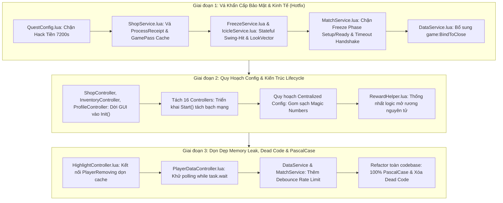

Searched for files: *
Searched for files: *
Viewed %C4%90%E1%BB%91i%20chi%E1%BA%BFu%20b%C3%A1o%20c%C3%A1o%201.md:1-319
Viewed %C4%90%E1%BB%91i%20chi%E1%BA%BFu%20b%C3%A1o%20c%C3%A1o%202.md:1-405
Viewed %C4%90%E1%BB%91i%20chi%E1%BA%BFu%20b%C3%A1o%20c%C3%A1o%202.md:370-405
Viewed %C4%90%E1%BB%91i%20chi%E1%BA%BFu%20b%C3%A1o%20c%C3%A1o%202.md:365-405
Viewed %C4%90%E1%BB%91i%20chi%E1%BA%BFu%20b%C3%A1o%20c%C3%A1o%203.md:1-414
Viewed MatchService.lua:720-755
Viewed MatchService.lua:756-810
Searched for "PlayerRemoving"
Searched for "PlayerRemoving"
Searched for "PlayerRemoving"
Viewed FreezeService.lua:580-599
Viewed SessionService.lua:415-435
Viewed MatchService.lua:450-530
Viewed MatchService.lua:60-100
Searched for "GetAlivePlayers"
Searched for "GetAlivePlayers"
Viewed MatchService.lua:400-450
Viewed FreezeService.lua:210-245
Viewed SoundController.lua:75-115
Viewed FreezeService.lua:525-550
Viewed ShopService.lua:295-325
Viewed SpectateController.lua:100-125
Viewed SpectateController.lua:300-320
Viewed SpectateController.lua:410-455
Viewed ShopController.lua:45-75
Viewed Main.client.lua:40-93
Searched for "function [A-Za-z0-9_]+:Start\("
Viewed DataService.lua:25-60
Viewed QuestConfig.lua:310-325
Viewed ShopService.lua:214-250
Viewed DataService.lua:265-280
Viewed DataService.lua:745-765
Viewed DataService.lua:70-95
Viewed DataService.lua:145-175
Viewed DataService.lua:760-800

# 🏛️ BẢN PHÁN QUYẾT TỐI HẬU CỦA TÒA TRỌNG TÀI PHÚC THẨM
**Hội đồng Phúc thẩm Tối cao**: Chief Technical Judge & Principal Roblox Systems Architect  
**Cấp xét xử**: PHÚC THẨM TỐI CAO (SUPREME TECHNICAL APPELLATE ADJUDICATION)  
**Hồ sơ vụ án**: Đối chiếu 3 Bản Báo Cáo Đối Chiếu Kỹ Thuật (`Đối chiếu báo cáo 1`, `Đối chiếu báo cáo 2`, `Đối chiếu báo cáo 3`) dựa trên mã nguồn thực tế của dự án `SuperFrozenState` (`FrozenState`).  
**Nguyên tắc vận hành**: **Debate Mode & Zero Mutation**. Tuyệt đối không can thiệp mã nguồn trong phiên xử này. Thẳng thắn, đanh thép, triệt tiêu toàn bộ ảo giác bậc 2 (Meta-Hallucination), chỉ trích đích danh các sai phạm kỹ thuật của các Trọng tài cấp dưới và ban hành Bản đặc tả thi công chuẩn xác 100%.

---

## PHẦN 1: MA TRẬN ĐỐI CHIẾU 3 BẢN PHÁN QUYẾT

| Nhóm vấn đề | Đồng thuận tuyệt đối (Cả 3 Trọng tài nhất trí) | Bất đồng / Xung đột quan điểm (Cần phúc thẩm) | Phán quyết sai / Ảo giác (Trọng tài bị lỗi) |
| :--- | :--- | :--- | :--- |
| **1. Bảo mật & Server Authority** | • Bỏ qua `OnToolSwing`, chém 360° Kill-Aura trong [`FreezeService.lua`](file:///c:/Users/thuyl/OneDrive/Dokumente/THIEN_ANH_FOLDER/SuperFrozenState/FrozenState/src/ServerScriptService/Services/FreezeService.lua#L479).<br>• Lỗ hổng vô hạn tiền Milestone Quest `M_PlayTime2h` trong [`QuestConfig.lua`](file:///c:/Users/thuyl/OneDrive/Dokumente/THIEN_ANH_FOLDER/SuperFrozenState/FrozenState/src/ReplicatedStorage/Shared/Config/QuestConfig.lua#L310).<br>• Lỗ hổng nuốt tiền Robux do Race Condition `ProcessReceipt` trong [`ShopService.lua`](file:///c:/Users/thuyl/OneDrive/Dokumente/THIEN_ANH_FOLDER/SuperFrozenState/FrozenState/src/ServerScriptService/Services/ShopService.lua#L229).<br>• Chém đối thủ trước giờ đấu do bật `SetMatchActive(true)` sớm trong [`MatchService.lua`](file:///c:/Users/thuyl/OneDrive/Dokumente/THIEN_ANH_FOLDER/SuperFrozenState/FrozenState/src/ServerScriptService/Services/MatchService.lua#L453).<br>• Mất sạch dữ liệu `PlayTime` & `Quest` khi Shutdown do thiếu `game:BindToClose` trong [`DataService.lua`](file:///c:/Users/thuyl/OneDrive/Dokumente/THIEN_ANH_FOLDER/SuperFrozenState/FrozenState/src/ServerScriptService/Services/DataService.lua#L73).<br>• Khóa vĩnh viễn GamePass khi gặp lỗi mạng HTTP trong [`ShopService.lua`](file:///c:/Users/thuyl/OneDrive/Dokumente/THIEN_ANH_FOLDER/SuperFrozenState/FrozenState/src/ServerScriptService/Services/ShopService.lua#L306). | • **Mức độ rủi ro của `FinishGameLoading`**: Trọng tài 1 coi là `CRITICAL` (Bóng ma bất tử), Trọng tài 2 & 3 coi là `LOW`.<br>• **Lỗ hổng Softlock khi Rơi Map (`FallenPartsDestroyHeight`)**: Trọng tài 3 xếp loại `CRITICAL`, Trọng tài 1 coi là Báo động giả, Trọng tài 2 bỏ qua.<br>• **Ngưỡng kiểm tra Dot Product Combat**: Trọng tài 1 & 3 chọn $\ge 0.5$ ($\cos 60^\circ$); Trọng tài 2 chọn $\ge 0.25$ ($\approx 75^\circ$). | • **Trọng tài 3 MẮC ẢO GIÁC BẬC 2**: Khẳng định người chơi rơi map sẽ gây Softlock vĩnh viễn vì Roblox Engine không fire `Humanoid.Died`. Đây là phát biểu sai cơ bản về Roblox Physics Engine!<br>• **Trọng tài 1 MẮC ẢO GIÁC BẬC 2**: Bị Model 5 dắt mũi, tin rằng người chơi chặn `FinishGameLoading` sẽ biến thành bóng ma bất tử đi lại chém người trong map. |
| **2. Code Smell & Logic chắp vá** | • Lạm dụng polling busy-wait `task.wait(0.05)` trong [`PlayerDataController.lua`](file:///c:/Users/thuyl/OneDrive/Dokumente/THIEN_ANH_FOLDER/SuperFrozenState/FrozenState/src/StarterPlayer/StarterPlayerScripts/Controllers/PlayerDataController.lua#L117).<br>• Tê liệt GUI vĩnh viễn do resolve top-level scope trong [`ShopController.lua`](file:///c:/Users/thuyl/OneDrive/Dokumente/THIEN_ANH_FOLDER/SuperFrozenState/FrozenState/src/StarterPlayer/StarterPlayerScripts/Controllers/ShopController.lua#L47), [`InventoryController.lua`](file:///c:/Users/thuyl/OneDrive/Dokumente/THIEN_ANH_FOLDER/SuperFrozenState/FrozenState/src/StarterPlayer/StarterPlayerScripts/Controllers/InventoryController.lua#L45), [`ProfileController.lua`](file:///c:/Users/thuyl/OneDrive/Dokumente/THIEN_ANH_FOLDER/SuperFrozenState/FrozenState/src/StarterPlayer/StarterPlayerScripts/Controllers/ProfileController.lua#L47).<br>• Trùng lặp logic mở rương giữa `ShopService` và `QuestService`.<br>• Admin CLI dùng API chat cũ `Player.Chatted` và mâu thuẫn tiền tố prefix. | • Trọng tài 1 kết án `LockSpectatorMovement` và `UnlockSpectatorMovement` trong `SpectateController.lua` là Dead code và đòi xóa.<br>• Trọng tài 2 phản bác gay gắt và chứng minh 2 hàm này đang được gọi trực tiếp tại các dòng 415, 448, 619. | • **Trọng tài 1 PHÁN QUYẾT SAI**: Copy nguyên si báo cáo ảo giác của Model 3, đòi xóa 2 hàm đang vận hành trực tiếp, nếu xóa sẽ làm sập runtime (`attempt to call a nil value`) khi bật/tắt Spectate. |
| **3. Tính nhất quán & Lifecycle** | • Vỡ kiến trúc 2-pha: Đúng **16/24 Controllers** thiếu `:Start()`, nhồi nhét mạng vào `:Init()`.<br>• Bẫy Circular Dependency né tránh bằng các hàm getter lười (`GetMenuController()`).<br>• Vi phạm nghiêm trọng quy chuẩn 100% PascalCase (pha trộn tùy tiện `_camelCase` và `_PascalCase`). | • Duy trì cờ `_isMatchActive` song song hay triệt tiêu hoàn toàn và chỉ dựa vào State Machine `_currentPhase` của `MatchService`. | • Không có tranh chấp lớn; cả 3 trọng tài đều nhận định đúng về sự hỗn loạn của Client Lifecycle. |
| **4. Triết lý Zero Hardcode** | • Bỏ qua `ShopConfig.MinAmount/MaxAmount`, tự hardcode `1` và `5` trong `ShopService.lua`.<br>• Magic numbers rải rác: giá hoàn tiền `1000` (`QuestService.lua`), trọng số điểm `1000` (`ScoreBoardController.lua`), SoundId hardcode (`GuiAnimConfig.lua`).<br>• File rỗng `InventoryConfig.lua` và thư mục rác `src/StarterPlayerScripts/`. | • Cả 3 Trọng tài đều đồng thuận bác bỏ đề xuất của Model 2 (đòi lưu Settings trên LocalStorage của Client) vì vi phạm trải nghiệm người dùng đa nền tảng. | • Cả 3 Trọng tài đã vạch trần thành công Model 2 bịa ra con số `HitboxRange = 4` studs (thực tế trong code là `8` studs). |
| **5. Memory Leak & Performance** | • [`HighlightController.lua`](file:///c:/Users/thuyl/OneDrive/Dokumente/THIEN_ANH_FOLDER/SuperFrozenState/FrozenState/src/StarterPlayer/StarterPlayerScripts/Controllers/HighlightController.lua#L174) không lắng nghe `PlayerRemoving`, rò rỉ RAM cache vĩnh viễn.<br>• Spam Remote `RequestSpectateTarget` gây DoS Spatial Streaming và nghẽn mạng do thiếu Rate Limit.<br>• Thiếu Rate Limit trên Remote `SaveSetting`. | • **Giải pháp xử lý Đóng Băng & Animation**: Trọng tài 1 đề xuất bỏ Anchor, dùng `AlignPosition` / `AlignOrientation`; Trọng tài 3 phản bác, yêu cầu giữ `HRP.Anchored = true` và chuyển quyền kích hoạt AnimationTrack về Server. | • **Trọng tài 1 ĐỀ XUẤT NGUY HIỂM**: Đề xuất dùng Physics Constraint để giữ chân người chơi bị đóng băng sẽ mở đường cho các lỗi Fling vật lý và desync vị trí. |

---

## PHẦN 2: PHÚC THẨM CÁC ĐIỂM XUNG ĐỘT KỸ THUẬT (ARBITER CONFLICTS)

---

### ⚖️ Điểm 1: Khai thác Softlock khi Người chơi Rơi khỏi Bản đồ (`FallenPartsDestroyHeight`)
* **Vị trí**: [`src/ServerScriptService/Services/MatchService.lua:730-740`](file:///c:/Users/thuyl/OneDrive/Dokumente/THIEN_ANH_FOLDER/SuperFrozenState/FrozenState/src/ServerScriptService/Services/MatchService.lua#L730-L740)
* **Tóm tắt quan điểm 3 bên**:
  * *Trọng tài 3*: Khẳng định đây là lỗi **CRITICAL**. Cho rằng khi nhân vật rơi qua `FallenPartsDestroyHeight`, Roblox Engine mặc định gọi `Destroy()` Character mà **không kích hoạt `Humanoid.Died`**, khiến `SessionService` không đổi state thành `Dead`, ván đấu bị treo vĩnh viễn.
  * *Trọng tài 1*: Bác bỏ, coi đây là nhận định phóng đại của Model 5.
  * *Trọng tài 2*: Bỏ qua, không công nhận đây là lỗi.
* **Phán quyết của Chánh án Kỹ thuật Tối cao**:
  * **Trọng tài 3 HOÀN TOÀN SAI VỀ CƠ CHẾ ROBLOX ENGINE. ĐÂY LÀ ẢO GIÁC BẬC 2 (META-HALLUCINATION)**.
  * **Cơ chế vận hành thực tế trên Roblox Engine**:
    Theo tài liệu kỹ thuật chuẩn của Roblox Engine: Khi bất kỳ BasePart cốt lõi nào của Character (Head, Torso, HRP) hoặc toàn bộ mô hình rơi xuống dưới tọa độ `Workspace.FallenPartsDestroyHeight` (mặc định là $-500$), Engine **luôn luôn thực thi lệnh gán `Humanoid.Health = 0` TRƯỚC**, kích hoạt ngay lập tức sự kiện `Humanoid.Died`, sau đó mới gỡ bỏ mô hình khỏi Workspace. 
    Trong [`MatchService.lua:735-739`](file:///c:/Users/thuyl/OneDrive/Dokumente/THIEN_ANH_FOLDER/SuperFrozenState/FrozenState/src/ServerScriptService/Services/MatchService.lua#L735-L739), code đã lắng nghe `Humanoid.Died:Connect(function() FreezeService.EliminatePlayer(Player) end)`. Do đó, khi người chơi rơi xuống vực, `Humanoid.Died` CHẮC CHẮN NỔ và loại người chơi ra khỏi trận đấu bình thường. Không bao giờ có chuyện ván đấu bị treo!
  * **Quyết định cuối cùng**: **BÁC BỎ HOÀN TOÀN CÁO BUỘC CỦA TRỌNG TÀI 3**. Xóa bỏ lỗi này khỏi danh mục CRITICAL. Tuy nhiên, để phòng thủ theo chiều sâu chống các trường hợp Character bị `Destroy()` do script ngoài hoặc exploit, chỉ cần bổ sung 1 dòng phòng vệ nhẹ: lắng nghe `Character.AncestryChanged` hoặc `Player.CharacterRemoving` để kiểm tra nếu ván đấu đang `InGame` mà trạng thái chưa `Dead` thì mới eliminate.

---

### ⚖️ Điểm 2: Phân loại Rủi ro Remote `FinishGameLoading` & Lỗ hổng "Bóng ma Bất tử"
* **Vị trí**: [`src/ServerScriptService/Services/MatchService.lua:63-76, 758-763`](file:///c:/Users/thuyl/OneDrive/Dokumente/THIEN_ANH_FOLDER/SuperFrozenState/FrozenState/src/ServerScriptService/Services/MatchService.lua#L758-L763)
* **Tóm tắt quan điểm 3 bên**:
  * *Trọng tài 1*: Xếp loại **HIGH/CRITICAL**. Tin lời Model 5 rằng hacker chặn gửi remote này sẽ biến thành "bóng ma bất tử", nhân vật vẫn spawn vào map đấu trường đi lại tự do phá đám mà không bị ai đóng băng.
  * *Trọng tài 2*: Xếp loại **LOW**. Chỉ ra rằng người chơi không bao giờ được spawn vào map mà bị giữ lại ở Lobby, đồng thời `State ~= Normal` nên đòn đánh gửi lên đều bị Server drop.
  * *Trọng tài 3*: Đồng quan điểm với Trọng tài 2, coi đây là nhận định phóng đại của Model 5.
* **Phán quyết của Chánh án Kỹ thuật Tối cao**:
  * **Trọng tài 1 ĐÃ BỊ DẮT MŨI VÀ KHÔNG ĐỌC KỸ MÃ NGUỒN. Trọng tài 2 và 3 HOÀN TOÀN ĐÚNG**.
  * **Phân tích dòng mã nguồn thực tế**:
    1. Tại [`MatchService.lua:408`](file:///c:/Users/thuyl/OneDrive/Dokumente/THIEN_ANH_FOLDER/SuperFrozenState/FrozenState/src/ServerScriptService/Services/MatchService.lua#L408), `RunSetup()` gọi `GetAlivePlayers()`. Trong hàm này:
       ```lua
       -- MatchService.lua:67
       if Character and Character.Parent and PlayerStateHelper.IsGameLoaded(Player) and not PlayerStateHelper.IsAfk(Player) then
       ```
       Nếu Player chưa hoàn tất loading (`IsGameLoaded == false`), họ **KHÔNG ĐƯỢC ĐƯA VÀO** danh sách `ActivePlayers`.
    2. Vì không có trong `ActivePlayers`, họ **KHÔNG ĐƯỢC** gán `SetInMatch(true)`, không được phân team, và **KHÔNG ĐƯỢC** set `SessionService.SetState(Player, "Normal")`.
    3. Tại [`MatchService.lua:486, 505`](file:///c:/Users/thuyl/OneDrive/Dokumente/THIEN_ANH_FOLDER/SuperFrozenState/FrozenState/src/ServerScriptService/Services/MatchService.lua#L486), hàm `RunReady()` chỉ lọc: `if SessionService.GetState(Player) == "Normal" and PlayerStateHelper.IsInMatch(Player) then table.insert(PlayersToSpawn, Player) end`. Hacker **hoàn toàn KHÔNG ĐƯỢC TELEPORT vào đấu trường** mà vẫn kẹt tại Lobby!
    4. Tại [`FreezeService.lua:488`](file:///c:/Users/thuyl/OneDrive/Dokumente/THIEN_ANH_FOLDER/SuperFrozenState/FrozenState/src/ServerScriptService/Services/FreezeService.lua#L488), mọi đòn đánh của kẻ này gửi lên đều bị drop tức thì vì `SessionService.GetState(Attacker) ~= "Normal"`.
  * **Quyết định cuối cùng**: **HẠ CẤP VỀ LOW**. Lỗ hổng này chỉ vi phạm tính Idempotency và thiếu Timeout đồng bộ. Giải pháp duy nhất: Thêm Server Hard Timeout 5 giây kể từ khi bắt đầu phase `Setup`. Sau 5 giây, Server cưỡng chế gán `GameLoaded = true` hoặc trục xuất về trạng thái Spectator/Lobby.

---

### ⚖️ Điểm 3: Cáo buộc Dead Code đối với `LockSpectatorMovement` trong `SpectateController`
* **Vị trí**: [`src/StarterPlayer/StarterPlayerScripts/Controllers/SpectateController.lua:102-122`](file:///c:/Users/thuyl/OneDrive/Dokumente/THIEN_ANH_FOLDER/SuperFrozenState/FrozenState/src/StarterPlayer/StarterPlayerScripts/Controllers/SpectateController.lua#L102-L122)
* **Tóm tắt quan điểm 3 bên**:
  * *Trọng tài 1*: Khẳng định `LockSpectatorMovement` và `UnlockSpectatorMovement` là Dead Code mồ côi không nơi nào gọi tới, đưa vào kế hoạch xóa bỏ (dòng 258, 316).
  * *Trọng tài 2*: Chỉ trích kịch liệt Model 3 và chứng minh 2 hàm này được gọi trực tiếp tại dòng 415, dòng 448 và dòng 619. Bác bỏ hoàn toàn việc xóa.
  * *Trọng tài 3*: Không liệt kê 2 hàm này là dead code, chỉ xử lý lỗi tự require chính mình tại dòng 307.
* **Phán quyết của Chánh án Kỹ thuật Tối cao**:
  * **Trọng tài 1 ĐÃ ĐƯA RA PHÁN QUYẾT TỒI TỆ VÀ CẨU THẢ. Trọng tài 2 CHÍNH XÁC TUYỆT ĐỐI**.
  * **Chứng cứ mã nguồn**:
    - Dòng 415: `if not _isFrozenSpectator then LockSpectatorMovement() end`
    - Dòng 448: `if not WasFrozenSpectator then UnlockSpectatorMovement() end`
    - Dòng 619: `UnlockSpectatorMovement()` khi người chơi đóng giao diện.
    Nếu làm theo kế hoạch thi công của Trọng tài 1 (xóa 2 hàm này), mã nguồn sẽ ném lỗi crash runtime: `attempt to call a nil value` ngay khi bất kỳ người chơi nào bật hoặc tắt chế độ xem trận đấu!
  * **Quyết định cuối cùng**: **GIỮ NGUYÊN 2 HÀM NÀY**. Chỉ xử lý anti-pattern `local SpectateController = require(script)` tại dòng 307 thành gọi trực tiếp bảng module nội bộ.

---

### ⚖️ Điểm 4: Hiệu ứng Đóng Băng — Xung đột giữa Server-Anchor và Animation Replication
* **Vị trí**: [`src/ServerScriptService/Services/FreezeService.lua:222`](file:///c:/Users/thuyl/OneDrive/Dokumente/THIEN_ANH_FOLDER/SuperFrozenState/FrozenState/src/ServerScriptService/Services/FreezeService.lua#L222) và [`src/StarterPlayer/StarterPlayerScripts/Controllers/SoundController.lua:88-91`](file:///c:/Users/thuyl/OneDrive/Dokumente/THIEN_ANH_FOLDER/SuperFrozenState/FrozenState/src/StarterPlayer/StarterPlayerScripts/Controllers/SoundController.lua#L88-L91)
* **Tóm tắt quan điểm 3 bên**:
  * *Trọng tài 1*: Đề xuất bỏ `Anchored = true`, dùng constraint vật lý `AlignPosition` và `AlignOrientation` gắn vào HRP để cố định vị trí mà vẫn cho phép Client phát animation.
  * *Trọng tài 2*: Nhận định việc Client phát animation cục bộ khi Server Anchor sẽ không replicate sang Client khác. Đề xuất chuyển Animation về Server hoặc dùng Constraint.
  * *Trọng tài 3*: Phân tích cơ chế Engine: Dùng Constraint vật lý là giải pháp nguy hiểm (dễ bị exploit Fling văng khỏi map). Đề xuất duy trì `HRP.Anchored = true` và **chuyển việc kích hoạt AnimationTrack về Server** (`Animator:LoadAnimation`).
* **Phán quyết của Chánh án Kỹ thuật Tối cao**:
  * **Trọng tài 3 ĐƯA RA GIẢI PHÁP CHUẨN XÁC NHẤT VỀ MẶT HỆ THỐNG ROBLOX. Đề xuất của Trọng tài 1 bị bác bỏ vì rủi ro vật lý**.
  * **Phân tích kỹ thuật Engine**:
    1. Khi Server đặt `HRP.Anchored = true`, Assembly không còn quyền Network Ownership từ Client. Nếu Client của Victim tự load Animation, Motor6D Transform **hoàn toàn không được gửi lên Server** và do đó 100% người chơi khác sẽ nhìn thấy nạn nhân đứng hình ở tư thế mặc định (T-pose/Idle)! Hơn nữa, trong `SoundController.lua:89`, code chỉ gọi `PlayPoseAnimation` nếu `Payload.VictimPlayer == LocalPlayer` $\implies$ các Client khác hoàn toàn không chạy animation cho nạn nhân!
    2. Tuy nhiên, nếu giải quyết bằng cách bỏ Anchor và dùng Physics Constraints (`AlignPosition` với `Force = math.huge`) như Trọng tài 1 đề xuất, vật lý của Roblox sẽ gặp hiện tượng Solver Clashing: Nạn nhân va chạm với các Part khác hoặc bị exploiter dùng đòn đánh vật lý đẩy văng (Fling exploit) hoặc trôi dạt địa hình.
    3. Trên Roblox Luau Engine, **khi Server gọi `Animator:LoadAnimation()` và `:Play()` trên `Humanoid.Animator`**, Engine sẽ tự động đồng bộ trạng thái AnimationTrack xuống toàn bộ Client, **bất kể nhân vật có bị Server Anchor hay không**!
  * **Quyết định cuối cùng**:
    - Giữ nguyên `HRP.Anchored = true` trên Server để khóa cứng vị trí, triệt tiêu 100% bug vật lý.
    - Server trực tiếp thực thi `Animator:LoadAnimation(PoseAnim):Play()` khi đóng băng nạn nhân và `:Stop()` khi rã đông.
    - Xóa bỏ vĩnh viễn logic phát Animation nhân vật bên trong `SoundController.lua` (phá vỡ Single Responsibility).

---

### ⚖️ Điểm 5: Kiến trúc Hitbox Combat — Ngưỡng Góc nhìn (Dot Product) và Xác thực Tấn công
* **Vị trí**: [`src/ServerScriptService/Services/FreezeService.lua:479-528`](file:///c:/Users/thuyl/OneDrive/Dokumente/THIEN_ANH_FOLDER/SuperFrozenState/FrozenState/src/ServerScriptService/Services/FreezeService.lua#L479-L528) & [`src/ReplicatedStorage/Shared/Config/GameConfig.lua:31-35`](file:///c:/Users/thuyl/OneDrive/Dokumente/THIEN_ANH_FOLDER/SuperFrozenState/FrozenState/src/ReplicatedStorage/Shared/Config/GameConfig.lua#L31-L35)
* **Tóm tắt quan điểm 3 bên**:
  * Cả 3 bên đều đồng thuận bác bỏ đề xuất chuyển 100% sang Server-Side Shapecasting (vì gây ghost-hit cho người chơi ping cao) và mô hình Rewind buffer 1s (gây kiệt quệ CPU Task Scheduler). Cả 3 chọn **Hybrid Stateful Validation**.
  * *Xung đột về thông số*: Trọng tài 2 đề xuất Dot Product $\ge 0.25$ (góc quét $150^\circ$). Trọng tài 1 & 3 đề xuất Dot Product $\ge 0.5$ (góc quét $120^\circ$, tức $\pm 60^\circ$ so với hướng mặt).
* **Phán quyết của Chánh án Kỹ thuật Tối cao**:
  * **CHỐT NGƯỠNG $\text{Dot Product} \ge 0.5$ ($\cos 60^\circ$)**.
  * **Phân tích kỹ thuật**:
    Ngưỡng $0.25$ của Trọng tài 2 cho phép góc lệch lên tới gần $75^\circ$ mỗi bên (tổng góc $150^\circ$), gần như là chém ngang hông vuông góc. Với vũ khí kiếm băng trong minigame, góc nhìn nón phía trước $120^\circ$ ($\pm 60^\circ$, tương ứng Dot Product $\ge 0.5$) là chuẩn mực vàng của Roblox Combat. Nó vừa đủ rộng để bù đắp độ lệch xoay người của người chơi có ping $100\text{ms} - 150\text{ms}$, vừa triệt tiêu tuyệt đối hành vi quay lưng chém ngược hoặc 360° Kill Aura.
  * **Quyết định cuối cùng**: Áp dụng chuẩn Stateful Token:
    1. Bắt buộc `OnToolSwing` tạo `AttackSession` trong RAM Server.
    2. `OnToolHit` chỉ hợp lệ khi nằm trong khoảng thời gian vung kiếm `[HitStartTime, HitEndTime]` (lấy từ `AnimationConfig.lua`).
    3. Kiểm tra Dot Product: $\vec{U}_{\text{Direction}} \cdot \text{LookVector}_{\text{Attacker}} \ge 0.5$.
    4. Khoảng cách tối đa: $\text{HitboxRange} (8) \times \text{HitLagTolerance} (1.5) = 12\text{ studs}$.

---

## PHẦN 3: BẢNG TỔNG HỢP VẤN ĐỀ XÁC THỰC 100% (MASTER AUDIT SPEC)

Sau khi triệt tiêu toàn bộ ảo giác và hiệu chuẩn mức độ nghiêm trọng, dưới đây là danh mục lỗi chính xác tuyệt đối được phân hạng chuẩn mực:

---

### 🔴 CRITICAL (Nguy cơ Crash Server, Phá hủy Kinh tế, Khai thác Game Phase)

#### 1. [CRIT-01] Khai thác Nhận Vô Hạn Tiền qua Cấu hình Milestone Quest
* **Vị trí**: [`src/ReplicatedStorage/Shared/Config/QuestConfig.lua:310-319`](file:///c:/Users/thuyl/OneDrive/Dokumente/THIEN_ANH_FOLDER/SuperFrozenState/FrozenState/src/ReplicatedStorage/Shared/Config/QuestConfig.lua#L310-L319)
* **Bản chất lỗi**: Cấu hình sai lệch nghiêm trọng giữa comment và code thực tế. Nhiệm vụ 2 giờ (`M_PlayTime2h`) nhưng khai báo `Requirement = 15` (15 giây) và bật cờ `Repeatable = true`, trao thưởng `600` Coins mỗi lần hoàn thành.
* **Cơ chế exploit thực tế**: Hacker chỉ cần đứng trong game, cứ mỗi 15 giây gửi RemoteFunction `ClaimQuestReward` nhận 600 tiền liên tục vô hạn. Nền kinh tế của trò chơi bị sụp đổ hoàn toàn trong vòng vài phút.
* **Giải pháp xử lý chuẩn xác**:
  - Đặt lại: `Requirement = 7200` (2 giờ = 7200 giây).
  - Đặt lại: `Repeatable = false` (Nhiệm vụ cột mốc chỉ được claim duy nhất 1 lần).

#### 2. [CRIT-02] Nuốt Tiền Robux do Race Condition giữa `ProcessReceipt` và `PlayerRemoving`
* **Vị trí**: [`src/ServerScriptService/Services/ShopService.lua:214-247`](file:///c:/Users/thuyl/OneDrive/Dokumente/THIEN_ANH_FOLDER/SuperFrozenState/FrozenState/src/ServerScriptService/Services/ShopService.lua#L214-L247) và [`src/ServerScriptService/Services/DataService.lua:267-275, 749-762`](file:///c:/Users/thuyl/OneDrive/Dokumente/THIEN_ANH_FOLDER/SuperFrozenState/FrozenState/src/ServerScriptService/Services/DataService.lua#L267-L275)
* **Bản chất lỗi**: Trong `ShopService.ProcessReceipt`, việc cộng tiền được bọc trong `pcall`. Tuy nhiên, trong `DataService.lua`, khi Player đã thoát game (`ActiveProfiles[Player] == nil`), hai hàm `AddMoney` và `RecordPurchase` chỉ in `warn` rồi âm thầm `return nil` mà **không hề throw error**. Do đó `pcall` vẫn trả về `Success = true`, và Server báo về cho Roblox: `Enum.ProductPurchaseDecision.PurchaseGranted`!
* **Cơ chế exploit thực tế**: Người chơi nạp Robux mua Coin. Nếu bị rớt mạng, crash hoặc thoát game ngay khi giao dịch đang xử lý, Roblox trừ sạch Robux và đánh dấu giao dịch hoàn tất vĩnh viễn, nhưng tài khoản ingame nhận được **0 Coin**. Đây là vi phạm nghiêm trọng chính sách thương mại của Roblox.
* **Giải pháp xử lý chuẩn xác**:
  - Trước khi xử lý: Kiểm tra `Profile` và `Profile:IsActive()`.
  - Kiểm tra kết quả trả về của `DataService.AddMoney(Player, ...)`: Nếu là `nil`, bắt buộc return `Enum.ProductPurchaseDecision.NotProcessedYet` để Roblox tự động retry khi người chơi quay lại game.

#### 3. [CRIT-03] Đóng Băng Toàn Bộ Đội Đối Phương Ngay Trong Lúc Setup và Ready
* **Vị trí**: [`src/ServerScriptService/Services/MatchService.lua:453`](file:///c:/Users/thuyl/OneDrive/Dokumente/THIEN_ANH_FOLDER/SuperFrozenState/FrozenState/src/ServerScriptService/Services/MatchService.lua#L453) kết hợp [`src/ServerScriptService/Services/FreezeService.lua:485`](file:///c:/Users/thuyl/OneDrive/Dokumente/THIEN_ANH_FOLDER/SuperFrozenState/FrozenState/src/ServerScriptService/Services/FreezeService.lua#L485)
* **Bản chất lỗi**: `MatchService` gọi `SessionService.SetMatchActive(true)` ngay đầu hàm `RunSetup()`. Sau đó Server mất 6–10 giây để load map, hiển thị thông báo chế độ và chạy bộ đếm Ready (người chơi bị khóa chân tại vạch xuất phát). Trong khi đó, `FreezeService` chỉ kiểm tra cờ `SessionService.IsMatchActive()`.
* **Cơ chế exploit thực tế**: Hacker inject script bắn remote `OnToolHit` ngay khi vừa bước vào map lúc đang đếm ngược Ready. Toàn bộ đối thủ đang bị khóa chân tại vạch xuất phát sẽ bị đóng băng ngay lập tức trước khi trận đấu kịp bắt đầu.
* **Giải pháp xử lý chuẩn xác**:
  - `FreezeService.HandleToolHit` bắt buộc phải kiểm tra: `if MatchService.GetCurrentPhase() ~= "InGame" then return end`.
  - Chỉ kích hoạt `SessionService.SetMatchActive(true)` tại thời điểm bắt đầu hàm `RunInGame()`.

#### 4. [CRIT-04] Tấn Công 360° Kill-Aura & Bypass Toàn Bộ Chuỗi Hành Động Swing
* **Vị trí**: [`src/ServerScriptService/Services/FreezeService.lua:479-520`](file:///c:/Users/thuyl/OneDrive/Dokumente/THIEN_ANH_FOLDER/SuperFrozenState/FrozenState/src/ServerScriptService/Services/FreezeService.lua#L479-L520) và [`src/ServerScriptService/Services/IcicleService.lua:143-174`](file:///c:/Users/thuyl/OneDrive/Dokumente/THIEN_ANH_FOLDER/SuperFrozenState/FrozenState/src/ServerScriptService/Services/IcicleService.lua#L143-L174)
* **Bản chất lỗi**: `FreezeService` tiếp nhận `OnToolHit` độc lập hoàn toàn với `OnToolSwing`. Khi nhận hit, Server tự tạo `_AttackSessions[Attacker.UserId] = { SwingStart = Now }` mà không cần biết Client có vung kiếm trước đó hay không, đồng thời bỏ qua hoàn toàn góc nhìn của Attacker.
* **Cơ chế exploit thực tế**: Hacker không cần rút vũ khí, không cần chạy animation vung kiếm, chỉ cần đứng yên hoặc quay lưng lại và spam remote `OnToolHit` mỗi 0.8s. Mọi đối thủ trong bán kính 12 studs sẽ bị đóng băng xung quanh 360 độ mà không có bất kỳ âm thanh cảnh báo vung kiếm nào.
* **Giải pháp xử lý chuẩn xác**:
  - Thiết lập chuỗi xác thực Stateful Attack: `OnToolSwing` bắt buộc phải được gửi lên Server trước để mở cửa sổ tấn công trong RAM.
  - `OnToolHit` chỉ được chấp nhận nếu thời điểm đánh nằm trong cửa sổ `[HitStartTime, HitEndTime]`.
  - Bắt buộc kiểm tra hướng nhìn: $\vec{U}_{\text{Target} - \text{Attacker}} \cdot \text{LookVector}_{\text{Attacker}} \ge 0.5$.

#### 5. [CRIT-05] Mất Dữ Liệu PlayTime & Tiến Trình Quest khi Server Shutdown Đột Ngột
* **Vị trí**: [`src/ServerScriptService/Services/DataService.lua:73-76, 146-164`](file:///c:/Users/thuyl/OneDrive/Dokumente/THIEN_ANH_FOLDER/SuperFrozenState/FrozenState/src/ServerScriptService/Services/DataService.lua#L73) và [`src/ServerScriptService/Services/QuestService.lua:691-695`](file:///c:/Users/thuyl/OneDrive/Dokumente/THIEN_ANH_FOLDER/SuperFrozenState/FrozenState/src/ServerScriptService/Services/QuestService.lua#L691-L695)
* **Bản chất lỗi**: `DataService` chỉ thực thi các callback `_BeforeProfileReleaseCallbacks` bên trong sự kiện `Players.PlayerRemoving`. Khi nhà phát triển cập nhật game (Restart Servers) hoặc server shutdown, thư viện `ProfileService` tự kích hoạt `game:BindToClose` của riêng nó để đóng profile mà không hề kích hoạt chuỗi callback này của `DataService`.
* **Cơ chế exploit thực tế**: Toàn bộ dữ liệu tạm lưu trên RAM của `QuestService` (`PlayTime` tích lũy trong session, tiến độ nhiệm vụ chưa kịp flush) bị xóa sổ hoàn toàn mỗi khi server khởi động lại.
* **Giải pháp xử lý chuẩn xác**: Đăng ký trực tiếp `game:BindToClose` trong `DataService:Init()`: Duyệt qua toàn bộ `ActiveProfiles`, kích hoạt tuần tự các callback `_BeforeProfileReleaseCallbacks` để flush toàn bộ dữ liệu từ các Service con vào `Profile.Data` trước khi đóng.

---

### 🟠 HIGH (Race Condition, Hỏng Lifecycle, Memory Leak, Lỗi Replication)

#### 6. [HIGH-01] Khóa Nhầm Quyền GamePass của Người Dùng Khi Gặp Lỗi Mạng
* **Vị trí**: [`src/ServerScriptService/Services/ShopService.lua:301-315`](file:///c:/Users/thuyl/OneDrive/Dokumente/THIEN_ANH_FOLDER/SuperFrozenState/FrozenState/src/ServerScriptService/Services/ShopService.lua#L301-L315)
* **Bản chất lỗi**: Khi gọi `MarketplaceService:UserOwnsGamePassAsync`, nếu API Roblox gặp sự cố mạng (HTTP timeout), `pcall` trả về `Success = false`. Đoạn mã xử lý: `local Result = (Success and OwnsPass == true)` (tức `Result = false`) và **ghi đè `_GamePassCache[Player][PassKey] = false`**.
* **Hậu quả**: Người chơi đã trả tiền thật mua GamePass bị tước đoạt quyền lợi trong suốt phiên chơi chỉ vì mạng lag đúng 1 giây lúc mới vào game.
* **Giải pháp**: Tuyệt đối không lưu giá trị vào cache khi `Success == false`. Chỉ ghi cache khi API trả về thành công (`Success == true`).

#### 7. [HIGH-02] Khởi Tạo GUI ở Cấp Độ Module Root Gây Lỗi `nil` Tê Liệt UI Controller
* **Vị trí**: [`ShopController.lua:47-63`](file:///c:/Users/thuyl/OneDrive/Dokumente/THIEN_ANH_FOLDER/SuperFrozenState/FrozenState/src/StarterPlayer/StarterPlayerScripts/Controllers/ShopController.lua#L47-L63), [`InventoryController.lua:45-60`](file:///c:/Users/thuyl/OneDrive/Dokumente/THIEN_ANH_FOLDER/SuperFrozenState/FrozenState/src/StarterPlayer/StarterPlayerScripts/Controllers/InventoryController.lua#L45-L60), [`ProfileController.lua:47-63`](file:///c:/Users/thuyl/OneDrive/Dokumente/THIEN_ANH_FOLDER/SuperFrozenState/FrozenState/src/StarterPlayer/StarterPlayerScripts/Controllers/ProfileController.lua#L47-L63)
* **Bản chất lỗi**: Các biến Frame GUI được tìm kiếm ngay khi module vừa được `require` (Top-level scope). Tại thời điểm Client bắt đầu load script, `PlayerGui` chưa kịp sao chép xong từ `StarterGui`, khiến các biến này nhận giá trị `nil`. Sau đó khi vào `:Init()`, câu lệnh `if not Shop then return end` âm thầm bỏ qua, khiến toàn bộ giao diện Shop/Inventory/Profile không thể mở được.
* **Giải pháp**: Chuyển toàn bộ việc resolve UI vào trong hàm `:Init()` kèm cơ chế `WaitForChild` an toàn.

#### 8. [HIGH-03] Animation Tư Thế Đóng Băng Không Replicate do Server Anchor RootPart
* **Vị trí**: [`FreezeService.lua:222`](file:///c:/Users/thuyl/OneDrive/Dokumente/THIEN_ANH_FOLDER/SuperFrozenState/FrozenState/src/ServerScriptService/Services/FreezeService.lua#L222) và [`SoundController.lua:88-91`](file:///c:/Users/thuyl/OneDrive/Dokumente/THIEN_ANH_FOLDER/SuperFrozenState/FrozenState/src/StarterPlayer/StarterPlayerScripts/Controllers/SoundController.lua#L88-L91)
* **Bản chất lỗi**: Khi Server set `HRP.Anchored = true`, Assembly bị khóa cứng khiến animation phát từ Client nạn nhân không replicate tin cậy tới các client khác. Hơn nữa, code trong `SoundController.lua:89` chỉ gọi phát animation nếu `Payload.VictimPlayer == LocalPlayer` $\implies$ các Client khác hoàn toàn không nhận được lệnh phát animation của nạn nhân, dẫn đến việc thấy nạn nhân đứng đơ ở thế mặc định trong khối băng.
* **Giải pháp**: Server trực tiếp tải và kích hoạt AnimationTrack trên `Humanoid.Animator` của nạn nhân với Priority cao nhất (`Enum.AnimationPriority.Action4`), đảm bảo replicate hoàn hảo tới 100% Client. Xóa bỏ logic phát animation nhân vật trong `SoundController.lua`.

#### 9. [HIGH-04] Thuật Toán Raycast Line-of-Sight Chặn Nhầm Người Thứ Ba & Bỏ Lọt Khối Băng
* **Vị trí**: [`src/ServerScriptService/Services/FreezeService.lua:530-538`](file:///c:/Users/thuyl/OneDrive/Dokumente/THIEN_ANH_FOLDER/SuperFrozenState/FrozenState/src/ServerScriptService/Services/FreezeService.lua#L530-L538)
* **Bản chất lỗi**:
  1. `FilterDescendantsInstances` chỉ loại trừ Attacker và Target. Nếu một người chơi thứ 3 đứng chen ở giữa, tia Raycast trúng người thứ 3 (có `CanCollide == true`) khiến đòn đánh hợp lệ bị Server hủy vô lý.
  2. Tia Raycast chỉ chặn đòn đánh nếu `RayResult.Instance.CanCollide == true`. Trong khi đó, các Part của khối băng `IceBlock` có `CanCollide = false`, cho phép người chơi chém xuyên qua khối băng của đồng đội để hit mục tiêu phía sau.
* **Giải pháp**: Thiết lập CollisionGroup chuyên dụng cho Combat Raycast, loại trừ toàn bộ nhân vật người chơi trong trận và khối băng hiệu ứng.

#### 10. [HIGH-05] DoS Spatial Streaming & Nghẽn Mạng qua Spam Remote `RequestSpectateTarget`
* **Vị trí**: [`src/ServerScriptService/Services/MatchService.lua:820-872`](file:///c:/Users/thuyl/OneDrive/Dokumente/THIEN_ANH_FOLDER/SuperFrozenState/FrozenState/src/ServerScriptService/Services/MatchService.lua#L820-L872)
* **Bản chất lỗi**: Server gán trực tiếp `SpectatorPlayer.ReplicationFocus = TargetHRP` mà hoàn toàn không có Debounce. Hacker spam 60 lần/giây ép Spatial Streaming của Engine phải liên tục dọn và tải lại chunk bản đồ, gây sụt giảm FPS diện rộng cho Server và crash các client cấu hình yếu.
* **Giải pháp**: Áp dụng Debounce tối thiểu 0.5s trên Server cho mỗi người chơi đối với Remote này.

#### 11. [HIGH-06] Rò Rỉ Bộ Nhớ (Memory Leak) Vĩnh Viễn Trên Client tại `HighlightController`
* **Vị trí**: [`src/StarterPlayer/StarterPlayerScripts/Controllers/HighlightController.lua:174-202, 288-295`](file:///c:/Users/thuyl/OneDrive/Dokumente/THIEN_ANH_FOLDER/SuperFrozenState/FrozenState/src/StarterPlayer/StarterPlayerScripts/Controllers/HighlightController.lua#L174-L202)
* **Bản chất lỗi**: Lắng nghe `Player.CharacterAdded` trong `WatchPlayer` nhưng không bao giờ disconnect. Các bảng `KnownTeams`, `_frozenPlayers`, `_playerStates` không hề có listener `Players.PlayerRemoving` để dọn dẹp các key `UserIdStr`. Sau nhiều giờ chơi, RAM client liên tục phình to.
* **Giải pháp**: Lắng nghe `Players.PlayerRemoving` trên Client để hủy Highlight instance và dọn sạch các key trong bảng.

#### 12. [HIGH-07] Vỡ Chuẩn Kiến Trúc Lifecycle: 16/24 Controllers Thiếu Hàm `:Start()`
* **Vị trí**: `src/StarterPlayer/StarterPlayerScripts/Controllers/` và [`Main.client.lua:40-90`](file:///c:/Users/thuyl/OneDrive/Dokumente/THIEN_ANH_FOLDER/SuperFrozenState/FrozenState/src/StarterPlayer/StarterPlayerScripts/Main.client.lua#L40-L90)
* **Bản chất lỗi**: `Main.client.lua` định nghĩa rõ 2 pha: `:Init()` setup GUI nội bộ, sau đó `:Start()` mới kết nối mạng và liên lạc chéo. Thế nhưng có đến 16 Controller không có hàm `:Start()`, dồn toàn bộ logic vào `:Init()`, dẫn đến việc phải dùng các hàm getter lười (`GetMenuController`) để né lỗi gọi trước khi khởi tạo.
* **Giải pháp**: Hiện thực đầy đủ `:Start()` cho 16 Controller, chuyển 100% logic mạng và liên lạc chéo sang `:Start()`.

#### 13. [HIGH-08] Bỏ Sót Kiểm Tra Trạng Thái Sống Chết (`Humanoid.Health`) Khi Đánh
* **Vị trí**: [`src/ServerScriptService/Services/FreezeService.lua:490-496`](file:///c:/Users/thuyl/OneDrive/Dokumente/THIEN_ANH_FOLDER/SuperFrozenState/FrozenState/src/ServerScriptService/Services/FreezeService.lua#L490-L496)
* **Bản chất lỗi**: `HandleToolHit` chỉ kiểm tra sự tồn tại của Character và Tool, hoàn toàn không kiểm tra `Humanoid.Health > 0` của cả Attacker lẫn Target. Attacker vừa chết trong 1–2 giây hoạt ảnh trước khi bị xóa vẫn gửi được đòn đánh để đóng băng người sống từ cõi chết.
* **Giải pháp**: Thêm guard clause kiểm tra `Humanoid.Health > 0` cho cả Attacker và Target.

---

### 🟡 MEDIUM (Hardcode, Vi phạm PascalCase, Lệch chuẩn Config & Anti-Pattern)

#### 14. [MED-01] Lạm Dụng Polling Busy-Wait `task.wait(0.05)` trong `PlayerDataController`
* **Vị trí**: [`src/StarterPlayer/StarterPlayerScripts/Controllers/PlayerDataController.lua:117-120, 136-139`](file:///c:/Users/thuyl/OneDrive/Dokumente/THIEN_ANH_FOLDER/SuperFrozenState/FrozenState/src/StarterPlayer/StarterPlayerScripts/Controllers/PlayerDataController.lua#L117-L120)
* **Bản chất lỗi**: Chạy vòng lặp `while not _isDataLoaded do task.wait(0.05) end` trong khi ngay dòng 22 đã khởi tạo sẵn `_dataLoadedBindable = Instance.new("BindableEvent")`.
* **Giải pháp**: Chuyển sang Event-driven thuần túy bằng `_dataLoadedBindable.Event:Wait()`.

#### 15. [MED-02] Vi Phạm Triết Lý Zero Hardcode Rải Rác trong Mã Nguồn
* **Vị trí**:
  - [`ShopService.lua:102-103`](file:///c:/Users/thuyl/OneDrive/Dokumente/THIEN_ANH_FOLDER/SuperFrozenState/FrozenState/src/ServerScriptService/Services/ShopService.lua#L102-L103): Hardcode `MinQty = 1, MaxQty = 5` (bỏ qua `ShopConfig.MinAmount/MaxAmount`).
  - [`QuestService.lua:151, 208`](file:///c:/Users/thuyl/OneDrive/Dokumente/THIEN_ANH_FOLDER/SuperFrozenState/FrozenState/src/ServerScriptService/Services/QuestService.lua#L151): Hardcode giá hoàn tiền mặc định `1000`.
  - [`ScoreBoardController.lua:55`](file:///c:/Users/thuyl/OneDrive/Dokumente/THIEN_ANH_FOLDER/SuperFrozenState/FrozenState/src/StarterPlayer/StarterPlayerScripts/Controllers/ScoreBoardController.lua#L55): Magic number trọng số điểm `(F + T) * 1000 + F`.
  - [`GuiAnimConfig.lua:137`](file:///c:/Users/thuyl/OneDrive/Dokumente/THIEN_ANH_FOLDER/SuperFrozenState/FrozenState/src/ReplicatedStorage/Shared/Config/GuiAnimConfig.lua#L137): Hardcode SoundId `132948338000932` trực tiếp ngoài `AudioConfig.lua`.
  - [`FreezeService.lua:500-528`](file:///c:/Users/thuyl/OneDrive/Dokumente/THIEN_ANH_FOLDER/SuperFrozenState/FrozenState/src/ServerScriptService/Services/FreezeService.lua#L500-L528): Rải rác fallback `or 0.8`, `or 0.4`, `or 1.5`.
* **Giải pháp**: Quy tụ toàn bộ các hằng số về đúng các file cấu hình tập trung tương ứng.

#### 16. [MED-03] Vi Phạm Nghiêm Trọng Quy Chuẩn Đặt Tên 100% PascalCase (Quy ước #1)
* **Vị trí**: Hầu như toàn bộ codebase (ví dụ: `_currentPhase`, `_isSpectating`, `_playerStates`, `_iceBlocks`).
* **Bản chất lỗi**: Biến module private bị đặt kiểu `_camelCase` lai tạp thay vì `_PascalCase`.
* **Giải pháp**: Đồng bộ hóa 100% về `_PascalCase` cho biến private và `PascalCase` cho biến cục bộ.

#### 17. [MED-04] Admin CLI Phụ Thuộc API Cũ `Player.Chatted` & Mâu Thuẫn Tiền Tố Lệnh
* **Vị trí**: [`AdminService.lua:112, 429-440`](file:///c:/Users/thuyl/OneDrive/Dokumente/THIEN_ANH_FOLDER/SuperFrozenState/FrozenState/src/ServerScriptService/Services/AdminService.lua#L112) và [`AdminConfig.lua:12`](file:///c:/Users/thuyl/OneDrive/Dokumente/THIEN_ANH_FOLDER/SuperFrozenState/FrozenState/src/ServerScriptService/Config/AdminConfig.lua#L12)
* **Bản chất lỗi**: `AdminConfig.Prefix` là `"//"`, nhưng thông báo cú pháp lại in ra `"Cú pháp: /givemoney..."`. Đồng thời `Player.Chatted` là API cũ không tương thích với `TextChatService`.
* **Giải pháp**: Hỗ trợ hook `TextChatService` và format chuỗi hướng dẫn theo đúng `AdminConfig.Prefix`.

#### 18. [MED-05] Dữ Liệu Rác Kế Thừa (Legacy Schema) trong ProfileStore
* **Vị trí**: [`DataService.lua:30, 48-52`](file:///c:/Users/thuyl/OneDrive/Dokumente/THIEN_ANH_FOLDER/SuperFrozenState/FrozenState/src/ServerScriptService/Services/DataService.lua#L30)
* **Bản chất lỗi**: Tồn đọng `OwnedCosmetics`, `DailyQuestData`, `MilestoneQuestData` song song với cấu hình mới làm tăng dung lượng DataStore.
* **Giải pháp**: Viết script migration 1 chiều để dọn dẹp dữ liệu cũ khi nạp profile.

#### 19. [MED-06] Thiếu Rate Limiter Trên RemoteEvent `SaveSetting`
* **Vị trí**: [`DataService.lua:801-809`](file:///c:/Users/thuyl/OneDrive/Dokumente/THIEN_ANH_FOLDER/SuperFrozenState/FrozenState/src/ServerScriptService/Services/DataService.lua#L801-L809)
* **Bản chất lỗi**: Không có bộ đếm thời gian chống spam gói tin lưu cấu hình khi người chơi kéo thanh trượt.
* **Giải pháp**: Đặt Debounce 1.0 giây trên Server cho mỗi người chơi. Client chỉ bắn remote khi thả chuột khỏi Slider (`InputEnded`).

#### 20. [MED-07] Phân Mảnh & Bất Đồng Bộ Logic Mở Rương (`ShopService` vs `QuestService`)
* **Vị trí**: [`ShopService.lua:139-142`](file:///c:/Users/thuyl/OneDrive/Dokumente/THIEN_ANH_FOLDER/SuperFrozenState/FrozenState/src/ServerScriptService/Services/ShopService.lua#L139-L142) và [`QuestService.lua:143-193`](file:///c:/Users/thuyl/OneDrive/Dokumente/THIEN_ANH_FOLDER/SuperFrozenState/FrozenState/src/ServerScriptService/Services/QuestService.lua#L143-L193)
* **Bản chất lỗi**: Logic mở rương, kiểm tra trùng item và hoàn tiền bị viết lặp lại ở hai nơi khác nhau; `ShopService` trừ tiền rồi cộng tiền hoàn lại (2 giao dịch) thay vì giao dịch nguyên tử (Atomic transaction).
* **Giải pháp**: Trích xuất logic mở rương vào module dùng chung `RewardHelper.lua` với chi phí ròng `NetCost = TotalPrice - TotalRefund`.

#### 21. [MED-08] AFK Farming: Treo Máy ở Lobby Nhận Đủ PlayTime Quest
* **Vị trí**: [`QuestService.lua:671-684`](file:///c:/Users/thuyl/OneDrive/Dokumente/THIEN_ANH_FOLDER/SuperFrozenState/FrozenState/src/ServerScriptService/Services/QuestService.lua#L671-L684)
* **Bản chất lỗi**: `OnPlayTime` tích lũy thời gian thuần túy theo `os.time() - _sessionStart[Player]` mà không kiểm tra người chơi có đang AFK hay đang trong trận đấu.
* **Giải pháp**: Chỉ tích lũy thời gian làm Quest nếu `PlayerStateHelper.IsInMatch(Player) == true` và không AFK.

---

### 🟢 LOW (Dead code, Tối ưu Vi mô & Dọn rác)

#### 22. [LOW-01] Thư Mục Rác `src/StarterPlayerScripts/` và File Rỗng `InventoryConfig.lua`
* **Vị trí**: Thư mục rỗng `src/StarterPlayerScripts/` nằm sai vị trí và file rỗng [`InventoryConfig.lua`](file:///c:/Users/thuyl/OneDrive/Dokumente/THIEN_ANH_FOLDER/SuperFrozenState/FrozenState/src/ReplicatedStorage/Shared/Config/InventoryConfig.lua).
* **Giải pháp**: Xóa bỏ thư mục thừa và quy hoạch tham số Inventory vào `InventoryConfig.lua`.

#### 23. [LOW-02] Anti-Pattern Tự `require(script)` Bên Trong `SpectateController.lua:307`
* **Vị trí**: [`SpectateController.lua:307`](file:///c:/Users/thuyl/OneDrive/Dokumente/THIEN_ANH_FOLDER/SuperFrozenState/FrozenState/src/StarterPlayer/StarterPlayerScripts/Controllers/SpectateController.lua#L307)
* **Bản chất lỗi**: Module tự gọi `local SpectateController = require(script)` bên trong chính nó để gọi `SetVisible(false)`.
* **Giải pháp**: Thay bằng gọi trực tiếp `SpectateController.SetVisible(false)`.

#### 24. [LOW-03] Bắn Trùng Lặp RemoteEvent `UpdateMoney` và Section Comment Rác
* **Vị trí**: [`QuestService.lua:615`](file:///c:/Users/thuyl/OneDrive/Dokumente/THIEN_ANH_FOLDER/SuperFrozenState/FrozenState/src/ServerScriptService/Services/QuestService.lua#L615) (bắn `UpdateMoneyEvent` lần 2) và [`FreezeService.lua:159-163`](file:///c:/Users/thuyl/OneDrive/Dokumente/THIEN_ANH_FOLDER/SuperFrozenState/FrozenState/src/ServerScriptService/Services/FreezeService.lua#L159-L163) (tiêu đề comment `PRIVATE: Audio` rỗng).
* **Giải pháp**: Xóa bỏ lệnh gọi thừa và tiêu đề rác.

#### 25. [LOW-04] Đăng Ký Trùng Lặp `FlushSession` trong `QuestService`
* **Vị trí**: [`QuestService.lua:691-695`](file:///c:/Users/thuyl/OneDrive/Dokumente/THIEN_ANH_FOLDER/SuperFrozenState/FrozenState/src/ServerScriptService/Services/QuestService.lua#L691-L695)
* **Bản chất lỗi**: `FlushSession` vừa đăng ký qua `DataService.RegisterBeforeProfileRelease`, vừa tự kết nối vào `Players.PlayerRemoving`.
* **Giải pháp**: Xóa bỏ kết nối `Players.PlayerRemoving` tại `QuestService`, quy tụ về `DataService`.

---

## PHẦN 4: KẾ HOẠCH THI CÔNG REFACTOR TOÀN DIỆN (EXECUTION BLUEPRINT)

Kế hoạch chia làm 3 giai đoạn thi công tuần tự, phân tách rõ ràng theo từng file để lập trình viên chỉ việc mở file ra và triển khai:



---

### 1. Danh Sách Remote Cần Vá Trên Server
1. **`OnToolHit`** (`FreezeService.lua` & `IcicleService.lua`):
   - Bắt buộc kiểm tra `MatchService.GetCurrentPhase() == "InGame"`.
   - Bắt buộc kiểm tra `_AttackSessions[Attacker.UserId]` hợp lệ (phải có `OnToolSwing` đi trước trong khung `[HitStartTime, HitEndTime]`).
   - Kiểm tra `Humanoid.Health > 0` cho cả Attacker và Target.
   - Bổ sung xác thực góc nhìn LookVector: $(\vec{P}_{\text{Target}} - \vec{P}_{\text{Attacker}}).\text{Unit} \cdot \text{LookVector}_{\text{Attacker}} \ge 0.5$.
   - Bổ sung CollisionGroup `CombatRaycast` loại trừ toàn bộ Character người chơi để kiểm tra LoS sạch.
2. **`FinishGameLoading`** (`MatchService.lua`):
   - Thêm kiểm tra Idempotency: `if PlayerStateHelper.IsGameLoaded(Player) then return end`.
   - Bổ sung Server Hard Timeout 5 giây trong `RunSetup()`.
3. **`RequestSpectateTarget`** (`MatchService.lua`):
   - Bổ sung Rate-limit trên Server: Tối đa 1 request mỗi $0.5\text{s}$ cho mỗi Player.
4. **`SaveSetting`** (`DataService.lua`):
   - Bổ sung Rate-limit trên Server: Tối đa 1 request mỗi $1.0\text{s}$ cho mỗi Player.
   - Whitelist key trong `DataConfig.DefaultSettings` và ép kiểu `number` clamp `[0, 100]`.

---

### 2. Quy Hoạch Centralized Config
1. **[`ReplicatedStorage/Shared/Config/EconomyConfig.lua`](file:///c:/Users/thuyl/OneDrive/Dokumente/THIEN_ANH_FOLDER/SuperFrozenState/FrozenState/src/ReplicatedStorage/Shared/Config/EconomyConfig.lua)**:
   - Thêm `DefaultRefundPrice = 1000` (thay thế magic number `1000` trong `QuestService.lua`).
2. **[`ReplicatedStorage/Shared/Config/ShopConfig.lua`](file:///c:/Users/thuyl/OneDrive/Dokumente/THIEN_ANH_FOLDER/SuperFrozenState/FrozenState/src/ReplicatedStorage/Shared/Config/ShopConfig.lua)**:
   - Đảm bảo `ShopService.lua` đọc trực tiếp `ShopConfig.MinAmount` và `ShopConfig.MaxAmount` thay vì tự khai báo cục bộ `MinQty = 1, MaxQty = 5`.
3. **[`ReplicatedStorage/Shared/Config/GuiConfig.lua`](file:///c:/Users/thuyl/OneDrive/Dokumente/THIEN_ANH_FOLDER/SuperFrozenState/FrozenState/src/ReplicatedStorage/Shared/Config/GuiConfig.lua)**:
   - Thêm `ScoreBoardWeight = 1000` (thay thế số `1000` tính điểm trong `ScoreBoardController.lua`).
4. **[`ReplicatedStorage/Shared/Config/AudioConfig.lua`](file:///c:/Users/thuyl/OneDrive/Dokumente/THIEN_ANH_FOLDER/SuperFrozenState/FrozenState/src/ReplicatedStorage/Shared/Config/AudioConfig.lua)**:
   - Khai báo SoundId `132948338000932` đang bị hardcode trong `GuiAnimConfig.lua`.
5. **[`ReplicatedStorage/Shared/Config/QuestConfig.lua`](file:///c:/Users/thuyl/OneDrive/Dokumente/THIEN_ANH_FOLDER/SuperFrozenState/FrozenState/src/ReplicatedStorage/Shared/Config/QuestConfig.lua)**:
   - Sửa nhiệm vụ `M_PlayTime2h`: `Requirement = 7200`, `Repeatable = false`.

---

### 3. Chuẩn Hóa Service / Controller Lifecycle (2-Phase Architecture)
1. **Top-Level GUI Lookups**:
   - Di dời việc query GUI từ top-level của `ShopController.lua`, `InventoryController.lua`, `ProfileController.lua` vào bên trong phương thức `:Init()`, sử dụng `WaitForChild` an toàn.
2. **Hiện Thực Hàm `:Start()` cho 16 Controllers Còn Thiếu**:
   - `GameLoadingController`, `MenuController`, `PlayerDataController`, `GameStatisticController`, `HighlightController`, `ItemRewardController`, `MusicController`, `SoundController`, `PlayerStatusController`, `ScoreBoardController`, `AccoladesController`, `ModeAnnouncementController`, `RoundLoadingScreenController`, `GameOverAnnouncementController`, `HotbarController`, `FrozenStateAnnouncementController`.
   - **Quy tắc phân tách**:
     - Trong `:Init()`: Chỉ khởi tạo biến, cache phần tử GUI nội bộ, binding sự kiện giao diện cục bộ. Cấm kết nối RemoteEvent và cấm gọi controller khác.
     - Trong `:Start()`: Kết nối toàn bộ `RemoteEvent.OnClientEvent`, kết nối `UserInputService`, và thực thi giao tiếp liên Controller.
   - Xóa bỏ toàn bộ các hàm getter lười (`GetMenuController()`, `GetNavigationController()`).

---

### 4. Dọn Dẹp Memory Leak, Dead Code & Đặt Tên
1. **[`HighlightController.lua`](file:///c:/Users/thuyl/OneDrive/Dokumente/THIEN_ANH_FOLDER/SuperFrozenState/FrozenState/src/StarterPlayer/StarterPlayerScripts/Controllers/HighlightController.lua)**:
   - Kết nối sự kiện `Players.PlayerRemoving`: Xóa sạch key trong `KnownTeams`, `_frozenPlayers`, `_playerStates` và destroy Highlight instance tương ứng.
2. **[`PlayerDataController.lua`](file:///c:/Users/thuyl/OneDrive/Dokumente/THIEN_ANH_FOLDER/SuperFrozenState/FrozenState/src/StarterPlayer/StarterPlayerScripts/Controllers/PlayerDataController.lua)**:
   - Thay thế toàn bộ vòng lặp `while not _isDataLoaded do task.wait(0.05) end` bằng `_dataLoadedBindable.Event:Wait()`.
3. **Dead Code & Anti-Pattern**:
   - Trong `SpectateController.lua:307`: Đổi `local SpectateController = require(script)` thành gọi trực tiếp bảng `SpectateController.SetVisible(false)`.
   - Trong `QuestService.lua`: Xóa lệnh bắn trùng `UpdateMoneyEvent` tại dòng 615 và xóa kết nối `PlayerRemoving` tại dòng 695.
   - Trong `FreezeService.lua`: Xóa tiêu đề comment rác tại dòng 159–163.
   - Xóa thư mục rỗng `src/StarterPlayerScripts/`.
4. **Chuẩn hóa PascalCase 100%**:
   - Chuyển toàn bộ các biến private từ dạng `_camelCase` sang `_PascalCase` (như `_currentPhase` $\rightarrow$ `_CurrentPhase`, `_isMatchActive` $\rightarrow$ `_IsMatchActive`, `_playerStates` $\rightarrow$ `_PlayerStates`).
