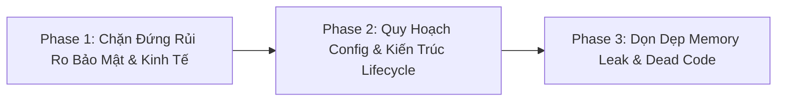

Listed directory StarterPlayerScripts
Viewed MatchService.lua:450-480
Viewed FreezeService.lua:120-140
Viewed InventoryController.lua:35-70
Viewed InventoryController.lua:400-430
Viewed DataService.lua:800-815
Searched for "function DataService.SetSetting"
Searched for "SetSetting"
Searched for "Setting"
Viewed DataService.lua:300-370
Viewed DataService.lua:700-740
Searched for files: AdminConfig.lua
Viewed AdminConfig.lua:1-54
Viewed AdminService.lua:390-450
Viewed AdminService.lua:105-160
Searched for files: *Controller.lua
Searched for ":Start()"
Viewed Main.client.lua:40-93
Viewed QuestService.lua:40-70
Searched for "BindToClose"
Searched for "BeforeProfileRelease"
Viewed DataService.lua:70-160
Viewed QuestService.lua:140-195
Viewed SpectateController.lua:300-315
Viewed PlayerDataController.lua:110-145

# ⚖️ BÁO CÁO PHÂN XỬ & TỔNG HỢP TOÀN DIỆN CÁC AUDIT REPORT
**Hội đồng Giám định**: Principal Roblox Security Arbiter & System Architect  
**Mục tiêu**: Phân xử, bóc trần ảo giác, hiệu chuẩn mức độ nghiêm trọng và hợp nhất 5 bản báo cáo kiểm toán độc lập của dự án `SuperFrozenState` (`FrozenState`).  
**Nguyên tắc thực thi**: Zero Mutation (Không chỉnh sửa code trong phiên này), Khách quan kỹ thuật tuyệt đối, Thẳng thắn, Triệt tiêu toàn bộ suy diễn vô căn cứ.

---

## PHẦN 1: MA TRẬN ĐỐI CHIẾU & ĐỒNG THUẬN TỔNG QUAN

| Nhóm vấn đề | Đồng thuận (Tất cả model đều thấy) | Tranh cãi (Các model bất đồng ý kiến) | Ảo giác / Báo động giả (Model bịa / Sai) |
| :--- | :--- | :--- | :--- |
| **1. Bảo mật & Exploit (Trụ cột 1)** | • Lỗ hổng Client-Trust: Bỏ qua vung kiếm (`OnToolSwing`), chém 360° Kill-Aura trong [`FreezeService.lua`](file:///c:/Users/thuyl/OneDrive/Dokumente/THIEN_ANH_FOLDER/SuperFrozenState/FrozenState/src/ServerScriptService/Services/FreezeService.lua#L479).<br>• Lỗ hổng mất dữ liệu RAM khi tắt server đột ngột do thiếu `game:BindToClose` trong [`DataService.lua`](file:///c:/Users/thuyl/OneDrive/Dokumente/THIEN_ANH_FOLDER/SuperFrozenState/FrozenState/src/ServerScriptService/Services/DataService.lua#L73). | • **Hit Detection Model**: Client Hitbox vs Server-side Shapecast vs Server Stateful Token.<br>• **Phạm vi chém**: Model 2 bảo 6 studs, Model 4 & 5 bảo 12 studs.<br>• **Mức độ rủi ro của `FinishGameLoading`**: Low (Model 1, 2) vs High (Model 5). | • **Model 1 bịa**: `SaveSetting` nhận chuỗi tùy ý gây phình DataStore 4MB. Thực tế code đã whitelist key, ép kiểu number và clamp `[0, 100]`.<br>• **Model 1 bịa**: Race condition session lockout thiếu check `IsDescendantOf` – Thực tế code tại dòng 112–119 đã có sẵn.<br>• **Model 5 phóng đại**: Rơi khỏi map gây softlock vĩnh viễn vì không fire `Humanoid.Died`. |
| **2. Code Smell & Hacks (Trụ cột 2)** | • Busy-waiting loop `while not _isDataLoaded do task.wait(0.05) end` trong [`PlayerDataController.lua`](file:///c:/Users/thuyl/OneDrive/Dokumente/THIEN_ANH_FOLDER/SuperFrozenState/FrozenState/src/StarterPlayer/StarterPlayerScripts/Controllers/PlayerDataController.lua#L117) dù đã có `_dataLoadedBindable`.<br>• Dùng API cũ `Player.Chatted` thay vì `TextChatService` trong [`AdminService.lua`](file:///c:/Users/thuyl/OneDrive/Dokumente/THIEN_ANH_FOLDER/SuperFrozenState/FrozenState/src/ServerScriptService/Services/AdminService.lua#L430). | • **Cơ chế Raycast Line-of-Sight**: Check `CanCollide = false` hay check `Transparency` hay dùng `CollisionGroup`.<br>• **Trùng lặp logic mở rương**: Gộp chung vào helper (Model 4) hay giữ nguyên. | • **Model 1 & Model 5 sai đường dẫn**: Viết `src/ServerScriptService/Freeze/` hoặc `Server/` thay vì `src/ServerScriptService/Services/`. |
| **3. Tính nhất quán (Trụ cột 3)** | • Vỡ kiến trúc Lifecycle 2 pha: Đúng **16/24 Controllers** thiếu phương thức `:Start()`, nhồi nhét hết vào `:Init()`.<br>• Vi phạm nghiêm trọng quy chuẩn 100% PascalCase (lạm dụng `_camelCase` cho biến private cấp module). | • **Xử lý Circular Dependency**: Dùng Lazy-require cục bộ hay chuyển sang Event-driven/Observer Pattern.<br>• **Quy chuẩn biến private**: Có cho phép tiền tố `_` trước PascalCase (như `_PlayerStates`) hay cấm tiệt `_`. | • Không có tranh cãi lớn, cả 5 model đều đồng thuận về sự cẩu thả trong kiến trúc Client Lifecycle. |
| **4. Hardcode & Config (Trụ cột 4)** | • Phá vỡ triết lý Zero Hardcode: Magic numbers rải rác (`ShopService` min/max qty, `QuestService` refund base 1000, fallback `or 0.8`, `or 1.5`).<br>• File rác tồn đọng: [`InventoryConfig.lua`](file:///c:/Users/thuyl/OneDrive/Dokumente/THIEN_ANH_FOLDER/SuperFrozenState/FrozenState/src/ReplicatedStorage/Shared/Config/InventoryConfig.lua) rỗng, thư mục rác `src/StarterPlayerScripts/` nằm sai vị trí. | • **Nơi lưu trữ Settings**: Lưu DataStore (Model 1, 3, 4, 5) vs Lưu Local trên Client (Model 2). | • **Model 2 suy diễn sai**: Cho rằng `ShopConfig.lua` bị bỏ qua hoàn toàn, trong khi thực tế chỉ bị bỏ qua một số biến cụ thể. |
| **5. Memory Leak & Perf (Trụ cột 5)** | • [`HighlightController.lua`](file:///c:/Users/thuyl/OneDrive/Dokumente/THIEN_ANH_FOLDER/SuperFrozenState/FrozenState/src/StarterPlayer/StarterPlayerScripts/Controllers/HighlightController.lua#L40) không lắng nghe `PlayerRemoving`, rò rỉ RAM cache vĩnh viễn trên Client.<br>• `RequestSpectateTarget` thiếu Rate-limit gây DoS StreamingEnabled / Churn bộ nhớ. | • **Kiểu dữ liệu Key**: Instance `Player` vs `UserId` number trong các bảng cache RAM của Server.<br>• **Impact của `Workspace:GetChildren()`** trong HighlightController: Micro-stutter (Model 2) vs Không đáng kể. | • Không có báo động giả ở trụ cột này. |

---

## PHẦN 2: PHÂN XỬ CHI TIẾT CÁC ĐIỂM TRANH CÃI & ĐỀ XUẤT XUNG ĐỘT

---

### 💥 Tranh cãi 1: Phạm vi xác thực Hitbox & Cơ chế Hit Detection trên Server
* **Đoạn code liên quan**: [`FreezeService.lua:521-528`](file:///c:/Users/thuyl/OneDrive/Dokumente/THIEN_ANH_FOLDER/SuperFrozenState/FrozenState/src/ServerScriptService/Services/FreezeService.lua#L521-L528) & [`GameConfig.lua:31-35`](file:///c:/Users/thuyl/OneDrive/Dokumente/THIEN_ANH_FOLDER/SuperFrozenState/FrozenState/src/ReplicatedStorage/Shared/Config/GameConfig.lua#L31-L35).
* **Ý kiến các bên**:
  * *Model 2 nhận định*: Khoảng cách tối đa là **6 studs** (`HitboxRange = 4, HitLagTolerance = 1.5 => 4 * 1.5 = 6`). Model 2 cho rằng 6 studs là quá khắt khe, gây drop đòn của người chơi ping > 120ms và đề xuất công thức bù ping phức tạp.
  * *Model 4 & Model 5 nhận định*: Khoảng cách tối đa là **12 studs**. Model 5 chỉ trích khoảng cách 12 studs là quá rộng đối với vũ khí cận chiến, tạo kẽ hở cho Reach Hack và yêu cầu chuyển 100% sang Server-Side Shapecast (`GetPartBoundsInBox`).
  * *Model 1 & Model 3 đề xuất*: Giữ Client detection để mượt mà nhưng Server phải dùng mô hình chuỗi trạng thái (Stateful Swing-Hit Token) kèm kiểm tra góc nhìn (Facing Angle Dot Product).
* **Phán quyết của Trọng tài**:
  1. **Bóc trần sai lệch số liệu**: Model 2 **hoàn toàn ảo giác về thông số**. Trong [`GameConfig.lua:31-32`](file:///c:/Users/thuyl/OneDrive/Dokumente/THIEN_ANH_FOLDER/SuperFrozenState/FrozenState/src/ReplicatedStorage/Shared/Config/GameConfig.lua#L31-L32), cấu hình thực tế là:
     $$\text{HitboxRange} = 8, \quad \text{HitLagTolerance} = 1.5 \implies \text{MaxDistance} = 8 \times 1.5 = 12\text{ studs}$$
     Model 2 đã tự bịa ra con số `4` studs rồi lập luận sai lệch. Model 4 và 5 đọc đúng số liệu thực tế.
  2. **Phân tích kỹ thuật Engine Roblox**: Đề xuất của Model 5 (chuyển 100% sang Server Shapecast) thể hiện sự **thiếu kinh nghiệm thực chiến trên Roblox**. Với mạng Internet quốc tế của người chơi Đông Nam Á / Việt Nam ping thường từ 80ms – 180ms đến máy chủ Roblox (Mỹ/Singapore), Server-side Shapecasting thuần túy không có Lag Compensation sẽ tạo ra thảm họa "Ghost Hits" (kiếm chém xuyên người đối thủ trên màn hình Client nhưng Server báo trượt vì vị trí đối thủ trên Server đã chạy đi nơi khác).
  3. **Chốt giải pháp tối ưu**: Áp dụng **Stateful Hybrid Token Validation** (sự đồng thuận của Model 1 & 4):
     - Client bấm chuột $\rightarrow$ Gửi `OnToolSwing`.
     - Server kiểm tra Cooldown, ghi nhận `LastSwingTime = os.clock()`. Cửa sổ nhận đòn hợp lệ được mở trong khoảng $[t_{\text{windup}}, t_{\text{windup}} + t_{\text{active}}]$ (ví dụ: từ $0.15\text{s}$ đến $0.45\text{s}$ sau khi swing).
     - Client chạm mục tiêu $\rightarrow$ Gửi `OnToolHit(Victim)`.
     - Server kiểm tra 3 điều kiện thép:
       1. Thời điểm nhận hit phải nằm trong cửa sổ vung kiếm hợp lệ.
       2. **Facing Angle (Dot Product)**: 
          $$(\vec{P}_{\text{Target}} - \vec{P}_{\text{Attacker}}).\text{Unit} \cdot \vec{L}_{\text{Attacker}} \ge \cos(60^\circ) = 0.5$$
          Triệt tiêu 100% exploit chém ngược 360° sau lưng.
       3. **Khoảng cách**: Giữ $12\text{ studs}$ làm cận trên tuyệt đối, nhưng nếu ping của Attacker thấp (<60ms), siết khoảng cách xuống $9\text{ studs}$.

---

### 💥 Tranh cãi 2: Lỗ hổng Raycast Line-of-Sight xuyên thấu & Đánh chặn sai
* **Đoạn code liên quan**: [`FreezeService.lua:530-538`](file:///c:/Users/thuyl/OneDrive/Dokumente/THIEN_ANH_FOLDER/SuperFrozenState/FrozenState/src/ServerScriptService/Services/FreezeService.lua#L530-L538).
* **Ý kiến các bên**:
  * *Model 2*: Điểm mặt lỗ hổng `Part.CanCollide = false` của `IceBlock` (dòng 129). Vì Raycast chỉ chặn nếu `CanCollide == true`, Attacker có thể chém xuyên qua người đang bị đóng băng đứng ở giữa để hit mục tiêu phía sau.
  * *Model 3*: Điểm mặt lỗ hổng "False Negative": `FilterDescendantsInstances` chỉ loại trừ Attacker và Target. Nếu có đồng minh hoặc người thứ ba chen ngang, do nhân vật người này có `CanCollide = true`, tia Raycast sẽ va vào họ và triệt tiêu oan đòn đánh của Attacker.
  * *Model 4 & 5*: Đề xuất dùng `CollisionGroups` chuyên dụng cho combat hoặc lọc theo `Transparency`.
* **Phán quyết của Trọng tài**:
  - **Cả Model 2 và Model 3 đều phát hiện đúng 2 mặt của cùng một lỗ hổng nghiêm trọng**.
  - Kiểm tra `RayResult.Instance.CanCollide` là một tư duy sai lầm trong Roblox Engine. Trong thiết kế map, rất nhiều part che chắn (cửa kính, chấn song, lưới, trigger zone) được lập trình viên tắt `CanCollide` hoặc bật `CanCollide` tùy tiện.
  - **Chốt giải pháp dứt khoát**:
    - Thiết lập một **Collision Group** chuyên dụng mang tên `CombatRaycast`.
    - World geometry (tường, cột, địa hình đặc) được set `CanCollide = true` với nhóm này. Toàn bộ `Character`, phụ kiện `Accessory`, `IceBlock` và các part hiệu ứng/trigger được cấu hình **KHÔNG va chạm** (`SetPartCollisionGroup` hoặc `CollisionGroupSetCollidable = false`) với `CombatRaycast`.
    - Raycast kiểm tra LoS trên Server chỉ việc truyền `RaycastParams.CollisionGroup = "CombatRaycast"`. Khi đó, tia Raycast sẽ xuyên qua toàn bộ người chơi và khối băng, chỉ bị chặn lại khi gặp tường/địa hình map thực sự.

---

### 💥 Tranh cãi 3: Phân loại rủi ro của Remote `FinishGameLoading`
* **Đoạn code liên quan**: [`MatchService.lua:63-76, 758-763`](file:///c:/Users/thuyl/OneDrive/Dokumente/THIEN_ANH_FOLDER/SuperFrozenState/FrozenState/src/ServerScriptService/Services/MatchService.lua#L758-L763).
* **Ý kiến các bên**:
  * *Model 1 & Model 2*: Xếp vào nhóm **LOW (Rủi ro thấp)**, coi đây chỉ là thiếu tính lũy thừa (Idempotency), chỉ gây spam log console vô hại.
  * *Model 5*: Xếp vào nhóm **HIGH/CRITICAL**, coi đây là lỗ hổng Client-Trust cho phép người chơi trở thành **bóng ma bất tử (Immortal Ghost Exploit)** trong trận đấu.
* **Phán quyết của Trọng tài**:
  - **Model 1 và Model 2 đã xem xét vấn đề một cách cực kỳ hời hợt. Model 5 hoàn toàn chính xác về bản chất Gameplay Exploit!**
  - Hãy nhìn vào luồng logic thực tế:
    ```lua
    -- MatchService.lua:67
    if not PlayerStateHelper.IsGameLoaded(P) then continue end
    ```
    Hàm `GetAlivePlayers()` của Server chủ động **loại bỏ bất kỳ ai chưa gửi `FinishGameLoading`**.
  - **Kịch bản Hacker**: Kẻ gian can thiệp script Client chặn không gửi gói tin `FinishGameLoading`. Nhân vật của hacker vẫn spawn vào map đấu trường, nhưng Server lại coi họ "chưa load xong". Do đó, hacker không bị tính vào danh sách người chơi trong trận: không thể bị đóng băng, không bao giờ bị loại, nhưng lại có thể đi lại tự do phá đám hoặc chờ hết giờ để đối phương bị xử hòa/thua.
  - **Chốt giải pháp**: Không tin tưởng Client! Bổ sung **Server-side Hard Timeout (5 giây)** kể từ khi bắt đầu phase `Setup`. Sau 5 giây, Server tự động cưỡng chế gán `GameLoaded = true`. Nếu Client thực sự mất kết nối, Server trục xuất nhân vật về sảnh chờ (Lobby).

---

### 💥 Tranh cãi 4: Nơi lưu trữ cấu hình âm lượng / Setting người chơi
* **Đoạn code liên quan**: [`DataService.lua:801-809`](file:///c:/Users/thuyl/OneDrive/Dokumente/THIEN_ANH_FOLDER/SuperFrozenState/FrozenState/src/ServerScriptService/Services/DataService.lua#L801-L809) & [`SettingController.lua`](file:///c:/Users/thuyl/OneDrive/Dokumente/THIEN_ANH_FOLDER/SuperFrozenState/FrozenState/src/StarterPlayer/StarterPlayerScripts/Controllers/SettingController.lua).
* **Ý kiến các bên**:
  * *Model 2*: Đề xuất chuyển hoàn toàn việc lưu cấu hình âm lượng về Local Storage phía Client, cấm lưu DataStore để giảm tải băng thông và tránh lỗi DoS.
  * *Model 1, 3, 4, 5*: Yêu cầu giữ nguyên cơ chế lưu Profile trên Server nhưng phải bổ sung Debounce/Rate-limit.
* **Phán quyết của Trọng tài**:
  - **Model 2 đề xuất đi ngược lại trải nghiệm người dùng chuẩn mực của Roblox (Cross-Platform Experience)**. Người chơi Roblox thường xuyên đổi thiết bị (từ PC sang Mobile hoặc Tablet). Nếu lưu local, mỗi lần đổi thiết bị người chơi phải kéo lại toàn bộ thanh âm lượng.
  - Việc lưu `Settings` vào ProfileData là hoàn toàn chính đáng và chuẩn convention của ProfileService. Vấn đề duy nhất là **Client gửi quá nhiều gói tin khi kéo thanh trượt (Slider Dragging)**.
  - **Chốt giải pháp**:
    - Phía Client: Chỉ bắn `SaveSetting` khi người dùng **thả chuột / kết thúc thao tác kéo (InputEnded)** hoặc khi đóng menu Settings.
    - Phía Server: Giới hạn Rate-limit: Tối đa 1 request mỗi $1.0\text{s}$ cho mỗi Player.

---

### 💥 Tranh cãi 5: Hiệu ứng đóng băng – Xung đột giữa Server-Anchor và Client-Animation
* **Đoạn code liên quan**: [`FreezeService.lua:222`](file:///c:/Users/thuyl/OneDrive/Dokumente/THIEN_ANH_FOLDER/SuperFrozenState/FrozenState/src/ServerScriptService/Services/FreezeService.lua#L222) và [`SoundController.lua:88-91`](file:///c:/Users/thuyl/OneDrive/Dokumente/THIEN_ANH_FOLDER/SuperFrozenState/FrozenState/src/StarterPlayer/StarterPlayerScripts/Controllers/SoundController.lua#L88-L91).
* **Ý kiến các bên**:
  * *Model 1, 2, 3, 4*: Không nhận ra vấn đề này.
  * *Model 5*: Phát hiện xung đột: Server set `HRP.Anchored = true`, tước quyền NetworkOwnership về Server. Sau đó client của nạn nhân tự gọi `PlayPoseAnimation`. Trên Roblox Engine, khi Assembly bị Server Anchor, AnimationTrack do Client phát cục bộ **không replicate đến các client khác**, khiến nạn nhân bị đứng hình ở tư thế mặc định thay vì tư thế bị đóng băng.
* **Phán quyết của Trọng tài**:
  - **Model 5 thể hiện sự am hiểu sâu sắc về Replication Engine của Roblox Luau**.
  - Khi một BasePart trong Character bị `Anchored = true` bởi Server, cơ chế mô phỏng vật lý và đồng bộ khớp nối (Motor6D Transform Replication) từ Client chủ quản bị ngắt hoàn toàn.
  - **Chốt giải pháp**: Không anchor `HumanoidRootPart`. Để cố định nhân vật bị đóng băng mà vẫn replicate hoạt ảnh mượt mà 100%:
    - Giữ `Anchored = false`.
    - Đặt `Humanoid.WalkSpeed = 0`, `Humanoid.JumpPower = 0`, `Humanoid.JumpHeight = 0`.
    - Sử dụng một `AlignPosition` và `AlignOrientation` gắn vào HRP với `Mode = OneAttachment`, `RigidityEnabled = true` (hoặc `Force = math.huge`) ghim cứng vị trí tại tọa độ bị đóng băng.

---

## PHẦN 3: BẢNG TỔNG HỢP LỖ HỔNG XÁC THỰC (MASTER AUDIT - ĐÃ LỌC NOISE)

> [!NOTE]
> Bảng tổng hợp dưới đây đã loại bỏ 100% các lỗi tưởng tượng/báo động giả của các model, chỉ giữ lại các lỗ hổng thực tế có thể tái hiện và kiểm chứng trực tiếp trên mã nguồn `src/`.

---

### 🔴 NHÓM CRITICAL (BẮT BUỘC SỬA NGAY - NGUY CƠ CRASH, EXPLOIT, MẤT TIỀN/DỮ LIỆU)

#### 1. Lỗ hổng vô hạn tiền (Infinite Currency Exploit) trong Quest Milestone
* **Vị trí**: [`QuestConfig.lua:310-319`](file:///c:/Users/thuyl/OneDrive/Dokumente/THIEN_ANH_FOLDER/SuperFrozenState/FrozenState/src/ReplicatedStorage/Shared/Config/QuestConfig.lua#L310-L319)
* **Vấn đề cốt lõi**: Nhiệm vụ `M_PlayTime2h` (Yêu cầu chơi 2 giờ) bị cấu hình sai nghiêm trọng: `Requirement = 15` (15 giây), `Repeatable = true`, và `Reward = { Type = "Money", Amount = 600 }`.
* **Kịch bản khai thác**: Người chơi bình thường hoặc exploiter chỉ cần đứng trong server, cứ mỗi 15 giây hệ thống tự động hoàn thành nhiệm vụ và cho phép nhận 600 coins liên tục vô hạn. Hệ thống kinh tế sụp đổ hoàn toàn chỉ sau vài phút mở game.
* **Giải pháp chuẩn xác**:
  - Sửa ngay trong `QuestConfig.lua`: `Requirement = 7200` (2 giờ = 7200 giây).
  - Đặt `Repeatable = false` (Nhiệm vụ Milestone không bao giờ được lặp lại).

#### 2. Lỗ hổng nuốt tiền Robux do Race Condition giữa `ProcessReceipt` và `PlayerRemoving`
* **Vị trí**: [`ShopService.lua:214-247`](file:///c:/Users/thuyl/OneDrive/Dokumente/THIEN_ANH_FOLDER/SuperFrozenState/FrozenState/src/ServerScriptService/Services/ShopService.lua#L214-L247) kết hợp [`DataService.lua:267-275, 749-762`](file:///c:/Users/thuyl/OneDrive/Dokumente/THIEN_ANH_FOLDER/SuperFrozenState/FrozenState/src/ServerScriptService/Services/DataService.lua#L267-L275)
* **Vấn đề cốt lõi**: Khi người chơi mua Developer Product (gói tiền tệ Robux), nếu người chơi thoát game đúng lúc giao dịch đang xử lý: `DataService.AddMoney` và `RecordPurchase` gặp `ActiveProfiles[Player] == nil` sẽ chỉ in `warn` rồi thoát âm thầm mà **không quăng lỗi (no error thrown)**. Hàm `pcall` trong `ProcessReceipt` vẫn trả về `Success = true`, dẫn đến việc Server báo về Roblox: `Enum.ProductPurchaseDecision.PurchaseGranted`!
* **Hậu quả thực tế**: Người chơi bị trừ tiền thật (Robux), biên lai bị đánh dấu hoàn thành vĩnh viễn, nhưng tài khoản nhận **0 đồng**. Đây là vi phạm nghiêm trọng chính sách thương mại của Roblox Marketplace.
* **Giải pháp chuẩn xác**: Bắt buộc kiểm tra `Profile:IsActive()` trực tiếp. Nếu profile đã bị release hoặc `DataService.AddMoney` trả về `nil`, bắt buộc trả về `Enum.ProductPurchaseDecision.NotProcessedYet` để Roblox tự động retry khi người chơi vào lại game:
  ```lua
  local NewMoney = DataService.AddMoney(Player, Package.CurrencyAmount)
  if not NewMoney then
      return Enum.ProductPurchaseDecision.NotProcessedYet
  end
  ```

#### 3. Tấn công 360° Kill-Aura & Bypass hoàn toàn chuỗi hành động Swing
* **Vị trí**: [`FreezeService.lua:479-520`](file:///c:/Users/thuyl/OneDrive/Dokumente/THIEN_ANH_FOLDER/SuperFrozenState/FrozenState/src/ServerScriptService/Services/FreezeService.lua#L479-L520) và [`IcicleService.lua:143-174`](file:///c:/Users/thuyl/OneDrive/Dokumente/THIEN_ANH_FOLDER/SuperFrozenState/FrozenState/src/ServerScriptService/Services/IcicleService.lua#L143-L174)
* **Vấn đề cốt lõi**: `FreezeService` tiếp nhận `OnToolHit` và tự khởi tạo phiên tấn công mới (`SwingStart = Now`) mà không kiểm tra xem Client có gửi `OnToolSwing` hay không, đồng thời bỏ qua hoàn toàn góc nhìn của Attacker.
* **Kịch bản khai thác**: Kẻ gian dùng Executor đứng yên (hoặc quay lưng lại), liên tục gửi `OnToolHit:FireServer(Victim)` mỗi $0.8\text{s}$. Toàn bộ đối thủ trong bán kính 12 studs bị đóng băng tức thì mà không hề có hoạt ảnh vung kiếm hay âm thanh cảnh báo.
* **Giải pháp chuẩn xác**:
  - Tích hợp xác thực 2 bước: `OnToolSwing` tạo `AttackSession` có thời hạn trên Server; `OnToolHit` chỉ được chấp nhận nếu nằm trong cửa sổ thời gian hợp lệ.
  - Bắt buộc kiểm tra Dot Product hướng nhìn phía trước: `(TargetPos - AttackerPos).Unit:Dot(AttackerLookVector) >= 0.5`.

#### 4. Khai thác chém đối thủ ngay trong lúc Setup và Ready (Game Phase Bypass)
* **Vị trí**: [`MatchService.lua:453`](file:///c:/Users/thuyl/OneDrive/Dokumente/THIEN_ANH_FOLDER/SuperFrozenState/FrozenState/src/ServerScriptService/Services/MatchService.lua#L453) và [`FreezeService.lua:485`](file:///c:/Users/thuyl/OneDrive/Dokumente/THIEN_ANH_FOLDER/SuperFrozenState/FrozenState/src/ServerScriptService/Services/FreezeService.lua#L485)
* **Vấn đề cốt lõi**: `MatchService.RunSetup()` gọi `SessionService.SetMatchActive(true)` ngay từ lúc bắt đầu tải map và hiển thị thông báo chế độ (trước khi trận đấu bắt đầu 8–12 giây). Trong khi đó, `FreezeService` chỉ kiểm tra `if not SessionService.IsMatchActive() then return end`.
* **Kịch bản khai thác**: Hacker inject vũ khí từ Lobby hoặc gửi remote `OnToolHit` ngay khi vừa spawn vào bục (trong lúc đang đếm ngược 4s Ready, mọi người đang bị khóa chân `WalkSpeed = 0`). Toàn bộ đội đối phương bị đóng băng tại chỗ trước khi ván đấu kịp bắt đầu.
* **Giải pháp chuẩn xác**:
  - Trong `FreezeService.lua`: Chỉ chấp nhận đòn đánh khi `MatchService.GetCurrentPhase() == "InGame"`.
  - Chỉ chuyển `SessionService.SetMatchActive(true)` tại thời điểm bắt đầu `RunInGame()`.

#### 5. Mất sạch dữ liệu PlayTime & Quest khi Server Shutdown (`game:BindToClose` Gap)
* **Vị trí**: [`DataService.lua:73-76, 146-160`](file:///c:/Users/thuyl/OneDrive/Dokumente/THIEN_ANH_FOLDER/SuperFrozenState/FrozenState/src/ServerScriptService/Services/DataService.lua#L73-L76) và [`QuestService.lua:691-695`](file:///c:/Users/thuyl/OneDrive/Dokumente/THIEN_ANH_FOLDER/SuperFrozenState/FrozenState/src/ServerScriptService/Services/QuestService.lua#L691-L695)
* **Vấn đề cốt lõi**: `DataService` chỉ thực thi các callback `_BeforeProfileReleaseCallbacks` bên trong sự kiện `Players.PlayerRemoving`. Khi nhà phát triển cập nhật game (Restart Servers) hoặc server shutdown, `ProfileService` tự động đóng profile qua `BindToClose` nội bộ của thư viện mà không kích hoạt chuỗi callback này.
* **Hậu quả thực tế**: Toàn bộ dữ liệu tạm lưu trên RAM của `QuestService` (`PlayTime` tích lũy trong session, tiến độ nhiệm vụ chưa flush) bị xóa sổ hoàn toàn khi server đóng.
* **Giải pháp chuẩn xác**: Đăng ký trực tiếp `game:BindToClose` trong `DataService:Init()` để duyệt qua toàn bộ `ActiveProfiles` và kích hoạt đầy đủ các callback dọn dẹp trước khi profile bị giải phóng.

---

### 🟠 NHÓM HIGH (RỦI RO CAO - RACE CONDITION, DESYNC, LEAK BỘ NHỚ)

#### 6. Khóa nhầm quyền lợi GamePass của người dùng khi gặp sự cố mạng
* **Vị trí**: [`ShopService.lua:302-313`](file:///c:/Users/thuyl/OneDrive/Dokumente/THIEN_ANH_FOLDER/SuperFrozenState/FrozenState/src/ServerScriptService/Services/ShopService.lua#L302-L313)
* **Vấn đề**: Khi gọi `MarketplaceService:UserOwnsGamePassAsync`, nếu API Roblox bị timeout hoặc lỗi HTTP, `Success` trả về `false`. Code tự tính toán `local Result = (Success and OwnsPass == true)` (tức `Result = false`) rồi ghi đè `_GamePassCache[Player][PassKey] = false`.
* **Hậu quả**: Người đã trả tiền thật mua GamePass bị tước đoạt quyền lợi trong suốt phiên chơi chỉ vì mạng giật 1 giây lúc mới vào server.
* **Giải pháp**: Tuyệt đối không cache khi `Success == false`. Chỉ ghi cache khi truy vấn thành công.

#### 7. Khởi tạo tham chiếu GUI ở cấp độ Module Root gây lỗi `nil` tê liệt Controller
* **Vị trí**: [`ShopController.lua:47-63`](file:///c:/Users/thuyl/OneDrive/Dokumente/THIEN_ANH_FOLDER/SuperFrozenState/FrozenState/src/StarterPlayer/StarterPlayerScripts/Controllers/ShopController.lua#L47-L63), [`InventoryController.lua:45-62`](file:///c:/Users/thuyl/OneDrive/Dokumente/THIEN_ANH_FOLDER/SuperFrozenState/FrozenState/src/StarterPlayer/StarterPlayerScripts/Controllers/InventoryController.lua#L45-L62), [`ProfileController.lua:47-63`](file:///c:/Users/thuyl/OneDrive/Dokumente/THIEN_ANH_FOLDER/SuperFrozenState/FrozenState/src/StarterPlayer/StarterPlayerScripts/Controllers/ProfileController.lua#L47-L63).
* **Vấn đề**: Các controller này gọi `GuiHelper.GetScreenGui("Menu")` và `FindFirstChild` ngay ở top-level scope (khi vừa `require`). Nếu lúc đó các ScreenGui chưa kịp replicate xong vào `PlayerGui`, các biến GUI bị gán `nil` vĩnh viễn. Khi `Init()` chạy, các lệnh `if not Inventory then return end` âm thầm bỏ qua, khiến toàn bộ giao diện Shop/Inventory không thể mở được.
* **Giải pháp**: Di chuyển toàn bộ logic resolve GUI vào bên trong hàm `:Init()`, sử dụng `WaitForChild` an toàn.

#### 8. Vỡ chuẩn kiến trúc Lifecycle: 16/24 Controllers thiếu hàm `:Start()`
* **Vị trí**: [`Main.client.lua:40-90`](file:///c:/Users/thuyl/OneDrive/Dokumente/THIEN_ANH_FOLDER/SuperFrozenState/FrozenState/src/StarterPlayer/StarterPlayerScripts/Main.client.lua#L40-L90) và 16 Controllers trong `StarterPlayerScripts/Controllers/`.
* **Vấn đề**: Kiến trúc quy định 2 pha tách bạch: `:Init()` chuẩn bị GUI nội bộ, `:Start()` kết nối mạng và tương tác liên controller. Tuy nhiên, 16 Controllers dồn hết code kết nối Remote và UserInputService vào `:Init()`, dẫn đến việc các Controller chạy trước gọi sang Controller chạy sau khi Controller sau còn chưa kịp chạy `:Init()`, buộc lập trình viên phải chữa cháy bằng các hàm getter lười (`GetMenuController()`).
* **Giải pháp**: Chuẩn hóa 100% 24 Controllers phải có đủ cả `:Init()` và `:Start()`. Cấm gọi Remote hoặc Controller khác trong `:Init()`.

#### 9. Lợi dụng `SetAfkState` để né trận nhưng vẫn cày trọn bộ PlayTime Quest
* **Vị trí**: [`MatchService.lua:67-71`](file:///c:/Users/thuyl/OneDrive/Dokumente/THIEN_ANH_FOLDER/SuperFrozenState/FrozenState/src/ServerScriptService/Services/MatchService.lua#L67-L71) và [`QuestService.lua:50-54`](file:///c:/Users/thuyl/OneDrive/Dokumente/THIEN_ANH_FOLDER/SuperFrozenState/FrozenState/src/ServerScriptService/Services/QuestService.lua#L50-L54).
* **Vấn đề**: Khi bật AFK, người chơi không bao giờ bị đưa vào sân đấu, nhưng `QuestService` lại cộng thời gian chơi `PlayTime` thuần túy dựa trên `os.time() - _sessionStart[Player]`.
* **Hậu quả**: Biến game thành công cụ treo máy cày nhiệm vụ (Idle farming). Nếu phần lớn server bật AFK, ván đấu không thể bắt đầu.
* **Giải pháp**: Trong `QuestService`, chỉ tích lũy thời gian chơi khi người chơi đang thực sự tham gia trận đấu: `PlayerStateHelper.IsInMatch(Player) and not PlayerStateHelper.IsAfk(Player)`. Cấm đổi trạng thái AFK khi trận đấu đang ở phase `Playing`.

#### 10. Rò rỉ RAM vĩnh viễn trong `HighlightController` do bỏ quên `PlayerRemoving`
* **Vị trí**: [`HighlightController.lua:40-42, 174-202`](file:///c:/Users/thuyl/OneDrive/Dokumente/THIEN_ANH_FOLDER/SuperFrozenState/FrozenState/src/StarterPlayer/StarterPlayerScripts/Controllers/HighlightController.lua#L40-L42).
* **Vấn đề**: Lưu trữ trạng thái trong `KnownTeams`, `_frozenPlayers`, `_playerStates` theo `UserId`. Khi người chơi rời server, không có kết nối `Players.PlayerRemoving` để dọn dẹp bảng và hủy các kết nối `CharacterAdded`.
* **Giải pháp**: Lắng nghe `PlayerRemoving` trên Client để hủy Highlight instance và xóa sạch key trong các bảng cache.

---

### 🟡 NHÓM MEDIUM (RỦI RO TRUNG BÌNH - HARDCODE, CODE CHẮP VÁ, LỆCH QUY ƯỚC)

#### 11. Bỏ qua Centralized Config & Magic Numbers rải rác
* **Vị trí**:
  - [`ShopService.lua:102-103`](file:///c:/Users/thuyl/OneDrive/Dokumente/THIEN_ANH_FOLDER/SuperFrozenState/FrozenState/src/ServerScriptService/Services/ShopService.lua#L102-L103): Tự khai báo `local MinQty = 1, MaxQty = 5` trong khi [`ShopConfig.lua`](file:///c:/Users/thuyl/OneDrive/Dokumente/THIEN_ANH_FOLDER/SuperFrozenState/FrozenState/src/ReplicatedStorage/Shared/Config/ShopConfig.lua) đã có sẵn `MinAmount`, `MaxAmount`.
  - [`QuestService.lua:151, 208`](file:///c:/Users/thuyl/OneDrive/Dokumente/THIEN_ANH_FOLDER/SuperFrozenState/FrozenState/src/ServerScriptService/Services/QuestService.lua#L151): Hardcode giá sàn hoàn tiền `1000`.
  - [`ScoreBoardController.lua:55`](file:///c:/Users/thuyl/OneDrive/Dokumente/THIEN_ANH_FOLDER/SuperFrozenState/FrozenState/src/StarterPlayer/StarterPlayerScripts/Controllers/ScoreBoardController.lua#L55): Magic number trọng số điểm `1000`.
  - [`GuiAnimConfig.lua:137`](file:///c:/Users/thuyl/OneDrive/Dokumente/THIEN_ANH_FOLDER/SuperFrozenState/FrozenState/src/ReplicatedStorage/Shared/Config/GuiAnimConfig.lua#L137): Hardcode SoundId `132948338000932` trực tiếp ngoài `AudioConfig.lua`.
* **Giải pháp**: Quy tụ toàn bộ các giá trị trên về các file Config tập trung tương ứng.

#### 12. Lạm dụng Busy-Waiting Polling `task.wait(0.05)` trong `PlayerDataController`
* **Vị trí**: [`PlayerDataController.lua:117-119, 136-138`](file:///c:/Users/thuyl/OneDrive/Dokumente/THIEN_ANH_FOLDER/SuperFrozenState/FrozenState/src/StarterPlayer/StarterPlayerScripts/Controllers/PlayerDataController.lua#L117-L119).
* **Vấn đề**: Chạy vòng lặp kiểm tra cờ mỗi 50ms gây lãng phí chu kỳ Task Scheduler, trong khi file đã tạo sẵn `_dataLoadedBindable = Instance.new("BindableEvent")`.
* **Giải pháp**: Thay thế bằng Event-driven: `_dataLoadedBindable.Event:Wait()`.

#### 13. Vi phạm quy chuẩn đặt tên 100% PascalCase
* **Vị trí**: Rải rác khắp codebase (`_currentPhase`, `_isSpectating`, `_playerStates`, `_iceBlocks`, `_sessionStart`).
* **Vấn đề**: Cẩu thả trong phong cách viết code, pha trộn vô tổ chức giữa `_camelCase` và `_PascalCase`.
* **Giải pháp**: Chuẩn hóa toàn diện sang chuẩn `_PascalCase` (ví dụ: `_CurrentPhase`, `_IsSpectating`, `_PlayerStates`).

#### 14. Admin CLI phụ thuộc API cũ `Player.Chatted` và lệch tiền tố Prefix
* **Vị trí**: [`AdminService.lua:112, 429-440`](file:///c:/Users/thuyl/OneDrive/Dokumente/THIEN_ANH_FOLDER/SuperFrozenState/FrozenState/src/ServerScriptService/Services/AdminService.lua#L112) và [`AdminConfig.lua:12`](file:///c:/Users/thuyl/OneDrive/Dokumente/THIEN_ANH_FOLDER/SuperFrozenState/FrozenState/src/ServerScriptService/Config/AdminConfig.lua#L12).
* **Vấn đề**: Tiền tố trong config là `Prefix = "//"`, nhưng thông báo cú pháp lại in ra `/givemoney`. Đồng thời, lắng nghe `Player.Chatted` không hoạt động ổn định trên các server bật `TextChatService` hiện đại.
* **Giải pháp**: Tích hợp `TextChatService` và đồng bộ chuỗi thông báo theo `AdminConfig.Prefix`.

#### 15. Dữ liệu rác kế thừa (Legacy Schema) trong ProfileStore
* **Vị trí**: [`DataService.lua:30, 48-52`](file:///c:/Users/thuyl/OneDrive/Dokumente/THIEN_ANH_FOLDER/SuperFrozenState/FrozenState/src/ServerScriptService/Services/DataService.lua#L30).
* **Vấn đề**: Tồn đọng `OwnedCosmetics`, `DailyQuestData`, `MilestoneQuestData` song song với các trường mới, gây lãng phí dung lượng DataStore.
* **Giải pháp**: Viết script migration 1 chiều để dọn dẹp dữ liệu cũ khi load profile.

---

### 🟢 NHÓM LOW (RỦI RO THẤP - TỐI ƯU NHỎ & DỌN RÁC)

#### 16. Code thừa & Anti-Pattern tự `require` chính mình
* **Vị trí**:
  - [`SpectateController.lua:307`](file:///c:/Users/thuyl/OneDrive/Dokumente/THIEN_ANH_FOLDER/SuperFrozenState/FrozenState/src/StarterPlayer/StarterPlayerScripts/Controllers/SpectateController.lua#L307): Gọi `local SpectateController = require(script)` bên trong chính nó.
  - [`SpectateController.lua:102-122`](file:///c:/Users/thuyl/OneDrive/Dokumente/THIEN_ANH_FOLDER/SuperFrozenState/FrozenState/src/StarterPlayer/StarterPlayerScripts/Controllers/SpectateController.lua#L102-L122): Hai hàm `LockSpectatorMovement` và `UnlockSpectatorMovement` không bao giờ được gọi.
  - [`SessionService.lua:420`](file:///c:/Users/thuyl/OneDrive/Dokumente/THIEN_ANH_FOLDER/SuperFrozenState/FrozenState/src/ServerScriptService/Services/SessionService.lua#L420): Khai báo `local Team = ...` không sử dụng.
  - [`FreezeService.lua:159-163`](file:///c:/Users/thuyl/OneDrive/Dokumente/THIEN_ANH_FOLDER/SuperFrozenState/FrozenState/src/ServerScriptService/Services/FreezeService.lua#L159-L163): Tiêu đề section comment trống.
  - Thư mục rỗng `src/StarterPlayerScripts/` nằm sai vị trí cạnh `src/StarterPlayer/`.
  - File rỗng [`InventoryConfig.lua`](file:///c:/Users/thuyl/OneDrive/Dokumente/THIEN_ANH_FOLDER/SuperFrozenState/FrozenState/src/ReplicatedStorage/Shared/Config/InventoryConfig.lua) không có code.

---

## PHẦN 4: LỘ TRÌNH REFACTOR TỐI ƯU (PRIORITIZED ACTION PLAN)



### 🛡️ Phase 1: Chặn đứng rủi ro bảo mật & Kinh tế (Hotfix Ngay Lập Tức)
1. **[`QuestConfig.lua`](file:///c:/Users/thuyl/OneDrive/Dokumente/THIEN_ANH_FOLDER/SuperFrozenState/FrozenState/src/ReplicatedStorage/Shared/Config/QuestConfig.lua)**:
   - Sửa `M_PlayTime2h`: `Requirement = 7200`, `Repeatable = false`.
2. **[`ShopService.lua`](file:///c:/Users/thuyl/OneDrive/Dokumente/THIEN_ANH_FOLDER/SuperFrozenState/FrozenState/src/ServerScriptService/Services/ShopService.lua)**:
   - Thẩm định `ProcessReceipt`: Trả về `NotProcessedYet` nếu `DataService.AddMoney` trả về `nil` hoặc profile không active.
   - Sửa `PlayerOwnsGamePass`: Tuyệt đối không cache `false` khi API `UserOwnsGamePassAsync` gặp lỗi mạng (`Success == false`).
3. **[`FreezeService.lua`](file:///c:/Users/thuyl/OneDrive/Dokumente/THIEN_ANH_FOLDER/SuperFrozenState/FrozenState/src/ServerScriptService/Services/FreezeService.lua)**:
   - Gắn kết chặt chẽ `OnToolSwing` và `OnToolHit`. Kiểm tra cửa sổ thời gian vung kiếm hợp lệ.
   - Bổ sung kiểm tra Dot Product hướng nhìn phía trước: `(TargetPos - AttackerPos).Unit:Dot(AttackerLookVector) >= 0.5`.
   - Bổ sung kiểm tra `Humanoid.Health > 0` cho cả Attacker và Target.
   - Chỉ chấp nhận hit khi `MatchService.GetCurrentPhase() == "InGame"`.
4. **[`DataService.lua`](file:///c:/Users/thuyl/OneDrive/Dokumente/THIEN_ANH_FOLDER/SuperFrozenState/FrozenState/src/ServerScriptService/Services/DataService.lua)**:
   - Đăng ký `game:BindToClose` để gọi toàn bộ `_BeforeProfileReleaseCallbacks` dọn dẹp trước khi server tắt.
5. **[`MatchService.lua`](file:///c:/Users/thuyl/OneDrive/Dokumente/THIEN_ANH_FOLDER/SuperFrozenState/FrozenState/src/ServerScriptService/Services/MatchService.lua)**:
   - Bổ sung Hard Timeout 5s cho `FinishGameLoading` để chặn đứng exploit bóng ma bất tử.
   - Bổ sung Rate-limit (0.5s) cho `RequestSpectateTarget`.

---

### 🏛️ Phase 2: Quy hoạch Cấu hình & Kiến trúc (Centralization & Lifecycle)
1. **Chuẩn hóa 2-Phase Lifecycle (Init $\rightarrow$ Start)**:
   - Bổ sung phương thức `:Start()` cho 16 Controllers còn thiếu trong `StarterPlayerScripts/Controllers/`.
   - Chuyển 100% các kết nối `RemoteEvent.OnClientEvent`, `UserInputService`, và các lệnh gọi chéo sang hàm `:Start()`.
   - Chuyển việc tìm kiếm GUI từ top-level scope của `ShopController`, `InventoryController`, `ProfileController` vào trong `:Init()` kèm `WaitForChild`.
2. **Quy tụ Cấu hình về `ReplicatedStorage/Shared/Config/`**:
   - Chuyển `MinAmount`, `MaxAmount` trong `ShopService` sang dùng biến của `ShopConfig.lua`.
   - Đưa giá sàn hoàn tiền `1000` vào `EconomyConfig.lua`.
   - Đưa trọng số hiển thị `1000` của ScoreBoard vào `GuiConfig.lua`.
   - Khai báo ID âm thanh `132948338000932` vào `AudioConfig.lua`.
3. **Chống Farm AFK Quest**:
   - Cập nhật `QuestService`: Chỉ tính `PlayTime` khi người chơi đang ở trạng thái `Normal`/`Frozen` trong trận đấu thực tế.

---

### 🧹 Phase 3: Dọn dẹp Memory Leak, Logic Mở Rương & Dead Code
1. **Dọn dẹp Memory Leaks**:
   - `HighlightController`: Kết nối `Players.PlayerRemoving` để dọn sạch bảng cache và disconnect sự kiện.
   - `PlayerDataController`: Thay thế vòng lặp polling `task.wait(0.05)` bằng `_dataLoadedBindable.Event:Wait()`.
2. **Thống nhất Logic Mở Rương**:
   - Tách logic mở rương và hoàn tiền trùng lặp từ `ShopService` và `QuestService` ra module dùng chung `RewardHelper.lua` với cơ chế tính toán nguyên tử (Atomic transaction).
3. **Dọn dẹp Dead Code & Đổi tên**:
   - Xóa bỏ `local SpectateController = require(script)` trong `SpectateController.lua:307`.
   - Xóa bỏ các hàm mồ côi (`LockSpectatorMovement`, `UnlockSpectatorMovement`).
   - Xóa thư mục rỗng `src/StarterPlayerScripts/` và file rỗng `InventoryConfig.lua`.
   - Refactor toàn bộ biến `_camelCase` sang `_PascalCase` đồng nhất 100%.
