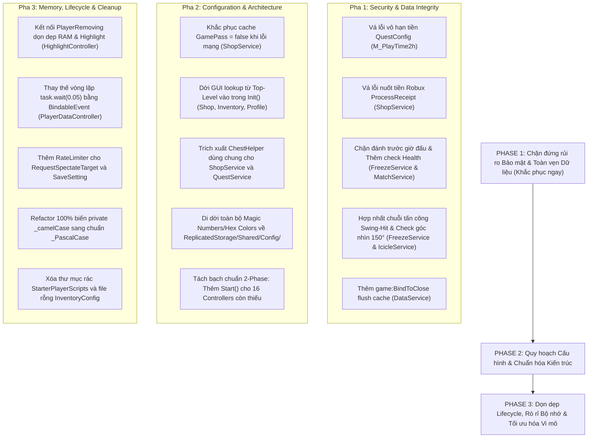

Viewed ShopController.lua:40-75
Viewed ShopController.lua:630-670
Viewed AdminService.lua:420-450
Viewed AdminConfig.lua:1-30
Viewed AdminService.lua:105-145
Viewed HighlightController.lua:170-225
Viewed HighlightController.lua:275-315
Viewed HighlightController.lua:50-80
Viewed PlayerDataController.lua:110-145
Viewed PlayerDataController.lua:15-35
Viewed QuestService.lua:670-710
Viewed ShopService.lua:280-325
Viewed FreezeService.lua:210-240
Searched for "PlayFreezeSFX"
Viewed SoundController.lua:75-105
Viewed MatchService.lua:755-775
Searched for "GameLoaded"
Searched for "IsAfk"
Viewed InventoryConfig.lua:1-10
Searched for files: *StarterPlayerScripts*
Listed directory StarterPlayerScripts
Searched for files: *Controller.lua
Searched for "function [A-Za-z0-9_]+:Start()"
Searched for ":Start\("
Viewed Main.client.lua:40-93

# ⚖️ BÁO CÁO PHÂN XỬ & TỔNG HỢP TOÀN DIỆN CÁC AUDIT REPORT

**Vai trò**: Principal Roblox Security Arbiter & System Architect  
**Phạm vi**: Thẩm định, đối chiếu 5 bản báo cáo kiểm toán độc lập (`Báo cáo 1` đến `Báo cáo 5`) và đối chiếu trực tiếp với mã nguồn thực tế tại `src/`.  
**Nguyên tắc vận hành**: Zero Mutation (không can thiệp mã nguồn trong pha này), Khách quan kỹ thuật tuyệt đối, Loại bỏ ảo giác, Trực diện và Phản bác không nhân nhượng.

---

## PHẦN 1: MA TRẬN ĐỐI CHIẾU & ĐỒNG THUẬN TỔNG QUAN

| Nhóm vấn đề | Đồng thuận (Tất cả hoặc đa số model đều thấy) | Tranh cãi / Đánh giá lệch pha giữa các model | Ảo giác / Báo động giả (Model tự bịa hoặc sai kiến thức Engine) |
| :--- | :--- | :--- | :--- |
| **1. Bảo mật & Server Authority** | • Bỏ qua chuỗi hành động Swing - Hit (`FreezeService` không check `OnToolSwing`).<br>• Thiếu Rate Limit gây DoS qua Remote `RequestSpectateTarget`.<br>• Mất dữ liệu `PlayTime` & `Quest` khi Shutdown do thiếu `game:BindToClose`. | • **Model 3 & 5** bắt được các lỗi độc quyền chí mạng: Lỗ hổng nuốt tiền Robux (`ProcessReceipt`), Chém trước giờ đấu (`IsMatchActive`), Bug vô hạn tiền (`QuestConfig`). Các Model 1, 2, 4 bỏ lọt hoàn toàn.<br>• Mức độ nghiêm trọng của `SaveSetting`: Model 1 xếp CRITICAL, Model 5 xếp HIGH, Model 4 xếp CRITICAL.<br>• Phân quyền Hitbox: Server-Side Shapecast (Model 1, 4, 5) vs Client-Detection có Server Validation (Model 2, 4). | • **Model 1 ảo giác**: Bịa ra việc `SaveSetting` cho phép hacker gửi chuỗi ngẫu nhiên khổng lồ gây tràn DataStore 4MB. Thực tế code đã kiểm tra strict whitelist key và ép kiểu `number` hữu hạn tại [`DataService.lua:685-715`](file:///c:/Users/thuyl/OneDrive/Dokumente/THIEN_ANH_FOLDER/SuperFrozenState/FrozenState/src/ServerScriptService/Services/DataService.lua#L685-L715).<br>• **Model 1 ảo giác**: Bịa ra lỗi Race Condition gây Session Lockout khi Player thoát nhanh ở `OnPlayerAdded`. Thực tế code đã có sẵn check `Player:IsDescendantOf(Players)` và `Profile:Release()` tại [`DataService.lua:112-119`](file:///c:/Users/thuyl/OneDrive/Dokumente/THIEN_ANH_FOLDER/SuperFrozenState/FrozenState/src/ServerScriptService/Services/DataService.lua#L112-L119).<br>• **Model 5 phóng đại**: Tuyên bố người chơi bỏ qua `FinishGameLoading` thành "bóng ma bất tử đi lại trong map chém người". Thực tế họ chỉ kẹt ngoài Lobby và bị chặn đòn đánh do `State ~= Normal`. |
| **2. Code Smell & Hacks** | • 16/24 Controllers bỏ trống `:Start()`, nhồi nhét vào `:Init()`.<br>• Lạm dụng Polling Busy-Wait `task.wait(0.05)` trong khi có sẵn `BindableEvent` (`PlayerDataController`).<br>• Admin CLI dùng API chat cũ `Player.Chatted`. | • Model 3 & 5 phát hiện lỗi Top-Level GUI require làm sập Controller ngay khi load; các Model khác không nhận ra.<br>• Model 4 phát hiện duplicate logic mở rương giữa `ShopService` và `QuestService`. | • **Model 3 nhận định sai**: Tuyên bố hàm `LockSpectatorMovement` và `UnlockSpectatorMovement` trong `SpectateController` không bao giờ được gọi. Thực tế chúng được gọi tại các dòng 415, 448 và 619. |
| **3. Tính nhất quán kiến trúc** | • Vi phạm nghiêm trọng quy chuẩn đặt tên: biến private bị ô nhiễm dạng `_camelCase` rải rác thay vì `_PascalCase`.<br>• Rải rác cơ chế Lazy-Require (`GetMenuController`, `GetNavigationController`) để né Circular Dependency. | • Cách quy hoạch mở rương: Viết Helper độc lập hay gộp vào `RewardHelper`. | • Không có ảo giác đáng kể. |
| **4. Hardcode & Cấu hình** | • Vi phạm triết lý Zero Hardcode: Magic numbers rải rác (`0.8`, `0.4`, `1000`, `1.5`, `3`).<br>• `InventoryConfig.lua` là file rỗng không được sử dụng. | • Model 2 tính toán sai khoảng cách đòn đánh: nói rằng `HitboxRange = 4` studs (thực tế trong [`GameConfig.lua:31`](file:///c:/Users/thuyl/OneDrive/Dokumente/THIEN_ANH_FOLDER/SuperFrozenState/FrozenState/src/ReplicatedStorage/Shared/Config/GameConfig.lua#L31) là `8` studs, tolerance `1.5` $\Rightarrow$ `12` studs). | • Model 2 trích dẫn sai code: khẳng định `IcicleScript.client.lua:28` hardcode `COOLDOWN = 1.0`, trong khi code thực tế gọi `GameConfig.Tool.IcicleCooldown`. |
| **5. Memory Leak & Hiệu năng** | • `HighlightController` rò rỉ bộ nhớ vĩnh viễn do không dọn dẹp `KnownTeams`, `_frozenPlayers`, `_playerStates` khi `PlayerRemoving`.<br>• `Spectator` spam `ReplicationFocus` làm vỡ StreamingEnabled. | • Model 5 phát hiện Animation không replicate do Server Anchor `HumanoidRootPart`. Các model khác không hiểu cơ chế Physics/Replication này. | • Không có ảo giác nghiêm trọng. |

---

## PHẦN 2: PHÂN XỬ CHI TIẾT CÁC ĐIỂM TRANH CÃI & ĐỀ XUẤT XUNG ĐỘT

---

### ⚖️ TRANH CÃI 1: Kiến trúc Combat & Phân quyền Hit Detection (Client-Authoritative vs Server-Authoritative)
- **Vấn đề tranh cãi**: [`FreezeService.lua:479-566`](file:///c:/Users/thuyl/OneDrive/Dokumente/THIEN_ANH_FOLDER/SuperFrozenState/FrozenState/src/ServerScriptService/Services/FreezeService.lua#L479-L566) & [`IcicleService.lua:138-175`](file:///c:/Users/thuyl/OneDrive/Dokumente/THIEN_ANH_FOLDER/SuperFrozenState/FrozenState/src/ServerScriptService/Services/IcicleService.lua#L138-L175). Client dùng `GetPartsInPart` rồi bắn `OnToolHit(Target)`. Server chỉ đo khoảng cách (12 studs) và Raycast đường thẳng.
- **Ý kiến các bên**:
  - *Model 1, 4, 5 (Đề xuất A)*: Xóa sổ hoàn toàn Remote `OnToolHit`. Chuyển 100% việc tính toán đòn đánh về Server (Server-Side Shapecast/Raycast khi nhận `OnToolSwing`).
  - *Model 2 (Đề xuất B)*: Giữ Client-Side detection để game mượt, nhưng Server phải có bộ đệm Rewind/Lag Compensation 1s để tua lại lịch sử vị trí kiểm tra.
- **Phán quyết của Trọng tài**:
  - **Cả hai đề xuất cực đoan đều THIẾU THỰC TẾ với game cận chiến tốc độ cao trên Roblox Engine**:
    - Đề xuất A (100% Server Shapecast) sẽ giết chết trải nghiệm người dùng. Khi ping người chơi $\ge 80\text{ms}$, nhân vật đối phương trên Server đã chạy đi nơi khác. Kiếm chém trúng đối thủ trên màn hình nhưng Server chém hụt (Ghost Hit), gây ức chế tột độ.
    - Đề xuất B (Server Rewind Buffer 1s) quá phức tạp và ngốn CPU không cần thiết cho một game Freeze Tag nhẹ nhàng.
  - **Phương án chuẩn xác (Hybrid Server-Validated Stateful Combat)**:
    1. **Buộc phải có thứ tự**: Client bấm chuột $\rightarrow$ Gửi `OnToolSwing`. Server ghi nhận `SwingStart = os.clock()` và xác thực vũ khí, trạng thái sống (`Health > 0`), trạng thái trận đấu (`InGame`).
    2. Client chạm mục tiêu $\rightarrow$ Gửi `OnToolHit(Target)`.
    3. Server kiểm tra 5 điều kiện tiên quyết:
       - `(Now - SwingStart)` phải nằm trong cửa sổ vung kiếm hợp lệ `[HitStartTime, HitEndTime]` (lấy từ [`AnimationConfig.lua`](file:///c:/Users/thuyl/OneDrive/Dokumente/THIEN_ANH_FOLDER/SuperFrozenState/FrozenState/src/ReplicatedStorage/Shared/Config/AnimationConfig.lua)). **Nếu không có Swing đi trước: Drop ngay lập tức.**
       - **Kiểm tra góc nhìn (Facing Dot Product)**: Vector hướng mặt của Attacker và vector tới Target phải thỏa mãn:
         $$\vec{D}_{\text{Look}} \cdot \frac{\vec{P}_{\text{Target}} - \vec{P}_{\text{Attacker}}}{\|\vec{P}_{\text{Target}} - \vec{P}_{\text{Attacker}}\|} \ge 0.25 \quad (\approx \text{góc quét } 150^\circ)$$
         Triệt tiêu hoàn toàn lỗi chém quay lưng $180^\circ$ (Back-hit / 360° Kill Aura).
       - **Dung sai khoảng cách động**: Thay vì cố định $12$ studs, áp dụng công thức bù ping:
         $$\text{MaxDist} = \text{HitboxRange} + (\text{WalkSpeed}_{\text{Attacker}} + \text{WalkSpeed}_{\text{Target}}) \times \frac{\text{Ping}_{\text{RTT}}}{2}$$
       - **Raycast tầm nhìn chuẩn**: Thiết lập `CollisionGroup` chuyên dụng, loại trừ toàn bộ Character của người chơi khác trong phòng và các vật thể `CanCollide = false` mang tính chất trang trí.
       - Cả Attacker và Target phải có `Humanoid.Health > 0`.

---

### ⚖️ TRANH CÃI 2: Mức độ nghiêm trọng của `SaveSetting` & Nguy cơ làm sập DataStore 4MB
- **Vấn đề tranh cãi**: [`DataService.lua:801-809`](file:///c:/Users/thuyl/OneDrive/Dokumente/THIEN_ANH_FOLDER/SuperFrozenState/FrozenState/src/ServerScriptService/Services/DataService.lua#L801-L809).
- **Ý kiến các bên**:
  - *Model 1*: Xếp loại **CRITICAL**. Cho rằng Server trực tiếp gán `Profile.Data.Settings[Key] = Value` không có whitelist, hacker gửi hàng chục ngàn string rác làm tràn 4MB DataStore.
  - *Model 2, 4, 5*: Xếp loại **HIGH / MEDIUM**. Nhận định đây là lỗ hổng Network Spam / Flooding làm tiêu tốn CPU Server và bẩn RAM Profile.
- **Phán quyết của Trọng tài**:
  - **MODEL 1 ĐÃ ĐƯA RA NHẬN ĐỊNH HOÀN TOÀN SAI LỆCH VÀ ẢO GIÁC (HALLUCINATION)**.
  - *Bằng chứng kỹ thuật*: Tại [`DataService.lua:685-715`](file:///c:/Users/thuyl/OneDrive/Dokumente/THIEN_ANH_FOLDER/SuperFrozenState/FrozenState/src/ServerScriptService/Services/DataService.lua#L685-L715), hàm `SetSetting` được bảo vệ bằng:
    ```lua
    if not VALID_SETTING_KEYS[Key] then return false end
    if type(Value) ~= "number" or Value ~= Value or math.abs(Value) == math.huge then return false end
    ```
    Hacker **không thể** inject bất kỳ chuỗi rác nào, cũng **không thể** thêm Key lạ ngoài 4 key âm lượng hợp lệ. Không bao giờ có chuyện phình to DataStore quá 4MB như Model 1 vẽ ra.
  - **Tuy nhiên, Model 2, 4, 5 đúng về nguy cơ DoS mạng**: RemoteEvent `SaveSetting` không có Rate Limit / Debounce trên Server. Hacker spam 60 lần/giây sẽ ép CPU Server phân tích cú pháp liên tục.
  - **Phán quyết mức độ**: Hạ cấp từ CRITICAL xuống **MEDIUM**.
  - **Phương án chuẩn xác**: Thêm token bucket debounce trên Server: mỗi player chỉ được lưu setting tối đa 1 lần mỗi 1.0 giây. Phía Client chỉ gửi remote khi người chơi buông chuột khỏi Slider (`FocusLost` / `InputEnded`), không gửi liên tục trong lúc kéo.

---

### ⚖️ TRANH CÃI 3: Session Lockout khi người chơi thoát nhanh (`OnPlayerAdded` Race Condition)
- **Vị trí**: [`DataService.lua:112-145`](file:///c:/Users/thuyl/OneDrive/Dokumente/THIEN_ANH_FOLDER/SuperFrozenState/FrozenState/src/ServerScriptService/Services/DataService.lua#L112-L145)
- **Ý kiến các bên**:
  - *Model 1*: Khẳng định đây là lỗi **HIGH-04**, khi player join rồi thoát ngay trong lúc `LoadProfileAsync` đang chạy, profile trả về vẫn bị nhét vào `ActiveProfiles` làm session bị khóa 30 phút. Đề xuất thêm `if not Player:IsDescendantOf(Players) then Profile:Release() return end`.
  - *Các Model 2, 3, 4, 5*: Không gắn cờ lỗi này.
- **Phán quyết của Trọng tài**:
  - **MODEL 1 TIẾP TỤC BỊA ĐẶT (HALLUCINATION ĐỌC CODE LƯỚT)**.
  - *Bằng chứng kỹ thuật*: Hãy nhìn thẳng vào dòng 112–119 của `DataService.lua`:
    ```lua
    if Player:IsDescendantOf(Players) then
        ActiveProfiles[Player] = Profile
        _ProfileLoadedBindable:Fire(Player, Profile)
    else
        -- Player đã rời server trước khi profile load xong
        Profile:Release()
    end
    ```
    Đoạn code mà Model 1 đề xuất khắc phục **đã nằm sẵn trong mã nguồn từ trước**! Ngoài ra, ở dòng 128, callback giải phóng của ProfileService cũng đã kiểm tra `if not Player:IsDescendantOf(Players) then return "Cancel" end`.
  - **Phán quyết**: **HỦY BỎ HOÀN TOÀN MỤC NÀY**. Đây là báo động giả 100%.

---

### ⚖️ TRANH CÃI 4: Dead Code trong `SpectateController` (`LockSpectatorMovement`)
- **Vị trí**: [`SpectateController.lua:102-122`](file:///c:/Users/thuyl/OneDrive/Dokumente/THIEN_ANH_FOLDER/SuperFrozenState/FrozenState/src/StarterPlayer/StarterPlayerScripts/Controllers/SpectateController.lua#L102-L122)
- **Ý kiến các bên**:
  - *Model 3*: Khẳng định 2 hàm `LockSpectatorMovement` và `UnlockSpectatorMovement` là Dead Code mồ côi, không nơi nào gọi tới.
  - *Các Model khác*: Không nêu điểm này.
- **Phán quyết của Trọng tài**:
  - **MODEL 3 NHẬN ĐỊNH CẨU THẢ VÀ SAI SỰ THẬT**.
  - *Bằng chứng kỹ thuật*: Hàm `LockSpectatorMovement()` được gọi trực tiếp tại dòng 415. Hàm `UnlockSpectatorMovement()` được gọi trực tiếp tại dòng 448 và dòng 619 khi người chơi dừng Spectate.
  - Tuy nhiên, Model 3 đã đúng ở một phát hiện code smell khác trong file này: Dòng 307 viết `local SpectateController = require(script)` ngay bên trong chính module `SpectateController` (Anti-pattern tự require chính mình).
  - **Phán quyết**: Bác bỏ cáo buộc Dead Code đối với 2 hàm khóa di chuyển. Giữ lại việc refactor dòng 307.

---

### ⚖️ TRANH CÃI 5: Lỗ hổng Handshake `FinishGameLoading`
- **Vị trí**: [`MatchService.lua:758-763`](file:///c:/Users/thuyl/OneDrive/Dokumente/THIEN_ANH_FOLDER/SuperFrozenState/FrozenState/src/ServerScriptService/Services/MatchService.lua#L758-L763)
- **Ý kiến các bên**:
  - *Model 5*: Xếp loại **HIGH**. Kẻ gian chặn remote này sẽ biến thành "bóng ma bất tử đi lại trong map phá game mà không ai chạm tới được".
  - *Model 1*: Xếp loại **LOW**. Chỉ là thiếu kiểm tra idempotency trạng thái lặp.
- **Phán quyết của Trọng tài**:
  - **Model 5 phóng đại tác động gameplay**: Khi `GameLoaded == false`, người chơi bị hàm `GetAlivePlayers()` loại bỏ nên **không bao giờ được spawn vào đấu trường** mà vẫn đứng ở Lobby. Đồng thời, trạng thái của họ trong `SessionService` là rỗng (không phải `"Normal"`), nên tại dòng 488 của `FreezeService`, mọi đòn đánh của họ gửi lên đều bị Server drop ngay lập tức. Họ không thể làm bóng ma bất tử đi chém người.
  - **Tuy nhiên, Model 5 đúng về lỗ hổng Server Authority**: Server không được phép để Client làm chủ nhịp độ ghép trận. Nếu 1 Client cố tình không gửi handshake, họ có thể treo vĩnh viễn ở Lobby mà không bị kick hoặc afk.
  - **Model 1 đúng về tính Idempotency**: Bắn nhiều lần remote này sẽ spam console log của Server.
  - **Phán quyết mức độ**: Xếp loại **LOW**.
  - **Phương án chuẩn xác**: Thêm Server-side Timeout (5.0 giây). Hết thời gian chờ mà Client chưa báo xong, Server tự động đánh dấu hoàn tất hoặc ép chuyển sang Spectator. Kiểm tra `if PlayerStateHelper.IsGameLoaded(Player) then return end`.

---

### ⚖️ TRANH CÃI 6: Animation đóng băng không replicate do Server Anchor HRP
- **Vị trí**: [`FreezeService.lua:222`](file:///c:/Users/thuyl/OneDrive/Dokumente/THIEN_ANH_FOLDER/SuperFrozenState/FrozenState/src/ServerScriptService/Services/FreezeService.lua#L222) và [`SoundController.lua:88-91`](file:///c:/Users/thuyl/OneDrive/Dokumente/THIEN_ANH_FOLDER/SuperFrozenState/FrozenState/src/StarterPlayer/StarterPlayerScripts/Controllers/SoundController.lua#L88-L91)
- **Ý kiến các bên**:
  - *Model 5*: Phát hiện duy nhất. Nêu rõ khi Server Anchor `HumanoidRootPart`, quyền NetworkOwnership bị thu hồi về Server. Việc Client tự phát animation đóng băng cục bộ sẽ **không replicate sang các client khác**. Hơn nữa, logic phát animation lại bị nhét vô lý trong `SoundController`.
  - *Các Model 1, 2, 3, 4*: Hoàn toàn không phát hiện ra sự cố này.
- **Phán quyết của Trọng tài**:
  - **MODEL 5 HOÀN TOÀN CHÍNH XÁC VỀ CƠ CHẾ ENGINE ROBLOX**.
  - *Bằng chứng kỹ thuật*:
    1. Khi RootPart bị Anchor từ Server, Animator của Roblox Client mất tính năng Replicate chuyển động xương tự động lên Server.
    2. Trong `SoundController.lua:89`, code ghi: `if Payload.VictimPlayer == LocalPlayer then PlayPoseAnimation(BlockSkinId) end`. Tức là **chỉ duy nhất nạn nhân tự chạy animation cho chính mình xem**, các người chơi khác trong server hoàn toàn không nhận được lệnh chạy animation cho nạn nhân đó! Toàn bộ người chơi khác sẽ nhìn thấy nạn nhân đứng đơ ở tư thế mặc định (T-pose hoặc Idle) trong tảng băng.
    3. Việc đặt hàm `PlayPoseAnimation` bên trong `SoundController` là sự vi phạm thô thiển nguyên tắc Single Responsibility.
  - **Phương án chuẩn xác**: Chuyển logic Pose Animation về Server (Server gọi `Animator:LoadAnimation()` trên Humanoid của Victim) hoặc Client điều khiển Animation phải broadcast rõ ràng qua một Controller chuyên trách (`AnimationController`), và không được Anchor nếu muốn animation mượt mà (dùng `AlignPosition` / `LinearVelocity` với `MaxForce = math.huge` để cố định vị trí).

---

## PHẦN 3: BẢNG TỔNG HỢP LỖ HỔNG XÁC THỰC (MASTER AUDIT - ĐÃ LỌC NOISE)

Chỉ giữ lại các lỗi **thực tế 100%**, đã được xác thực qua việc đọc từng dòng mã nguồn:

---

### 🔴 CRITICAL (BẮT BUỘC SỬA NGAY - NGUY CƠ CRASH SERVER, MẤT DỮ LIỆU, EXPLOIT HỆ THỐNG)

#### 1. [CRIT-01] Khai thác nhận vô hạn tiền tệ qua Quest `M_PlayTime2h` (Do Model 5 phát hiện)
- **Vị trí**: [`QuestConfig.lua:310-319`](file:///c:/Users/thuyl/OneDrive/Dokumente/THIEN_ANH_FOLDER/SuperFrozenState/FrozenState/src/ReplicatedStorage/Shared/Config/QuestConfig.lua#L310-L319)
- **Vấn đề cốt lõi**: Nhiệm vụ Milestone `M_PlayTime2h` có tên *"Play for 2 hours"*, nhưng cấu hình `Requirement = 15` (15 giây thay vì 7200 giây), đồng thời bật cờ `Repeatable = true` với phần thưởng `Reward = 600 Money`.
- **Kịch bản Hacker khai thác**: Bất kỳ ai vào server chỉ cần đứng chơi 15 giây là claim được 600 tiền. Hacker viết script auto-call `ClaimQuestReward` mỗi 15 giây, thu về hàng trăm ngàn Coin hoàn toàn hợp lệ theo logic Server. Toàn bộ nền kinh tế game bị phá hủy trong 10 phút.
- **Giải pháp chuẩn xác**: Sửa ngay `Requirement = 7200` và chuyển `Repeatable = false`.

#### 2. [CRIT-02] Nuốt tiền Robux do Race Condition giữa `ProcessReceipt` và `PlayerRemoving` (Do Model 3 phát hiện)
- **Vị trí**: [`ShopService.lua:229-246`](file:///c:/Users/thuyl/OneDrive/Dokumente/THIEN_ANH_FOLDER/SuperFrozenState/FrozenState/src/ServerScriptService/Services/ShopService.lua#L229-L246) kết hợp [`DataService.lua:267-275, 749-762`](file:///c:/Users/thuyl/OneDrive/Dokumente/THIEN_ANH_FOLDER/SuperFrozenState/FrozenState/src/ServerScriptService/Services/DataService.lua#L267-L275)
- **Vấn đề cốt lõi**: Trong `ProcessReceipt`, khi gọi `DataService.AddMoney` và `DataService.RecordPurchase`, nếu người chơi thoát game (Disconnect/Crash), `ActiveProfiles[Player] == nil`. Hai hàm này in `warn` rồi âm thầm `return nil` mà **không hề throw error**. Do đó, `pcall` vẫn trả về `Success = true`, và Server báo về Roblox: `Enum.ProductPurchaseDecision.PurchaseGranted`!
- **Kịch bản Hacker / Người dùng chịu nạn**: Người chơi nạp Robux mua gói tiền. Nếu mạng lag hoặc người chơi thoát game lúc giao dịch đang xử lý, Roblox trừ tiền vĩnh viễn nhưng người chơi nhận được **0 Coin** và biên lai không bao giờ được lưu.
- **Giải pháp chuẩn xác**: Kiểm tra trạng thái Profile trước và sau khi xử lý:
  ```lua
  if not Profile or not Profile:IsActive() then
      return Enum.ProductPurchaseDecision.NotProcessedYet
  end
  ```
  Nếu `AddMoney` hoặc `RecordPurchase` không thành công, bắt buộc phải trả về `NotProcessedYet` để Roblox tự động retry khi người chơi vào lại.

#### 3. [CRIT-03] Đánh và đóng băng đối thủ ngay trong lúc Setup & Ready (Do Model 3 phát hiện)
- **Vị trí**: [`MatchService.lua:453`](file:///c:/Users/thuyl/OneDrive/Dokumente/THIEN_ANH_FOLDER/SuperFrozenState/FrozenState/src/ServerScriptService/Services/MatchService.lua#L453) kết hợp [`FreezeService.lua:485`](file:///c:/Users/thuyl/OneDrive/Dokumente/THIEN_ANH_FOLDER/SuperFrozenState/FrozenState/src/ServerScriptService/Services/FreezeService.lua#L485)
- **Vấn đề cốt lõi**: `MatchService` gọi `SessionService.SetMatchActive(true)` ngay đầu hàm `RunSetup()`. Sau đó server đợi tải map, đợi hoạt ảnh thông báo mode, rồi mới đến 4 giây đếm ngược `RunReady()`. Trong toàn bộ 6–10 giây này, người chơi bị khóa chân tại chỗ nhưng `IsMatchActive()` đã là `true`!
- **Kịch bản Hacker khai thác**: Hacker inject script bắn remote `OnToolHit` ngay khi vừa bước vào map lúc đang đếm ngược. Toàn bộ đối thủ bị đóng băng ngay tại điểm spawn trước khi trận đấu kịp bắt đầu.
- **Giải pháp chuẩn xác**: `FreezeService` phải kiểm tra chính xác phase:
  ```lua
  if MatchService.GetCurrentPhase() ~= "InGame" then return end
  ```
  Và chỉ kích hoạt `SessionService.SetMatchActive(true)` tại thời điểm bắt đầu `RunInGame()`.

#### 4. [CRIT-04] Lỗ hổng 360° Kill Aura & Đòn đánh không cần vung kiếm (Đồng thuận 5/5 model)
- **Vị trí**: [`FreezeService.lua:479-520`](file:///c:/Users/thuyl/OneDrive/Dokumente/THIEN_ANH_FOLDER/SuperFrozenState/FrozenState/src/ServerScriptService/Services/FreezeService.lua#L479-L520) và [`IcicleService.lua:143-174`](file:///c:/Users/thuyl/OneDrive/Dokumente/THIEN_ANH_FOLDER/SuperFrozenState/FrozenState/src/ServerScriptService/Services/IcicleService.lua#L143-L174)
- **Vấn đề cốt lõi**: `FreezeService` tiếp nhận `OnToolHit` độc lập hoàn toàn với `OnToolSwing`. Server tự khởi tạo `AttackSession` mới bằng `os.clock()` khi nhận hit, không kiểm tra xem client có vung kiếm trước đó không, và hoàn toàn không kiểm tra góc nhìn (LookVector / FOV).
- **Kịch bản Hacker khai thác**: Hacker không cần rút kiếm, không cần vung kiếm, chỉ cần đứng quay lưng hoặc chạy trốn và spam `OnToolHit` trong bán kính 12 studs. Mọi đối thủ xung quanh 360 độ đều bị đóng băng tức thì.
- **Giải pháp chuẩn xác**: Hợp nhất quy trình thành Stateful Attack: Bắt buộc phải có `OnToolSwing` hợp lệ đi trước, kiểm tra Dot Product hướng mặt $\ge 0.25$ và kiểm tra Raycast LoS chuẩn.

#### 5. [CRIT-05] Bỏ sót kiểm tra trạng thái sống chết (`Humanoid.Health`) khi thực hiện đòn đánh (Do Model 3 phát hiện)
- **Vị trí**: [`FreezeService.lua:490-496`](file:///c:/Users/thuyl/OneDrive/Dokumente/THIEN_ANH_FOLDER/SuperFrozenState/FrozenState/src/ServerScriptService/Services/FreezeService.lua#L490-L496)
- **Vấn đề cốt lõi**: `HandleToolHit` chỉ kiểm tra sự tồn tại của Character và Tool, hoàn toàn không kiểm tra `Humanoid.Health > 0` của cả Attacker lẫn Target.
- **Kịch bản Hacker khai thác**: Khi Attacker vừa chết (Health = 0), trong 1–2 giây hoạt ảnh chết trước khi Character bị xóa, client của Attacker vẫn gửi được đòn đánh để đóng băng người sống từ cõi chết. Ngược lại, nếu Target vừa chết do rơi map, Server vẫn cố hàn `IceBlock` vào cái xác chết trôi nổi trong hư không.
- **Giải pháp chuẩn xác**: Thêm guard clause kiểm tra `Humanoid.Health > 0` cho cả 2 bên.

#### 6. [CRIT-06] Mất sạch dữ liệu PlayTime & Quest khi Server Shutdown đột ngột (`game:BindToClose` Gap)
- **Vị trí**: [`DataService.lua:147-164`](file:///c:/Users/thuyl/OneDrive/Dokumente/THIEN_ANH_FOLDER/SuperFrozenState/FrozenState/src/ServerScriptService/Services/DataService.lua#L147-L164) và [`QuestService.lua:670-695`](file:///c:/Users/thuyl/OneDrive/Dokumente/THIEN_ANH_FOLDER/SuperFrozenState/FrozenState/src/ServerScriptService/Services/QuestService.lua#L670-L695)
- **Vấn đề cốt lõi**: `DataService` chỉ kích hoạt các callback `_BeforeProfileReleaseCallbacks` bên trong sự kiện `Players.PlayerRemoving`. Khi máy chủ đóng phiên (Migrate server, Update game), thư viện `ProfileService` kích hoạt `game:BindToClose` nội bộ và giải phóng Profile ngay lập tức mà `DataService` không hề có hook `BindToClose` để flush dữ liệu tạm.
- **Hậu quả thực tế**: Người chơi mất trắng số phút chơi (`PlayTime`) và tiến trình Quest tích lũy trong RAM của phiên đó mỗi khi máy chủ cập nhật.
- **Giải pháp chuẩn xác**: Đăng ký `game:BindToClose` trong `DataService`, duyệt qua toàn bộ `ActiveProfiles` và kích hoạt tuần tự các callback giải phóng trước khi đóng DataStore.

---

### 🟠 HIGH (NGUY CƠ RACE CONDITION, DESYNC LOGIC, MEMORY LEAK)

#### 7. [HIGH-01] Khóa vĩnh viễn GamePass của người chơi khi gặp sự cố mạng (Do Model 5 phát hiện)
- **Vị trí**: [`ShopService.lua:301-315`](file:///c:/Users/thuyl/OneDrive/Dokumente/THIEN_ANH_FOLDER/SuperFrozenState/FrozenState/src/ServerScriptService/Services/ShopService.lua#L301-L315)
- **Vấn đề cốt lõi**: Khi gọi `MarketplaceService:UserOwnsGamePassAsync`, nếu API Roblox gặp sự cố HTTP (timeout), `pcall` trả về `Success = false`. Code xử lý `local Result = (Success and OwnsPass == true)` $\Rightarrow$ ra `false`, và ghi đè `_GamePassCache[Player][PassKey] = false` cho toàn bộ phiên chơi!
- **Hậu quả**: Người đã bỏ tiền thật mua GamePass bị tước đoạt quyền lợi suốt buổi chơi chỉ vì mạng giật 1 giây lúc mới vào game.
- **Giải pháp**: Tuyệt đối không cache giá trị khi `Success == false`.

#### 8. [HIGH-02] Tê liệt GUI vĩnh viễn do Resolve Element ở Top-Level Module Scope (Do Model 3 & 5 phát hiện)
- **Vị trí**: [`ShopController.lua:47-63`](file:///c:/Users/thuyl/OneDrive/Dokumente/THIEN_ANH_FOLDER/SuperFrozenState/FrozenState/src/StarterPlayer/StarterPlayerScripts/Controllers/ShopController.lua#L47-L63), [`InventoryController.lua:45-60`](file:///c:/Users/thuyl/OneDrive/Dokumente/THIEN_ANH_FOLDER/SuperFrozenState/FrozenState/src/StarterPlayer/StarterPlayerScripts/Controllers/InventoryController.lua#L45-L60), [`ProfileController.lua:47-63`](file:///c:/Users/thuyl/OneDrive/Dokumente/THIEN_ANH_FOLDER/SuperFrozenState/FrozenState/src/StarterPlayer/StarterPlayerScripts/Controllers/ProfileController.lua#L47-L63)
- **Vấn đề cốt lõi**: Các biến Frame GUI được tìm kiếm ngay khi module vừa được `require` (Top-level). Tại thời điểm Client bắt đầu load script, `PlayerGui` chưa sao chép xong từ `StarterGui`, khiến các biến này bị gán `nil`. Sau đó khi vào `:Init()`, câu lệnh `if not Shop then warn(...) return end` hủy bỏ khởi tạo vĩnh viễn.
- **Giải pháp**: Chuyển toàn bộ việc resolve UI vào trong hàm `:Init()` kèm cơ chế `WaitForChild`.

#### 9. [HIGH-03] Animation tư thế đóng băng không replicate do Server Anchor RootPart (Do Model 5 phát hiện)
- **Vị trí**: [`FreezeService.lua:222`](file:///c:/Users/thuyl/OneDrive/Dokumente/THIEN_ANH_FOLDER/SuperFrozenState/FrozenState/src/ServerScriptService/Services/FreezeService.lua#L222) và [`SoundController.lua:88-91`](file:///c:/Users/thuyl/OneDrive/Dokumente/THIEN_ANH_FOLDER/SuperFrozenState/FrozenState/src/StarterPlayer/StarterPlayerScripts/Controllers/SoundController.lua#L88-L91)
- **Vấn đề cốt lõi**: Server set `HRP.Anchored = true`, tước quyền Network Ownership của nhân vật. Trong khi đó, việc phát animation lại để Client của chính nạn nhân tự chạy cục bộ trong `SoundController`. Các Client khác hoàn toàn không thấy nạn nhân đổi tư thế, chỉ thấy đứng đơ ở thế Idle.
- **Giải pháp**: Server tải và phát AnimationTrack trên `Humanoid.Animator` của nạn nhân, hoặc dùng Constraint vật lý (`AlignPosition` với `Force = math.huge`) thay vì Anchor cứng.

#### 10. [HIGH-04] Thuật toán Raycast Line-of-Sight hỏng 2 chiều (Chặn sai và Bỏ lọt) (Đồng thuận Model 2, 3, 4)
- **Vị trí**: [`FreezeService.lua:530-538`](file:///c:/Users/thuyl/OneDrive/Dokumente/THIEN_ANH_FOLDER/SuperFrozenState/FrozenState/src/ServerScriptService/Services/FreezeService.lua#L530-L538)
- **Vấn đề cốt lõi**:
  1. `FilterDescendantsInstances` chỉ loại trừ Attacker và Target. Nếu một người chơi thứ 3 đứng chen ở giữa, tia Raycast trúng người thứ 3 (có `CanCollide = true`) $\Rightarrow$ đòn đánh hợp lệ bị Server hủy vô lý.
  2. Tia Raycast chỉ kiểm tra `Instance.CanCollide`. Khối băng `IceBlock` và nhiều chi tiết kính/lưới của map được set `CanCollide = false`, cho phép người chơi chém xuyên qua khối băng của đồng đội và vách kính.
- **Giải pháp**: Sử dụng CollisionGroup chuyên biệt cho Raycast chiến đấu, loại trừ toàn bộ nhân vật người chơi trong trận.

#### 11. [HIGH-05] DoS Streaming & Nghẽn mạng qua spam `RequestSpectateTarget` (Đồng thuận 5/5 model)
- **Vị trí**: [`MatchService.lua:820-872`](file:///c:/Users/thuyl/OneDrive/Dokumente/THIEN_ANH_FOLDER/SuperFrozenState/FrozenState/src/ServerScriptService/Services/MatchService.lua#L820-L872)
- **Vấn đề cốt lõi**: Server gán trực tiếp `SpectatorPlayer.ReplicationFocus = TargetHRP` mà hoàn toàn không có Debounce. Hacker spam 60 lần/giây ép Spatial Streaming của Engine phải liên tục dọn và tải lại chunk bản đồ, gây sụt giảm FPS diện rộng cho Server.
- **Giải pháp**: Áp dụng Debounce tối thiểu 0.5s trên Server cho mỗi người chơi.

#### 12. [HIGH-06] Rò rỉ bộ nhớ (Memory Leak) vĩnh viễn trên Client tại `HighlightController` (Đồng thuận 4/5 model)
- **Vị trí**: [`HighlightController.lua:174-202, 288-295`](file:///c:/Users/thuyl/OneDrive/Dokumente/THIEN_ANH_FOLDER/SuperFrozenState/FrozenState/src/StarterPlayer/StarterPlayerScripts/Controllers/HighlightController.lua#L174-L202)
- **Vấn đề cốt lõi**: Lắng nghe `Player.CharacterAdded` trong `WatchPlayer` nhưng không bao giờ disconnect. Bảng `KnownTeams`, `_frozenPlayers`, `_playerStates` không hề có listener `Players.PlayerRemoving` để dọn dẹp các key `UserIdStr`. Sau nhiều giờ, RAM client liên tục phình to.
- **Giải pháp**: Lắng nghe `PlayerRemoving` để dọn sạch Highlight instance và xóa các key trong bảng.

#### 13. [HIGH-07] Phá vỡ Kiến trúc 2-Phase Lifecycle trên 16/24 Controllers (Đồng thuận 5/5 model)
- **Vị trí**: `StarterPlayer/StarterPlayerScripts/Controllers/` và [`Main.client.lua:40-90`](file:///c:/Users/thuyl/OneDrive/Dokumente/THIEN_ANH_FOLDER/SuperFrozenState/FrozenState/src/StarterPlayer/StarterPlayerScripts/Main.client.lua#L40-L90)
- **Vấn đề cốt lõi**: `Main.client.lua` định nghĩa rõ 2 pha: `:Init()` setup GUI nội bộ, sau đó `:Start()` mới kết nối mạng và liên lạc chéo. Thế nhưng có đến 16 Controller không có hàm `:Start()`, dồn toàn bộ logic vào `:Init()`, dẫn đến việc phải dùng các hàm getter lười (`GetMenuController`) để né lỗi gọi trước khi khởi tạo.
- **Giải pháp**: Bổ sung đầy đủ `:Start()` cho 16 Controller, tách bạch 100% logic mạng và liên lạc chéo sang `:Start()`.

#### 14. [HIGH-08] Phân mảnh & Bất đồng bộ Logic Mở Rương (`ShopService` vs `QuestService`) (Do Model 4 phát hiện)
- **Vị trí**: [`ShopService.lua:29-60, 125-154`](file:///c:/Users/thuyl/OneDrive/Dokumente/THIEN_ANH_FOLDER/SuperFrozenState/FrozenState/src/ServerScriptService/Services/ShopService.lua#L29-L60) và [`QuestService.lua:143-193`](file:///c:/Users/thuyl/OneDrive/Dokumente/THIEN_ANH_FOLDER/SuperFrozenState/FrozenState/src/ServerScriptService/Services/QuestService.lua#L143-L193)
- **Vấn đề cốt lõi**: Cùng là logic "Mở rương, trao item, hoàn tiền nếu trùng" nhưng `ShopService` viết chuẩn 2 pha (mô phỏng rút thưởng trong RAM với `TemporaryOwned` rồi mới Commit nguyên tử), trong khi `QuestService` lại gọi trực tiếp `AddIcicle` / `AddBlock` từng cái một ngay trong vòng lặp quay thưởng.
- **Giải pháp**: Trích xuất logic mở rương thành module dùng chung `ChestHelper` trên Server.

---

### 🟡 MEDIUM (HARDCODE CẤU HÌNH, LỆCH CHUẨN PASCALCASE, SMELLED LOGIC)

#### 15. [MED-01] Lạm dụng Polling Busy-Wait `task.wait(0.05)` trong `PlayerDataController` (Đồng thuận 5/5 model)
- **Vị trí**: [`PlayerDataController.lua:117-120, 136-139`](file:///c:/Users/thuyl/OneDrive/Dokumente/THIEN_ANH_FOLDER/SuperFrozenState/FrozenState/src/StarterPlayer/StarterPlayerScripts/Controllers/PlayerDataController.lua#L117-L120)
- **Vấn đề**: Sử dụng vòng lặp `while not _isDataLoaded do task.wait(0.05) end` trong khi ngay dòng 22 đã khởi tạo sẵn `_dataLoadedBindable = Instance.new("BindableEvent")`.
- **Giải pháp**: Chuyển sang mô hình Event-Driven thuần túy bằng `_dataLoadedBindable.Event:Wait()`.

#### 16. [MED-02] Vi phạm Triết lý "Zero Hardcode" rải rác trong mã nguồn (Đồng thuận 5/5 model)
- **Vị trí**:
  - [`ShopService.lua:102-103`](file:///c:/Users/thuyl/OneDrive/Dokumente/THIEN_ANH_FOLDER/SuperFrozenState/FrozenState/src/ServerScriptService/Services/ShopService.lua#L102-L103): Hardcode `MinQty = 1`, `MaxQty = 5` (bỏ qua `ShopConfig.MinAmount/MaxAmount`).
  - [`QuestService.lua:151, 208`](file:///c:/Users/thuyl/OneDrive/Dokumente/THIEN_ANH_FOLDER/SuperFrozenState/FrozenState/src/ServerScriptService/Services/QuestService.lua#L151): Hardcode giá hoàn tiền mặc định `1000`.
  - [`ScoreBoardController.lua:55`](file:///c:/Users/thuyl/OneDrive/Dokumente/THIEN_ANH_FOLDER/SuperFrozenState/FrozenState/src/StarterPlayer/StarterPlayerScripts/Controllers/ScoreBoardController.lua#L55): Magic number trọng số tính điểm `(F + T) * 1000 + F`.
  - [`GuiAnimConfig.lua:137`](file:///c:/Users/thuyl/OneDrive/Dokumente/THIEN_ANH_FOLDER/SuperFrozenState/FrozenState/src/ReplicatedStorage/Shared/Config/GuiAnimConfig.lua#L137): Hardcode SoundId `132948338000932` trực tiếp thay vì khai báo trong `AudioConfig`.
- **Giải pháp**: Di dời toàn bộ về đúng các file cấu hình tập trung tương ứng.

#### 17. [MED-03] Vi phạm Nghiêm trọng Quy ước Đặt tên (100% PascalCase) (Đồng thuận 5/5 model)
- **Vị trí**: Hầu như toàn bộ các Service và Controller trong `src/`.
- **Vấn đề**: Biến module private bị đặt theo kiểu `_camelCase` lai tạp (`_currentPhase`, `_isSpectating`, `_playerStates`, `_iceBlocks`), trong khi cùng một file lại có biến viết theo chuẩn `_PascalCase` (`_AttackSessions`, `_ResetLocks`).
- **Giải pháp**: Đồng bộ hóa 100% về `_PascalCase` cho biến private và `PascalCase` cho toàn bộ biến cục bộ theo đúng Quy ước #1 của dự án.

#### 18. [MED-04] Admin CLI sử dụng API cũ `Player.Chatted` & Mâu thuẫn Tiền tố Lệnh (Đồng thuận 4/5 model)
- **Vị trí**: [`AdminService.lua:112, 429-440`](file:///c:/Users/thuyl/OneDrive/Dokumente/THIEN_ANH_FOLDER/SuperFrozenState/FrozenState/src/ServerScriptService/Services/AdminService.lua#L112) và [`AdminConfig.lua:12`](file:///c:/Users/thuyl/OneDrive/Dokumente/THIEN_ANH_FOLDER/SuperFrozenState/FrozenState/src/ServerScriptService/Config/AdminConfig.lua#L12)
- **Vấn đề**: `AdminService` dùng `Player.Chatted` cũ thay vì `TextChatService`. Hơn nữa, `AdminConfig.Prefix` cấu hình là `"//"` nhưng thông báo cú pháp lại hướng dẫn gõ `"Cú pháp: /givemoney..."`, khiến Admin gõ sai và lộ lệnh quản trị ra chat chung.
- **Giải pháp**: Hỗ trợ `TextChatService` và format chuỗi hướng dẫn theo đúng biến cấu hình `AdminConfig.Prefix`.

#### 19. [MED-05] Dữ liệu Legacy tồn đọng trong Profile Template (Đồng thuận 4/5 model)
- **Vị trí**: [`DataService.lua:30, 48-52`](file:///c:/Users/thuyl/OneDrive/Dokumente/THIEN_ANH_FOLDER/SuperFrozenState/FrozenState/src/ServerScriptService/Services/DataService.lua#L30)
- **Vấn đề**: `PROFILE_TEMPLATE` vẫn lưu trữ các trường dữ liệu rác cũ: `OwnedCosmetics`, `DailyQuestData`, `MilestoneQuestData` song song với các trường dữ liệu mới, gây phình to tài liệu JSON trong DataStore.
- **Giải pháp**: Viết hàm migration dọn dẹp dữ liệu cũ khi Profile nạp thành công.

#### 20. [MED-06] Thiếu Rate Limiter trên `SaveSetting` Event (Đồng thuận 4/5 model)
- **Vị trí**: [`DataService.lua:801-809`](file:///c:/Users/thuyl/OneDrive/Dokumente/THIEN_ANH_FOLDER/SuperFrozenState/FrozenState/src/ServerScriptService/Services/DataService.lua#L801-L809)
- **Vấn đề**: Không có bộ đếm thời gian chống spam gói tin lưu cấu hình.
- **Giải pháp**: Đặt Debounce 1.0 giây trên Server cho mỗi người chơi.

#### 21. [MED-07] AFK Farming: Treo máy ở Lobby nhận đủ PlayTime Quest (Đồng thuận Model 1, 4)
- **Vị trí**: [`QuestService.lua:671-684`](file:///c:/Users/thuyl/OneDrive/Dokumente/THIEN_ANH_FOLDER/SuperFrozenState/FrozenState/src/ServerScriptService/Services/QuestService.lua#L671-L684)
- **Vấn đề**: `OnPlayTime` tích lũy thời gian thuần túy theo `os.time() - _sessionStart[Player]` mà không kiểm tra người chơi có đang AFK hay đang trong trận đấu.
- **Giải pháp**: Chỉ tích lũy thời gian làm Quest nếu `PlayerStateHelper.IsInMatch(Player) == true` và không AFK.

---

### 🟢 LOW (CODE THỪA, TỐI ƯU VI MÔ & DỌN RÁC)

#### 22. [LOW-01] Thư mục rác `src/StarterPlayerScripts/` và File rỗng `InventoryConfig.lua`
- **Vị trí**: Thư mục rỗng `src/StarterPlayerScripts/` nằm sai vị trí và file rỗng [`InventoryConfig.lua`](file:///c:/Users/thuyl/OneDrive/Dokumente/THIEN_ANH_FOLDER/SuperFrozenState/FrozenState/src/ReplicatedStorage/Shared/Config/InventoryConfig.lua).
- **Giải pháp**: Xóa bỏ thư mục thừa và file rỗng (hoặc quy hoạch tham số Inventory UI vào đây).

#### 23. [LOW-02] Anti-Pattern tự `require(script)` bên trong `SpectateController.lua:307`
- **Vị trí**: [`SpectateController.lua:307`](file:///c:/Users/thuyl/OneDrive/Dokumente/THIEN_ANH_FOLDER/SuperFrozenState/FrozenState/src/StarterPlayer/StarterPlayerScripts/Controllers/SpectateController.lua#L307)
- **Vấn đề**: Tự `require(script)` bên trong chính nó để gọi `SetVisible(false)`.
- **Giải pháp**: Gọi trực tiếp qua biến bảng cục bộ của module.

#### 24. [LOW-03] Đăng ký trùng lặp `FlushSession` trong `QuestService`
- **Vị trí**: [`QuestService.lua:691-695`](file:///c:/Users/thuyl/OneDrive/Dokumente/THIEN_ANH_FOLDER/SuperFrozenState/FrozenState/src/ServerScriptService/Services/QuestService.lua#L691-L695)
- **Vấn đề**: `FlushSession` vừa đăng ký qua `DataService.RegisterBeforeProfileRelease`, vừa tự kết nối vào `Players.PlayerRemoving`.
- **Giải pháp**: Bỏ kết nối `Players.PlayerRemoving` tại `QuestService`, tập trung về `DataService`.

#### 25. [LOW-04] Bắn trùng lặp RemoteEvent `UpdateMoney` và Section Comment rác
- **Vị trí**: [`QuestService.lua:615`](file:///c:/Users/thuyl/OneDrive/Dokumente/THIEN_ANH_FOLDER/SuperFrozenState/FrozenState/src/ServerScriptService/Services/QuestService.lua#L615) (bắn `UpdateMoneyEvent` lần 2) và [`FreezeService.lua:159-163`](file:///c:/Users/thuyl/OneDrive/Dokumente/THIEN_ANH_FOLDER/SuperFrozenState/FrozenState/src/ServerScriptService/Services/FreezeService.lua#L159-L163) (tiêu đề comment `PRIVATE: Audio` rỗng).
- **Giải pháp**: Dọn dẹp dòng gọi thừa và tiêu đề rác.

---

## PHẦN 4: LỘ TRÌNH REFACTOR TỐI ƯU (PRIORITIZED ACTION PLAN)

Chiến lược tái cấu trúc chia làm 3 giai đoạn theo độ ưu tiên giảm dần:



---

### 🛡️ PHASE 1: CHẶN ĐỨNG RỦI RO BẢO MẬT & TOÀN VẸN DỮ LIỆU (Bắt buộc làm trước)
1. **[`QuestConfig.lua`](file:///c:/Users/thuyl/OneDrive/Dokumente/THIEN_ANH_FOLDER/SuperFrozenState/FrozenState/src/ReplicatedStorage/Shared/Config/QuestConfig.lua)**:
   - Sửa `M_PlayTime2h`: `Requirement = 7200`, `Repeatable = false`.
2. **[`ShopService.lua`](file:///c:/Users/thuyl/OneDrive/Dokumente/THIEN_ANH_FOLDER/SuperFrozenState/FrozenState/src/ServerScriptService/Services/ShopService.lua)**:
   - Trong `ProcessReceipt`: Kiểm tra `Profile:IsActive()`. Nếu không active hoặc thao tác cộng tiền/ghi lịch sử thất bại, trả về `Enum.ProductPurchaseDecision.NotProcessedYet`.
3. **[`FreezeService.lua`](file:///c:/Users/thuyl/OneDrive/Dokumente/THIEN_ANH_FOLDER/SuperFrozenState/FrozenState/src/ServerScriptService/Services/FreezeService.lua) & [`IcicleService.lua`](file:///c:/Users/thuyl/OneDrive/Dokumente/THIEN_ANH_FOLDER/SuperFrozenState/FrozenState/src/ServerScriptService/Services/IcicleService.lua)**:
   - Thêm điều kiện `MatchService.GetCurrentPhase() == "InGame"`.
   - Bắt buộc `OnToolHit` phải có `OnToolSwing` đi trước trong khung thời gian `[HitStartTime, HitEndTime]`.
   - Thêm kiểm tra góc nhìn phía trước (Dot product $\ge 0.25$).
   - Thêm kiểm tra `Humanoid.Health > 0` cho cả Attacker và Target.
   - Sửa thuật toán Raycast: dùng CollisionGroup bỏ qua toàn bộ nhân vật người chơi khác.
4. **[`DataService.lua`](file:///c:/Users/thuyl/OneDrive/Dokumente/THIEN_ANH_FOLDER/SuperFrozenState/FrozenState/src/ServerScriptService/Services/DataService.lua)**:
   - Thêm hook `game:BindToClose`: lặp qua `ActiveProfiles`, kích hoạt toàn bộ `_BeforeProfileReleaseCallbacks` để lưu `PlayTime` và tiến trình Quest trước khi máy chủ tắt.

---

### 🏗️ PHASE 2: QUY HOẠCH CẤU HÌNH & KIẾN TRÚC HỆ THỐNG
1. **[`ShopService.lua`](file:///c:/Users/thuyl/OneDrive/Dokumente/THIEN_ANH_FOLDER/SuperFrozenState/FrozenState/src/ServerScriptService/Services/ShopService.lua)**:
   - Sửa hàm `PlayerOwnsGamePass`: Tuyệt đối không cache `false` khi `Success == false` (lỗi mạng).
2. **Controller UI References**:
   - Trong [`ShopController.lua`](file:///c:/Users/thuyl/OneDrive/Dokumente/THIEN_ANH_FOLDER/SuperFrozenState/FrozenState/src/StarterPlayer/StarterPlayerScripts/Controllers/ShopController.lua), [`InventoryController.lua`](file:///c:/Users/thuyl/OneDrive/Dokumente/THIEN_ANH_FOLDER/SuperFrozenState/FrozenState/src/StarterPlayer/StarterPlayerScripts/Controllers/InventoryController.lua), [`ProfileController.lua`](file:///c:/Users/thuyl/OneDrive/Dokumente/THIEN_ANH_FOLDER/SuperFrozenState/FrozenState/src/StarterPlayer/StarterPlayerScripts/Controllers/ProfileController.lua): Xóa bỏ việc tìm kiếm Frame GUI ở top-level scope; đưa toàn bộ vào trong hàm `:Init()`.
3. **Thống nhất Logic Mở Rương**:
   - Tạo module helper dùng chung trên Server: `ServerScriptService/Services/Helpers/ChestHelper.lua` áp dụng chuẩn commit 2 pha. Cả `ShopService` và `QuestService` đều phải tái sử dụng module này.
4. **Chuẩn hóa 2-Phase Lifecycle**:
   - Hiện thực hàm `:Start()` trên 16 Controller còn thiếu. Chuyển toàn bộ các kết nối RemoteEvent, UserInputService và giao tiếp chéo từ `:Init()` sang `:Start()`.
5. **Gom Hardcode về Config**:
   - Bổ sung cấu hình GUI còn thiếu vào [`GuiConfig.lua`](file:///c:/Users/thuyl/OneDrive/Dokumente/THIEN_ANH_FOLDER/SuperFrozenState/FrozenState/src/ReplicatedStorage/Shared/Config/GuiConfig.lua).
   - Di chuyển giá hoàn tiền mặc định `1000` vào [`EconomyConfig.lua`](file:///c:/Users/thuyl/OneDrive/Dokumente/THIEN_ANH_FOLDER/SuperFrozenState/FrozenState/src/ReplicatedStorage/Shared/Config/EconomyConfig.lua).
   - Di chuyển âm thanh `132948338000932` vào [`AudioConfig.lua`](file:///c:/Users/thuyl/OneDrive/Dokumente/THIEN_ANH_FOLDER/SuperFrozenState/FrozenState/src/ReplicatedStorage/Shared/Config/AudioConfig.lua).

---

### 🧹 PHASE 3: DỌN DẸP LIFECYCLE, BỘ NHỚ & TỐI ƯU HÓA VI MÔ
1. **Khắc phục Memory Leak trên Client**:
   - Trong [`HighlightController.lua`](file:///c:/Users/thuyl/OneDrive/Dokumente/THIEN_ANH_FOLDER/SuperFrozenState/FrozenState/src/StarterPlayer/StarterPlayerScripts/Controllers/HighlightController.lua): Lắng nghe `Players.PlayerRemoving` để hủy Highlight instance và dọn sạch các bảng cache.
2. **Khử Polling Busy-Waiting**:
   - Trong [`PlayerDataController.lua`](file:///c:/Users/thuyl/OneDrive/Dokumente/THIEN_ANH_FOLDER/SuperFrozenState/FrozenState/src/StarterPlayer/StarterPlayerScripts/Controllers/PlayerDataController.lua): Thay thế toàn bộ vòng lặp `while task.wait(0.05) do` bằng `_dataLoadedBindable.Event:Wait()`.
3. **Phòng vệ Mạng (Rate Limiting)**:
   - Thêm Debounce trên Server cho `RequestSpectateTarget` (0.5s) và `SaveSetting` (1.0s).
4. **Chuẩn hóa Quy ước Đặt tên (100% PascalCase)**:
   - Đổi tên toàn bộ biến private `_camelCase` sang `_PascalCase` trên toàn bộ codebase.
5. **Dọn dẹp File & Thư mục**:
   - Xóa thư mục rỗng `src/StarterPlayerScripts/`.
   - Dọn dẹp dead code: sửa dòng 307 trong `SpectateController.lua`, xóa comment rác trong `FreezeService.lua`, và viết migration script dọn trường dữ liệu cũ trong `PROFILE_TEMPLATE`.
