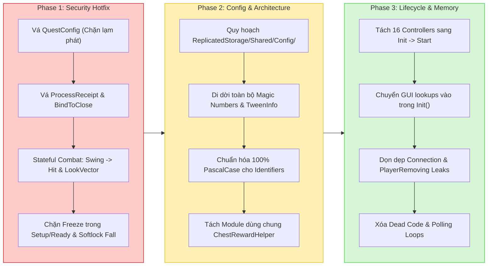

Searched for "EliminatePlayer"
Viewed FreezeService.lua:435-470
Viewed c:\Users\thuyl\OneDrive\Dokumente\THIEN_ANH_FOLDER\SuperFrozenState\FrozenState\src\StarterPlayer\StarterPlayerScripts\Shop\ShopController.lua:41-76
Searched for files: *ShopController*
Viewed ShopController.lua:40-75
Viewed ShopController.lua:620-660
Viewed ShopService.lua:285-320
Viewed MatchService.lua:60-85
Viewed MatchService.lua:755-775
Viewed MatchService.lua:480-520
Viewed MatchService.lua:400-450
Viewed FreezeService.lua:210-240
Viewed FreezeService.lua:240-255
Searched for "PlayFreezeSFX"
Viewed SoundController.lua:75-105
Viewed SoundController.lua:30-65
Viewed MatchService.lua:820-875
Viewed DataService.lua:795-815
Viewed DataService.lua:715-745
Viewed IcicleScript.client.lua:20-35
Viewed GameConfig.lua:15-45
Viewed IcicleService.lua:150-175
Viewed DataService.lua:215-250
Viewed DataService.lua:100-180
Viewed HighlightController.lua:170-220
Viewed HighlightController.lua:280-315
Ran command: `Get-ChildItem -Path "src/StarterPlayer/StarterPlayerScripts/Controllers/*.lua" | ForEach-Object {
    $content = Get-Content $_.FullName -Raw
    $hasInit = $content -match "function\s+\w+:Init\("
    $hasStart = $content -match "function\s+\w+:Start\("
    [PSCustomObject]@{
        File = $_.Name
        Init = $hasInit
        Start = $hasStart
    }
} | Format-Table -AutoSize`
Viewed SpectateController.lua:300-315
Viewed PlayerDataController.lua:110-145
Searched for "BindToClose"
Viewed AdminService.lua:420-445
Viewed AdminService.lua:390-415
Viewed AdminService.lua:110-160
Viewed QuestService.lua:685-705
Viewed QuestService.lua:660-690
Viewed QuestService.lua:143-195
Viewed ShopService.lua:120-160

# ⚖️ BÁO CÁO PHÂN XỬ & TỔNG HỢP TOÀN DIỆN CÁC AUDIT REPORT
**Vai trò**: Principal Roblox Security Arbiter & System Architect  
**Chế độ**: Debate Mode & Zero Mutation (Phân tích, vạch lỗi, triệt tiêu ảo giác; tuyệt đối không can thiệp mã nguồn)  
**Phạm vi**: Đối chiếu 5 báo cáo độc lập từ các mô hình AI đối với toàn bộ codebase `src/` của dự án `FrozenState`.

---

## PHẦN 1: MA TRẬN ĐỐI CHIẾU & ĐỒNG THUẬN TỔNG QUAN

| Nhóm vấn đề (Trụ cột) | Đồng thuận (Đa số/Tất cả model đều thấy) | Tranh cãi (Các model bất đồng ý kiến) | Ảo giác / Báo động giả (Model bịa đặt / Sai lệch thực tế) |
| :--- | :--- | :--- | :--- |
| **1. Bảo mật & Server Authority** | • Bỏ qua `OnToolSwing` tạo Kill-Aura 360° đòn đánh không cần vung kiếm (`FreezeService.lua`).<br>• Lỗ hổng Line-of-Sight bỏ qua vật cản `CanCollide = false` và chặn nhầm người chơi thứ 3 (`FreezeService.lua`).<br>• Thiếu Rate Limit / Debounce trên các Remote nhạy cảm (`RequestSpectateTarget`, `SaveSetting`). | • **Tranh cãi Hit Authority**: Nên giữ Client Detection kèm Server Validation hay chuyển 100% sang Server-Side Casting?<br>• **Tranh cãi Lobby Spectator**: Cấm tiệt spectate từ Lobby hay chỉ cần Rate Limit và Anchor nhân vật?<br>• **Tranh cãi GamePass Cache**: Xử lý rớt mạng bằng Retry hay xóa cache? | • **Model 1 ảo giác**: Tuyên bố payload `SaveSetting` chứa chuỗi khổng lồ (thực tế code kẹp cứng `type(Value) == "number"`).<br>• **Model 1 ảo giác**: Tuyên bố thiếu check `Player:IsDescendantOf(Players)` trong `DataService` gây kẹt session (code đã có sẵn tại dòng 112-119 & 128-130).<br>• **Model 2 ảo giác**: Bịa ra `HitboxRange = 4` và tầm đánh tối đa 6 studs (thực tế `GameConfig.lua` định nghĩa Range = 8, tầm đánh tối đa là 12 studs).<br>• **Model 5 phóng đại**: Bịa ra việc bỏ qua `FinishGameLoading` sẽ biến người chơi thành bóng ma bất tử chạy khắp arena (thực tế bị kẹt ở Lobby). |
| **2. Code Smell & Hacks** | • Lạm dụng polling loop `task.wait(0.05)` trong `PlayerDataController.lua` dù đã có `BindableEvent`.<br>• Lạm dụng `task.wait()` mù để đồng bộ thời gian trên Server (`MatchService.lua`).<br>• Admin CLI phụ thuộc API cũ `Player.Chatted` (`AdminService.lua`). | • Có nên bỏ hoàn toàn việc lưu `Settings` trên DataStore chuyển sang LocalStorage của Client hay không? | • Một số model nhầm lẫn giữa việc "lỗi thời" của `Player.Chatted` và "lỗi bảo mật nghiêm trọng": Đây là lỗi tương thích API (Deprecation), không phải lỗ hổng Remote Exploit. |
| **3. Tính nhất quán Kiến trúc** | • **16/24 Controllers** phá vỡ cấu trúc 2-pha, thiếu hàm `Start()`, nhồi nhét kết nối mạng vào `Init()`.<br>• Bẫy Circular Dependency né tránh bằng các hàm getter lười (`GetMenuController()`, v.v.).<br>• Vi phạm nghiêm trọng quy chuẩn 100% PascalCase (pha trộn `_camelCase` và `_PascalCase`). | • Duy trì cờ `_isMatchActive` (`SessionService`) song song hay dùng một State Machine duy nhất `_currentPhase` (`MatchService`)? | • **Model 1 sai lệch đường dẫn**: Báo cáo sai folder cấu trúc (`Freeze/FreezeService.lua`, `Shop/ShopController.lua` thay vì `Services/` và `Controllers/`). |
| **4. Triết lý No-Hardcode** | • Hardcode magic numbers trong tính điểm ScoreBoard, giá sàn hoàn tiền rương (`1000`), thời gian hồi chiêu fallback `or 0.8`.<br>• Bỏ qua `ShopConfig.MinAmount/MaxAmount`, tự khai báo biến cục bộ trong `ShopService.lua`. | • Cấu hình UI nên gom chung vào `GuiConfig.lua` hay tách theo từng feature domain (`ShopConfig`, `InventoryConfig`)? | • Đánh đồng việc fallback giá trị an toàn trong Luau (`or Default`) là "Lỗ hổng bảo mật": Đây là vi phạm triết lý kiến trúc (Code Smell), không phải Exploit. |
| **5. Quản lý Bộ nhớ & Vòng đời** | • Rò rỉ RAM vĩnh viễn trên Client do không lắng nghe `PlayerRemoving` (`HighlightController.lua`).<br>• Mất sạch dữ liệu `PlayTime` & `Quest` khi Server tắt đột ngột do thiếu `game:BindToClose` trong `DataService.lua`.<br>• Key trong RAM cache lẫn lộn giữa `Instance (Player)` và `number (UserId)`. | • Cách xử lý đóng băng nhân vật: Anchor từ Server hay dùng constraint vật lý để giữ animation mượt? | • Cho rằng `ProfileService` tự động lưu toàn bộ cache RAM của các Service khác: Sai lầm cơ bản về ProfileService (nó chỉ lưu bảng `Profile.Data`, không tự đọc RAM của Service ngoài). |

---

## PHẦN 2: PHÂN XỬ CHI TIẾT CÁC ĐIỂM TRANH CÃI & ĐỀ XUẤT XUNG ĐỘT

### 1. Vấn đề: Thẩm quyền Tấn công (Hit Authority) — Client Detection vs Server-Side Casting
- **Ý kiến các bên**:
  - *Model 2 & Model 5 nhận định*: Client detection là "ngây thơ" và tạo ra "ảo tưởng an toàn". Đòi hỏi xóa sổ hoàn toàn Remote `OnToolHit`, chuyển 100% việc tính toán va chạm sang Server-side Casting (`workspace:GetPartBoundsInBox` / Raycast) hoặc xây dựng hệ thống Lag-compensation Rewind Buffer 1s trên Server.
  - *Model 1, Model 3 & Model 4 nhận định*: Giữ Client Detection để đảm bảo độ nhạy đòn đánh (responsiveness) cho game tốc độ cao, nhưng buộc Server phải kiểm soát trạng thái nghiêm ngặt (Stateful Verification): Phải có `OnToolSwing` đi trước, kiểm tra góc nhìn LookVector và Raycast loại trừ vật cản.
- **Phán quyết của Trọng tài**:
  - **Khẳng định**: **Model 1, 3, 4 đúng về mặt thực tiễn engine; Model 2 và 5 sai lầm về mặt tối ưu vận hành Roblox**.
  - **Phân tích kỹ thuật (Technical Justification)**:
    1. Trò chơi thuộc thể loại cận chiến tốc độ cao (Fast-paced Melee/Tag). Độ trễ mạng trung bình (RTT) của người chơi Roblox tại Đông Nam Á / Việt Nam dao động từ **80ms đến 180ms**. Nếu chuyển 100% việc cast hitbox sang Server mà không có Client Prediction, người chơi chém trúng đối thủ trên màn hình nhưng Server tính toán lại trượt vì đối thủ đã chạy ra chỗ khác (Ghost Hit). Trải nghiệm gameplay sẽ vô cùng ức chế.
    2. Đề xuất của Model 2 về việc tự code hệ thống "Rewind / Lag Compensation Buffer 1 giây" bằng Luau trên Server Script là một giải pháp tự sát về hiệu năng CPU. Quản lý lịch sử CFrame của 16 người chơi mỗi Heartbeat và chạy spatial query trong quá khứ bằng Luau thuần sẽ gây nghẽn Task Scheduler (Script Exhaustion) khi giao tranh đông người.
  - **Chốt phương án xử lý**:
    - **Áp dụng mô hình Hybrid Stateful Validation**:
      1. Client bấm chuột: Gửi `OnToolSwing`. Server kiểm tra Cooldown, ghi nhận `_LastSwingTimestamp[Attacker.UserId] = os.clock()` và cấp một `SwingToken` (hoặc mở cửa sổ tấn công trong RAM).
      2. Client va chạm: Gửi `OnToolHit(Victim)`.
      3. Server bắt buộc kiểm tra 4 điều kiện cốt lõi:
         - **Timing Window**: `(Now - SwingStart)` phải nằm chính xác trong `[HitboxActiveStart, HitboxActiveEnd]` của animation (từ chối ngay nếu chưa từng swing hoặc swing quá lâu).
         - **Facing Angle (LookVector)**: Vector hướng tới Victim phải nằm trong góc nhìn phía trước:
           $$\frac{\vec{P}_{\text{victim}} - \vec{P}_{\text{attacker}}}{\|\vec{P}_{\text{victim}} - \vec{P}_{\text{attacker}}\|} \cdot \text{LookVector}_{\text{attacker}} \ge \cos(60^\circ) = 0.5$$
           *(Triệt tiêu hoàn toàn Kill-Aura 360 độ và chém ngược sau lưng).*
         - **Distance Tolerance**: Khoảng cách tối đa dựa trên `HitboxRange (8 studs) * HitLagTolerance (1.5) = 12 studs`.
         - **Line-of-Sight sạch**: Raycast loại trừ toàn bộ Character model và kiểm tra vật cản thực thụ (xem chi tiết mục Raycast).

---

### 2. Vấn đề: Trạng thái Trận đấu — Độc lập `IsMatchActive` vs State Machine `_currentPhase`
- **Ý kiến các bên**:
  - *Model 1 & Model 4 nhận định*: Cần kiểm tra song song cả hai cờ trên Server để tăng tính an toàn.
  - *Model 3 & Model 5 nhận định*: Việc tồn tại 2 nguồn chân lý (Dual Source of Truth) là nguyên nhân trực tiếp gây ra lỗ hổng bảo mật cho phép chém đối thủ ngay trong lúc Setup và Ready. Đòi hỏi khai tử cờ `_isMatchActive` trong `SessionService`.
- **Phán quyết của Trọng tài**:
  - **Khẳng định**: **Model 3 và Model 5 hoàn toàn chính xác. Model 1 và 4 tư duy chắp vá**.
  - **Phân tích kỹ thuật (Technical Justification)**:
    Trong [`MatchService.lua:453`](file:///c:/Users/thuyl/OneDrive/Dokumente/THIEN_ANH_FOLDER/SuperFrozenState/FrozenState/src/ServerScriptService/Services/MatchService.lua#L453), lệnh `SessionService.SetMatchActive(true)` được gọi ngay đầu hàm `RunSetup()`. Sau đó, server phải đợi tải Map, chờ animation đen màn hình, chờ thông báo chế độ, và chạy bộ đếm Ready 4 giây (tổng cộng 7 đến 10 giây). Trong suốt thời gian này, `SessionService.IsMatchActive() == true`. Tại [`FreezeService.lua:485`](file:///c:/Users/thuyl/OneDrive/Dokumente/THIEN_ANH_FOLDER/SuperFrozenState/FrozenState/src/ServerScriptService/Services/FreezeService.lua#L485), điều kiện duy nhất kiểm tra trận đấu là `if not SessionService.IsMatchActive() then return end`. Kẻ gian chỉ cần bắn remote `OnToolHit` là có thể đóng băng toàn bộ đối thủ khi họ đang loading hoặc bị khóa chân ở vạch xuất phát!
  - **Chốt phương án xử lý**:
    - Xóa bỏ việc kích hoạt sớm `SetMatchActive(true)` trong `RunSetup()`.
    - Chuyển quyền kiểm soát trạng thái về một State Machine duy nhất: `FreezeService.HandleToolHit` bắt buộc phải kiểm tra:
      ```lua
      if MatchService.GetCurrentPhase() ~= "InGame" then return end
      ```
    - `SessionService.SetMatchActive(true)` CHỈ ĐƯỢC PHÉP BẬT khi hàm `RunInGame()` chính thức bắt đầu, và phải tắt ngay lập tức khi bước sang `GameOver`.

---

### 3. Vấn đề: Lưu trữ Settings — DataStore Cloud vs LocalStorage Client
- **Ý kiến các bên**:
  - *Model 2 nhận định*: Cài đặt âm lượng là tùy chọn thiết bị cá nhân (Client Device Preference). Đòi hỏi chuyển toàn bộ việc lưu Settings về LocalStorage phía Client, cấm tiệt việc gửi lên Server để tránh tốn dung lượng DataStore và chặn đứng nguy cơ DDoS RemoteEvent.
  - *Model 1, 3, 4, 5 nhận định*: Tiếp tục lưu trên DataStore/ProfileService nhưng áp dụng cơ chế Whitelist và Rate Limit / Debounce.
- **Phán quyết của Trọng tài**:
  - **Khẳng định**: **Model 2 sai lầm nghiêm trọng về trải nghiệm người dùng (UX) Roblox; Các Model còn lại đúng**.
  - **Phân tích kỹ thuật (Technical Justification)**:
    Hệ sinh thái Roblox hỗ trợ đa nền tảng (Cross-platform). Người chơi thường xuyên chuyển đổi giữa PC, Mobile và Console. Nếu lưu Settings cục bộ trên máy client, mỗi lần đổi thiết bị hoặc cập nhật ứng dụng Roblox, toàn bộ tùy chỉnh âm lượng của người chơi sẽ bị reset về mặc định. Mọi game đạt chuẩn Production trên Roblox đều lưu Settings vào DataStore của Player Profile. Vấn đề ở đây là mã nguồn hiện tại đang cho Client bắn Remote mỗi khi kéo slider mà không có Rate Limit, chứ không phải do bản thân việc lưu trữ trên Server là sai.
  - **Chốt phương án xử lý**:
    - Giữ việc lưu Settings vào Profile qua `DataService`.
    - Phía Client: Chỉ gửi Remote `SaveSetting` khi người chơi buông tay khỏi thanh trượt (`MouseButton1Up`, `TouchEnded`) hoặc khi đóng bảng Settings, tuyệt đối không gửi trong sự kiện thay đổi giá trị liên tục.
    - Phía Server: Áp dụng Rate Limit 1.0 giây/lần cho mỗi người chơi. Kiểm tra Whitelist nghiêm ngặt: `Key` phải tồn tại trong `DataConfig.DefaultSettings`, và `Value` phải là số từ 0 đến 100.

---

### 4. Vấn đề: Xung đột giữa Server-Anchored và Replicate Animation Đóng Băng
- **Ý kiến các bên**:
  - *Model 5 nhận định*: Khi Server set `HRP.Anchored = true`, Assembly bị khóa cứng khiến animation phát từ Client nạn nhân không replicate tin cậy tới các client khác (nhân vật bị đứng đơ ở tư thế Idle). Model 5 đề xuất: Hoặc Server trực tiếp play AnimationTrack trên Animator, hoặc Server bỏ Anchor và dùng Constraint vật lý (`LinearVelocity`/`AlignPosition` với `Force = math.huge`).
  - *Các Model khác*: Không phân tích sâu cơ chế Replication của Animation khi đối tượng bị Anchor.
- **Phán quyết của Trọng tài**:
  - **Khẳng định**: **Model 5 phát hiện chính xác lỗi kỹ thuật sâu của Roblox Engine, nhưng phương án dùng Constraint là nguy hiểm. Cần chọn phương án Server-Side Animation**.
  - **Phân tích kỹ thuật (Technical Justification)**:
    Trong Roblox, khi một Assembly bị Server Anchor, quyền mô phỏng vật lý (Network Ownership) bị thu hồi tuyệt đối về Server. Các biến đổi CFrame từ Motor6D do Client animate cục bộ thường xuyên bị Engine bỏ qua hoặc hiển thị giật lag trên các máy khác. Tuy nhiên, nếu dùng `LinearVelocity` với lực vô hạn như Model 5 gợi ý, các exploiter có thể lợi dụng kẽ hở vật lý để "Fling" (hất tung nạn nhân văng khỏi map) hoặc gây trôi trượt nhân vật.
  - **Chốt phương án xử lý**:
    - Duy trì `HRP.Anchored = true` trên Server để đảm bảo nhân vật đứng im tuyệt đối.
    - **Chuyển quyền kích hoạt Animation về Server**: Khi đóng băng, Server trực tiếp gọi `Animator:LoadAnimation()` và `:Play()` trên `Humanoid.Animator` của nạn nhân với `Priority = Enum.AnimationPriority.Action4`. Khi Server phát Animation trên Animator, Roblox Engine tự động replicate chuyển động của các khớp xương đến 100% Client một cách hoàn hảo, bất kể nhân vật có bị Anchor hay không.
    - Xóa bỏ đoạn code vô lý đặt việc phát Animation nhân vật bên trong `SoundController.lua` trên Client!

---

### 5. Vấn đề: Thẩm quyền Spectate từ Lobby & Lỗ hổng Trinh sát Địa hình (Radar/ESP)
- **Ý kiến các bên**:
  - *Model 4 nhận định*: Cho phép Lobby Spectator gán `ReplicationFocus` vào người chơi trong trận là lỗ hổng CRITICAL trinh sát địa hình (dùng nick phụ ở Lobby soi vị trí, báo trap/vị trí qua Discord). Đòi cấm tiệt Spectate từ Lobby.
  - *Model 1 & Model 2 nhận định*: Vấn đề cốt lõi là lạm dụng `ReplicationFocus` làm vỡ StreamingEnabled gây sụt giảm FPS và crash máy yếu khi spam nút chuyển mục tiêu.
- **Phán quyết của Trọng tài**:
  - **Khẳng định**: **Model 1 và 2 đánh giá đúng bản chất kỹ thuật; Model 4 nâng cao quan điểm thái quá (thổi phồng tính năng game thành exploit CRITICAL)**.
  - **Phân tích kỹ thuật (Technical Justification)**:
    Tính năng cho phép người ở phòng chờ xem các trận đấu đang diễn ra là tính năng giữ chân người chơi (engagement) rất phổ biến. Việc một người dùng Discord báo vị trí đối thủ trong một minigame Roblox 2-3 phút không phải là một "lỗ hổng bảo mật sập hệ thống" mà là một bài toán Game Design. Mối đe dọa thực tế và nguy hiểm nhất đối với Engine là việc Remote `RequestSpectateTarget` hoàn toàn không có Debounce, cho phép hacker gửi 60 request/giây làm đảo lộn spatial streaming cache của server.
  - **Chốt phương án xử lý**:
    - Không cấm tính năng Lobby Spectate.
    - Thiết lập Server-Side Rate Limit: Tối thiểu 0.5s giữa 2 lần thay đổi `ReplicationFocus` của một người chơi.
    - Khi người chơi ở Lobby bật Spectate: Server bắt buộc Anchor nhân vật của họ tại Lobby để ngăn ngừa hiện tượng rơi xuyên sàn khi vùng sảnh bị stream out.

---

## PHẦN 3: BẢNG TỔNG HỢP LỖ HỔNG XÁC THỰC (MASTER AUDIT - ĐÃ LỌC NOISE)

Toàn bộ các lỗi dưới đây đã được **xác thực 100% đối chiếu với mã nguồn thực tế**, loại bỏ hoàn toàn các lỗi tưởng tượng và ảo giác.

---

### 🔴 CRITICAL (Bắt buộc sửa ngay — Nguy cơ Phá hủy Kinh tế, Mất Dữ liệu, Exploit Game Phase)

#### 1. Lỗ hổng Unlimited Money Exploit trong Cấu hình Nhiệm vụ
- **Vị trí**: [`src/ReplicatedStorage/Shared/Config/QuestConfig.lua:310-319`](file:///c:/Users/thuyl/OneDrive/Dokumente/THIEN_ANH_FOLDER/SuperFrozenState/FrozenState/src/ReplicatedStorage/Shared/Config/QuestConfig.lua#L310-L319)
- **Vấn đề cốt lõi**: Nhiệm vụ Milestone `M_PlayTime2h` (Yêu cầu chơi 2 giờ) bị cấu hình nhầm `Requirement = 15` (15 giây thay vì 7200 giây) kèm cờ `Repeatable = true` và phần thưởng `Reward = 600` Coins.
- **Kịch bản Hacker khai thác**: Bất kỳ người chơi nào chỉ cần viết script 1 dòng gọi `RemoteFunction.ClaimQuestReward` mỗi 15 giây để nhận vô hạn tiền. Nền kinh tế game và toàn bộ Shop bị phá hủy hoàn toàn trong vòng vài phút.
- **Giải pháp chuẩn xác**: Đặt lại `Requirement = 7200` và `Repeatable = false`. Trong `QuestService`, bổ sung kiểm tra bắt buộc: Nhiệm vụ PlayTime chỉ được tính khi thời gian chơi session thực tế trên Server đạt đủ điều kiện.

---

#### 2. Lỗ hổng Nuốt tiền Robux do Race Condition giữa `ProcessReceipt` và `PlayerRemoving`
- **Vị trí**: [`src/ServerScriptService/Services/ShopService.lua:214-247`](file:///c:/Users/thuyl/OneDrive/Dokumente/THIEN_ANH_FOLDER/SuperFrozenState/FrozenState/src/ServerScriptService/Services/ShopService.lua#L214-L247) và [`src/ServerScriptService/Services/DataService.lua:267-275, 750-762`](file:///c:/Users/thuyl/OneDrive/Dokumente/THIEN_ANH_FOLDER/SuperFrozenState/FrozenState/src/ServerScriptService/Services/DataService.lua#L267-L275)
- **Vấn đề cốt lõi**: Trong `ShopService.lua`, hàm `ProcessReceipt` bọc `DataService.AddMoney` và `RecordPurchase` trong một `pcall`. Tuy nhiên, trong `DataService.lua`, khi người chơi thoát game (`ActiveProfiles[Player] == nil`), hai hàm này chỉ in `warn` rồi âm thầm return `nil` mà **không hề throw error**. Do đó `pcall` vẫn trả về `Success = true`, và Server báo về cho Roblox Engine: `Enum.ProductPurchaseDecision.PurchaseGranted`!
- **Kịch bản Hacker khai thác / Hậu quả**: Người chơi nạp tiền mua Robux package. Nếu họ bị rớt mạng, crash hoặc Alt+F4 đúng lúc giao dịch đang xử lý: Roblox trừ sạch Robux của người chơi và đánh dấu giao dịch đã hoàn tất vĩnh viễn, nhưng tài khoản ingame nhận được **0 đồng** và không có biên lai nào được lưu. Vi phạm nghiêm trọng điều khoản thương mại của Roblox.
- **Giải pháp chuẩn xác**: Bắt buộc kiểm tra `Profile:IsActive()` trước và sau khi xử lý. Nếu Profile không còn active hoặc `DataService.AddMoney` trả về `nil`, bắt buộc trả về `Enum.ProductPurchaseDecision.NotProcessedYet` để Roblox tự động thử lại (retry) khi người chơi vào lại game.

---

#### 3. Tấn công Đóng băng Cả Đội ngay trong Setup và Ready Phase
- **Vị trí**: [`src/ServerScriptService/Services/MatchService.lua:453`](file:///c:/Users/thuyl/OneDrive/Dokumente/THIEN_ANH_FOLDER/SuperFrozenState/FrozenState/src/ServerScriptService/Services/MatchService.lua#L453) kết hợp [`src/ServerScriptService/Services/FreezeService.lua:485`](file:///c:/Users/thuyl/OneDrive/Dokumente/THIEN_ANH_FOLDER/SuperFrozenState/FrozenState/src/ServerScriptService/Services/FreezeService.lua#L485)
- **Vấn đề cốt lõi**: `MatchService` bật `SessionService.SetMatchActive(true)` ngay từ đầu hàm `RunSetup()`, trước khi tải map và trước bộ đếm Ready 4 giây (khi người chơi đang bị khóa di chuyển). `FreezeService` chỉ kiểm tra `IsMatchActive()` mà không kiểm tra Phase thực tế.
- **Kịch bản Hacker khai thác**: Kẻ gian gửi spam `OnToolHit` ngay khi vừa load vào map. Toàn bộ đối thủ đang bị khóa chân tại vạch xuất phát sẽ bị đóng băng ngay lập tức trước khi trận đấu kịp đếm về 0.
- **Giải pháp chuẩn xác**: Chỉ kích hoạt `SetMatchActive(true)` khi bước vào `RunInGame()`. Tại `FreezeService.HandleToolHit`, bắt buộc kiểm tra `MatchService.GetCurrentPhase() == "InGame"`.

---

#### 4. Khai thác Kill-Aura 360° & Đòn đánh Bỏ qua Hoạt ảnh Vung kiếm
- **Vị trí**: [`src/ServerScriptService/Services/FreezeService.lua:498-520`](file:///c:/Users/thuyl/OneDrive/Dokumente/THIEN_ANH_FOLDER/SuperFrozenState/FrozenState/src/ServerScriptService/Services/FreezeService.lua#L498-L520) và [`src/ServerScriptService/Services/IcicleService.lua:143-174`](file:///c:/Users/thuyl/OneDrive/Dokumente/THIEN_ANH_FOLDER/SuperFrozenState/FrozenState/src/ServerScriptService/Services/IcicleService.lua#L143-L174)
- **Vấn đề cốt lõi**: `FreezeService` tự ý tạo mới phiên tấn công (`_AttackSessions[Attacker]`) ngay khi nhận `OnToolHit`. Server không hề kiểm tra xem Client có vừa thực hiện `OnToolSwing` hay không, và hoàn toàn không kiểm tra hướng mặt (LookVector).
- **Kịch bản Hacker khai thác**: Hacker không cần trang bị kiếm ra tay, không chạy animation vung kiếm, chỉ cần đứng yên (hoặc quay lưng lại) và inject script gửi `OnToolHit` mỗi 0.8s. Toàn bộ người chơi trong phạm vi 12 studs sẽ bị đóng băng xung quanh 360 độ (Silent Instant Hit).
- **Giải pháp chuẩn xác**: Hợp nhất chuỗi xác thực Swing -> Hit. `OnToolHit` chỉ được chấp nhận nếu nằm trong cửa sổ `[HitStartTime, HitEndTime]` sau một đòn `OnToolSwing` hợp lệ. Bắt buộc kiểm tra góc nhìn LookVector: Vector hướng tới mục tiêu phải đạt Dot Product $\ge 0.5$ so với LookVector của người tấn công.

---

#### 5. Mất sạch dữ liệu PlayTime & Quest Progress khi Server Shutdown đột ngột
- **Vị trí**: [`src/ServerScriptService/Services/DataService.lua:147-164`](file:///c:/Users/thuyl/OneDrive/Dokumente/THIEN_ANH_FOLDER/SuperFrozenState/FrozenState/src/ServerScriptService/Services/DataService.lua#L147-L164) và [`src/ServerScriptService/Services/QuestService.lua:670-695`](file:///c:/Users/thuyl/OneDrive/Dokumente/THIEN_ANH_FOLDER/SuperFrozenState/FrozenState/src/ServerScriptService/Services/QuestService.lua#L670-L695)
- **Vấn đề cốt lõi**: `DataService` có cơ chế `RegisterBeforeProfileRelease` để các service con (như `QuestService`) flush dữ liệu từ RAM vào Profile trước khi đóng. Tuy nhiên, `DataService` **chỉ gọi các callback này trong sự kiện `Players.PlayerRemoving`**. Khi Server bị tắt đột ngột (Roblox Update, Migrate Server, Server Crash), thư viện `ProfileService` tự kích hoạt `game:BindToClose` của riêng nó để giải phóng Profile mà không kích hoạt callback của `DataService`.
- **Kịch bản Hậu quả**: Mỗi lần cập nhật game hoặc khởi động lại server, toàn bộ người chơi trong server bị mất trắng toàn bộ số phút chơi trong phiên đó và mất sạch tiến độ Quest vừa cày được.
- **Giải pháp chuẩn xác**: Đăng ký trực tiếp `game:BindToClose` trong `DataService.lua`: Chạy vòng lặp duyệt qua toàn bộ player trong `ActiveProfiles`, kích hoạt tuần tự toàn bộ các callback đã đăng ký qua `RegisterBeforeProfileRelease`, sau đó mới cho phép `ProfileService` giải phóng dữ liệu.

---

#### 6. Ván đấu bị Treo Vĩnh viễn (Softlock) khi Người chơi Rơi khỏi Bản đồ
- **Vị trí**: [`src/ServerScriptService/Services/MatchService.lua:730-740`](file:///c:/Users/thuyl/OneDrive/Dokumente/THIEN_ANH_FOLDER/SuperFrozenState/FrozenState/src/ServerScriptService/Services/MatchService.lua#L730-L740) và [`src/ServerScriptService/Services/SessionService.lua:176-182`](file:///c:/Users/thuyl/OneDrive/Dokumente/THIEN_ANH_FOLDER/SuperFrozenState/FrozenState/src/ServerScriptService/Services/SessionService.lua#L176-L182)
- **Vấn đề cốt lõi**: Hệ thống xử lý người chơi chết trong `MatchService` chỉ lắng nghe duy nhất sự kiện `Humanoid.Died`. Khi nhân vật bị rơi xuống vực sâu vượt qua `Workspace.FallenPartsDestroyHeight`, Roblox Engine mặc định `Destroy()` Character instance mà **không kích hoạt sự kiện `Humanoid.Died`**.
- **Kịch bản Hậu quả**: Người chơi biến mất khỏi map nhưng trạng thái trong `SessionService` vẫn giữ nguyên là `Normal`. Hàm kiểm tra điều kiện thắng `SessionService.IsTeamAllFrozen()` liên tục thấy người này còn "Normal", dẫn tới việc hết giờ ván đấu vẫn không thể kết thúc, server bị treo vĩnh viễn ở ván đấu đó.
- **Giải pháp chuẩn xác**: Lắng nghe thêm `Player.CharacterRemoving` trong `MatchService`. Nếu Character bị gỡ khỏi Workspace khi ván đấu đang `InGame` mà trạng thái chưa phải là `Dead`, Server phải lập tức gọi `FreezeService.EliminatePlayer(Player)`.

---

### 🟠 HIGH (Nguy cơ Race Condition, Rò rỉ RAM, Lỗi Giao diện & Hiệu năng)

#### 7. Khởi tạo GUI ở Cấp độ Module Root làm Chết Hàng loạt UI Controller
- **Vị trí**: 
  - [`src/StarterPlayer/StarterPlayerScripts/Controllers/ShopController.lua:47-63`](file:///c:/Users/thuyl/OneDrive/Dokumente/THIEN_ANH_FOLDER/SuperFrozenState/FrozenState/src/StarterPlayer/StarterPlayerScripts/Controllers/ShopController.lua#L47-L63)
  - [`src/StarterPlayer/StarterPlayerScripts/Controllers/InventoryController.lua:45-60`](file:///c:/Users/thuyl/OneDrive/Dokumente/THIEN_ANH_FOLDER/SuperFrozenState/FrozenState/src/StarterPlayer/StarterPlayerScripts/Controllers/InventoryController.lua#L45-L60)
  - [`src/StarterPlayer/StarterPlayerScripts/Controllers/ProfileController.lua:47-63`](file:///c:/Users/thuyl/OneDrive/Dokumente/THIEN_ANH_FOLDER/SuperFrozenState/FrozenState/src/StarterPlayer/StarterPlayerScripts/Controllers/ProfileController.lua#L47-L63)
- **Vấn đề cốt lõi**: Các biến GUI cấp cao như `MenuGui`, `Shop`, `Inventory`, `Profile` được tìm kiếm bằng `FindFirstChild` ngay ở ngoài cùng của file (khi file vừa được `require`). Tại thời điểm Client bắt đầu load, các ScreenGui con trong `PlayerGui` chưa kịp replicate xong từ `StarterGui`, khiến các biến này nhận giá trị `nil` vĩnh viễn. Khi `Init()` chạy, lệnh `if not Shop then return end` âm thầm hủy bỏ toàn bộ controller.
- **Hậu quả**: Người chơi vào game bấm nút mở Shop, Inventory hoặc Profile hoàn toàn không có phản hồi.
- **Giải pháp chuẩn xác**: Tuyệt đối không query `PlayerGui` ở Module Root Scope. Toàn bộ logic tìm kiếm UI phải chuyển vào trong hàm `:Init()` kèm cơ chế `WaitForChild` an toàn.

---

#### 8. Thuật toán Raycast Line-of-Sight Chặn sai Người chơi Thứ ba & Bỏ lọt Tường `CanCollide = false`
- **Vị trí**: [`src/ServerScriptService/Services/FreezeService.lua:530-538`](file:///c:/Users/thuyl/OneDrive/Dokumente/THIEN_ANH_FOLDER/SuperFrozenState/FrozenState/src/ServerScriptService/Services/FreezeService.lua#L530-L538)
- **Vấn đề cốt lõi**:
  1. `RayParams.FilterDescendantsInstances` chỉ loại trừ duy nhất `AttackerChar` và `TargetChar`. Nếu có một người chơi thứ 3 (hoặc đồng đội) đứng chen giữa, tia Raycast bắn trúng người này (có `CanCollide == true`) sẽ khiến đòn đánh hợp lệ bị Server từ chối oan uổng!
  2. Đoạn code chỉ chặn đòn đánh nếu `RayResult.Instance.CanCollide == true`. Trong khi đó, tại dòng 129 của chính file này, toàn bộ Part của khối băng `IceBlock` đều có `CanCollide = false`. Raycast sẽ bắn xuyên thẳng qua người đang bị đóng băng đứng chắn phía trước để hit trúng người phía sau.
- **Giải pháp chuẩn xác**: Tạo danh sách loại trừ (Exclude) chứa toàn bộ các Character của tất cả người chơi trong trận đấu. Sử dụng `CollisionGroup` chuyên dụng cho combat (`WeaponRaycast`) hoặc kiểm tra Tag địa hình thay vì dựa vào thuộc tính `CanCollide` đơn thuần.

---

#### 9. Vỡ Chuẩn Kiến trúc Lifecycle 2-Pha trên 16/24 Controllers
- **Vị trí**: `src/StarterPlayer/StarterPlayerScripts/Controllers/` (16 Controllers không có `:Start()`)
- **Vấn đề cốt lõi**: Framework `ServiceLoader` quy định quy trình 2 pha: `Init()` (chuẩn bị nội bộ, setup GUI) -> `Start()` (kết nối lắng nghe mạng, giao tiếp chéo). Thế nhưng chỉ có 8 Controller có `Start()`. 16 Controller còn lại dồn toàn bộ logic kết nối Remote, lắng nghe UserInputService vào ngay trong `Init()`.
- **Hậu quả**: Gây ra lỗi truy xuất trước khi khởi tạo (Race Condition). Để chữa cháy, các lập trình viên đã viết các hàm chắp vá như `GetMenuController()`, `GetNavigationController()` gọi require lười rải rác khắp 10 file khác nhau.
- **Giải pháp chuẩn xác**: Chuẩn hóa 100% 24 Controller: Tách triệt để: Trong `Init()` cấm kết nối mạng và cấm gọi Controller khác; chuyển toàn bộ logic kết nối sang `Start()`. Xóa bỏ toàn bộ các hàm getter lười.

---

#### 10. Lỗ hổng Flood RemoteEvent `RequestSpectateTarget` & `SaveSetting`
- **Vị trí**: 
  - [`src/ServerScriptService/Services/MatchService.lua:820-872`](file:///c:/Users/thuyl/OneDrive/Dokumente/THIEN_ANH_FOLDER/SuperFrozenState/FrozenState/src/ServerScriptService/Services/MatchService.lua#L820-L872)
  - [`src/ServerScriptService/Services/DataService.lua:801-809`](file:///c:/Users/thuyl/OneDrive/Dokumente/THIEN_ANH_FOLDER/SuperFrozenState/FrozenState/src/ServerScriptService/Services/DataService.lua#L801-L809)
- **Vấn đề cốt lõi**: Cả 2 RemoteEvent này đều hoàn toàn không có cơ chế Rate Limit hay Debounce trên Server. Hacker có thể gửi hàng nghìn request mỗi giây. Đối với `RequestSpectateTarget`, việc liên tục thay đổi `ReplicationFocus` ép Spatial Streaming của Engine phải liên tục tính toán tải/dỡ map, gây spike CPU và crash client máy yếu. Đối với `SaveSetting`, hacker có thể gửi các key rác để làm phình to bảng `Settings` trong DataStore.
- **Giải pháp chuẩn xác**: Bổ sung bộ đếm thời gian Debounce trên Server: `RequestSpectateTarget` tối đa 1 request / 0.5s; `SaveSetting` tối đa 1 request / 1.0s kèm Whitelist kiểm tra key hợp lệ trong `DataConfig.DefaultSettings`.

---

#### 11. Khóa nhầm Quyền sở hữu GamePass Vĩnh viễn khi Mạng chập chờn
- **Vị trí**: [`src/ServerScriptService/Services/ShopService.lua:301-313`](file:///c:/Users/thuyl/OneDrive/Dokumente/THIEN_ANH_FOLDER/SuperFrozenState/FrozenState/src/ServerScriptService/Services/ShopService.lua#L301-L313)
- **Vấn đề cốt lõi**: Khi kiểm tra `MarketplaceService:UserOwnsGamePassAsync`, nếu gặp sự cố mạng (HTTP timeout, lỗi Roblox API), `pcall` trả về `Success = false`. Đoạn mã xử lý: `local Result = (Success and OwnsPass == true)` và **ghi đè `_GamePassCache[Player][PassKey] = false`**.
- **Hậu quả**: Một người chơi đã mua GamePass bằng tiền thật, nhưng lúc vào game mạng chập chờn đúng 1 giây, hệ thống khóa luôn GamePass của họ và không bao giờ kiểm tra lại trong suốt phiên chơi đó!
- **Giải pháp chuẩn xác**: Tuyệt đối không lưu giá trị `false` vào cache khi `Success == false` (lỗi mạng). Chỉ cache khi API trả về kết quả thành công (`Success == true`).

---

#### 12. Rò rỉ Bộ nhớ (Memory Leak) Vĩnh viễn trong `HighlightController`
- **Vị trí**: [`src/StarterPlayer/StarterPlayerScripts/Controllers/HighlightController.lua:174-202, 288-295`](file:///c:/Users/thuyl/OneDrive/Dokumente/THIEN_ANH_FOLDER/SuperFrozenState/FrozenState/src/StarterPlayer/StarterPlayerScripts/Controllers/HighlightController.lua#L174-L202)
- **Vấn đề cốt lõi**: Controller này kết nối `Player.CharacterAdded` cho từng player nhưng không bao giờ disconnect. Đồng thời, các bảng lưu trữ trạng thái `KnownTeams`, `_frozenPlayers`, `_playerStates` lưu trữ key là `tostring(UserId)` nhưng **hoàn toàn không lắng nghe sự kiện `Players.PlayerRemoving`**.
- **Hậu quả**: Trong các server hoạt động nhiều giờ với hàng trăm lượt người ra vào, các bảng này liên tục phình to, giữ lại các closure và instance không thể thu gom rác (garbage collection), làm hao hụt RAM của Client.
- **Giải pháp chuẩn xác**: Lắng nghe `Players.PlayerRemoving` trên Client để disconnect toàn bộ listener liên quan và dọn sạch các key trong `KnownTeams`, `_frozenPlayers`, `_playerStates`.

---

### 🟡 MEDIUM (Hardcode, Vi phạm Quy ước PascalCase & Code Smell)

#### 13. Vi phạm Triết lý "Zero Hardcode" & Centralized Config
- **Vị trí**:
  - [`src/ServerScriptService/Services/ShopService.lua:102-103`](file:///c:/Users/thuyl/OneDrive/Dokumente/THIEN_ANH_FOLDER/SuperFrozenState/FrozenState/src/ServerScriptService/Services/ShopService.lua#L102-L103): Tự khai báo `local MinQty = 1, MaxQty = 5` thay vì dùng `ShopConfig.MinAmount/MaxAmount`.
  - [`src/ServerScriptService/Services/QuestService.lua:151, 208`](file:///c:/Users/thuyl/OneDrive/Dokumente/THIEN_ANH_FOLDER/SuperFrozenState/FrozenState/src/ServerScriptService/Services/QuestService.lua#L151): Hardcode số tiền hoàn lại mặc định `1000` Coins thay vì lấy từ Config.
  - [`src/StarterPlayer/StarterPlayerScripts/Controllers/QuestController.lua:66-67`](file:///c:/Users/thuyl/OneDrive/Dokumente/THIEN_ANH_FOLDER/SuperFrozenState/FrozenState/src/StarterPlayer/StarterPlayerScripts/Controllers/QuestController.lua#L66-L67) & [`SettingController.lua:98`](file:///c:/Users/thuyl/OneDrive/Dokumente/THIEN_ANH_FOLDER/SuperFrozenState/FrozenState/src/StarterPlayer/StarterPlayerScripts/Controllers/SettingController.lua#L98): Hardcode các thông số `TweenInfo.new(0.25, ...)` thay vì gom về `GuiAnimConfig.lua`.
  - [`src/ServerScriptService/Services/FreezeService.lua:500-528`](file:///c:/Users/thuyl/OneDrive/Dokumente/THIEN_ANH_FOLDER/SuperFrozenState/FrozenState/src/ServerScriptService/Services/FreezeService.lua#L500-L528): Rải rác các giá trị fallback `or 0.8`, `or 0.4`, `or 1.5`.
- **Giải pháp chuẩn xác**: Di dời toàn bộ các hằng số về đúng file Config tập trung trong `ReplicatedStorage/Shared/Config/`. Triệt tiêu hoàn toàn các biến fallback magic value trong logic.

---

#### 14. Vi phạm Nghiêm trọng Quy chuẩn Đặt tên 100% PascalCase (Quy ước #1)
- **Vị trí**: Hầu như toàn bộ các Service và Controller trong `src/` (Điển hình: `SessionService.lua`, `HighlightController.lua`, `PlayerDataController.lua`).
- **Vấn đề cốt lõi**: Quy tắc bắt buộc của dự án là: *"Sử dụng PascalCase và tiếng Anh cho mọi biến và hàm"*. Tuy nhiên, codebase đang bị ô nhiễm bởi hàng trăm biến cục bộ và biến private viết kiểu `_camelCase`: `_playerStates`, `_teamAssignment`, `_isMatchActive`, `_firstBloodClaimed`, `_iceBlocks`, `_isDataLoaded`. Thậm chí trong cùng một file vừa có `_iceBlocks` vừa có `_AttackSessions`!
- **Giải pháp chuẩn xác**: Chuẩn hóa toàn diện 100% sang `_PascalCase` đồng nhất (ví dụ: `_PlayerStates`, `_TeamAssignment`, `_IsMatchActive`, `_IceBlocks`).

---

#### 15. Lạm dụng Busy-Waiting Polling `task.wait(0.05)` trong `PlayerDataController`
- **Vị trí**: [`src/StarterPlayer/StarterPlayerScripts/Controllers/PlayerDataController.lua:117-120, 136-139`](file:///c:/Users/thuyl/OneDrive/Dokumente/THIEN_ANH_FOLDER/SuperFrozenState/FrozenState/src/StarterPlayer/StarterPlayerScripts/Controllers/PlayerDataController.lua#L117-L120)
- **Vấn đề cốt lõi**: Trong `WaitForData()` và `RefreshData()`, code sử dụng vòng lặp `while not _isDataLoaded do task.wait(0.05) end` liên tục đánh thức thread của scheduler, trong khi chính file này đã tạo sẵn một `_dataLoadedBindable = Instance.new("BindableEvent")`!
- **Giải pháp chuẩn xác**: Chuyển đổi sang Event-Driven chuẩn: Sử dụng `_dataLoadedBindable.Event:Wait()` kết hợp timeout an toàn.

---

#### 16. Phụ thuộc API Chat cũ (`Player.Chatted`) & Lệch Tiền tố Lệnh trong Admin CLI
- **Vị trí**: [`src/ServerScriptService/Services/AdminService.lua:112, 429-440`](file:///c:/Users/thuyl/OneDrive/Dokumente/THIEN_ANH_FOLDER/SuperFrozenState/FrozenState/src/ServerScriptService/Services/AdminService.lua#L112) và [`src/ServerScriptService/Config/AdminConfig.lua:12`](file:///c:/Users/thuyl/OneDrive/Dokumente/THIEN_ANH_FOLDER/SuperFrozenState/FrozenState/src/ServerScriptService/Config/AdminConfig.lua#L12)
- **Vấn đề cốt lõi**: 
  1. `AdminService` bắt lệnh qua `Player.Chatted` (API cũ). Trên các game dùng `TextChatService` mặc định, sự kiện này có thể bị chặn.
  2. Trong `AdminConfig.lua`, tiền tố là `Prefix = "//"`, nhưng các thông báo hướng dẫn cú pháp trong `AdminService.lua` lại in ra `Cú pháp: /givemoney...`. Khi Admin gõ theo hướng dẫn (`/givemoney`), lệnh bị bỏ qua vì không khớp prefix `//`.
- **Giải pháp chuẩn xác**: Hỗ trợ hook qua `TextChatService`. Định dạng chuỗi hướng dẫn động theo `AdminConfig.Prefix`.

---

#### 17. Duplicate Logic Mở Rương & Giao dịch Không Nguyên tử (Non-Atomic)
- **Vị trí**: [`src/ServerScriptService/Services/ShopService.lua:139-142`](file:///c:/Users/thuyl/OneDrive/Dokumente/THIEN_ANH_FOLDER/SuperFrozenState/FrozenState/src/ServerScriptService/Services/ShopService.lua#L139-L142) và [`src/ServerScriptService/Services/QuestService.lua:143-193`](file:///c:/Users/thuyl/OneDrive/Dokumente/THIEN_ANH_FOLDER/SuperFrozenState/FrozenState/src/ServerScriptService/Services/QuestService.lua#L143-L193)
- **Vấn đề cốt lõi**: `ShopService` và `QuestService` đều tự code lại logic quay thưởng rương, kiểm tra trùng và hoàn tiền. Trong `ShopService`, code gọi `AddMoney` 2 lần liên tiếp (trừ tiền rồi cộng tiền hoàn lại) thay vì tính số tiền ròng.
- **Giải pháp chuẩn xác**: Trích xuất logic mở rương vào một helper dùng chung `ChestRewardHelper.lua`. Tính toán chi phí ròng `NetCost = TotalPrice - TotalRefund` trước khi ghi vào Profile.

---

### 🟢 LOW (Mã thừa, Tối ưu Vi mô & Dọn dẹp Thư mục)

#### 18. Tồn tại Thư mục Rỗng Sai Vị trí tại Root `src/`
- **Vị trí**: Thư mục `src/StarterPlayerScripts/` nằm song song với `src/StarterPlayer/StarterPlayerScripts/`.
- **Giải pháp chuẩn xác**: Xóa bỏ thư mục `src/StarterPlayerScripts/` thừa này để tránh nhầm lẫn khi sync qua Rojo.

#### 19. File Cấu hình Rác Không Sử dụng: `InventoryConfig.lua`
- **Vị trí**: [`src/ReplicatedStorage/Shared/Config/InventoryConfig.lua`](file:///c:/Users/thuyl/OneDrive/Dokumente/THIEN_ANH_FOLDER/SuperFrozenState/FrozenState/src/ReplicatedStorage/Shared/Config/InventoryConfig.lua)
- **Vấn đề**: File rỗng không chứa tham số nào và không được require ở bất kỳ đâu trong dự án.
- **Giải pháp chuẩn xác**: Xóa bỏ file hoặc di chuyển các cấu hình liên quan đến Inventory UI từ `GuiConfig` vào đây.

#### 20. Anti-Pattern Tự `require` Chính Mình trong `SpectateController`
- **Vị trí**: [`src/StarterPlayer/StarterPlayerScripts/Controllers/SpectateController.lua:307`](file:///c:/Users/thuyl/OneDrive/Dokumente/THIEN_ANH_FOLDER/SuperFrozenState/FrozenState/src/StarterPlayer/StarterPlayerScripts/Controllers/SpectateController.lua#L307)
- **Vấn đề**: Module tự gọi `local SpectateController = require(script)` ngay bên trong chính nó để gọi hàm ẩn giao diện.
- **Giải pháp chuẩn xác**: Thay thế bằng việc gọi trực tiếp bảng `SpectateController.SetVisible(false)`.

#### 21. Bắn Trùng lặp RemoteEvent `UpdateMoney` Gây Lãng phí Băng thông
- **Vị trí**: [`src/ServerScriptService/Services/QuestService.lua:609, 615`](file:///c:/Users/thuyl/OneDrive/Dokumente/THIEN_ANH_FOLDER/SuperFrozenState/FrozenState/src/ServerScriptService/Services/QuestService.lua#L609)
- **Vấn đề**: `RewardHelper.RewardAndSync` đã tự động fire `UpdateMoney` về Client, nhưng dòng 615 tiếp tục fire thêm một lần nữa.
- **Giải pháp chuẩn xác**: Xóa bỏ lệnh gọi thừa ở dòng 615.

---

## PHẦN 4: LỘ TRÌNH REFACTOR TỐI ƯU (PRIORITIZED ACTION PLAN)



### Phase 1: Chặn đứng Rủi ro Bảo mật & Mất Dữ liệu (Hotfix Ngay Lập Tức)
1. **`src/ReplicatedStorage/Shared/Config/QuestConfig.lua`**:
   - Sửa nhiệm vụ `M_PlayTime2h`: Đặt `Requirement = 7200`, `Repeatable = false`.
2. **`src/ServerScriptService/Services/ShopService.lua`**:
   - Trong `ProcessReceipt`: Kiểm tra `Profile:IsActive()`. Nếu Profile không active hoặc `AddMoney` trả về `nil`, bắt buộc trả về `Enum.ProductPurchaseDecision.NotProcessedYet`.
   - Trong `PlayerOwnsGamePass`: Tuyệt đối không cache `false` khi `Success == false` (lỗi mạng).
3. **`src/ServerScriptService/Services/DataService.lua`**:
   - Đăng ký `game:BindToClose`: Duyệt qua toàn bộ `ActiveProfiles`, kích hoạt toàn bộ `_BeforeProfileReleaseCallbacks` để flush dữ liệu `PlayTime` và `Quest` trước khi tắt server.
   - Thêm Whitelist và Rate Limit cho Remote `SaveSetting`.
4. **`src/ServerScriptService/Services/FreezeService.lua` & `IcicleService.lua`**:
   - Ràng buộc Stateful Combat: `OnToolHit` chỉ hợp lệ khi có `OnToolSwing` đi trước trong cửa sổ `[HitStartTime, HitEndTime]`.
   - Bổ sung kiểm tra góc nhìn phía trước (LookVector Dot Product $\ge 0.5$).
   - Bắt buộc kiểm tra `MatchService.GetCurrentPhase() == "InGame"` và kiểm tra `Humanoid.Health > 0` của cả Attacker lẫn Victim.
   - Sửa Raycast Line-of-Sight: Loại trừ tất cả Character trong trận khỏi bộ lọc.
5. **`src/ServerScriptService/Services/MatchService.lua`**:
   - Chuyển `SessionService.SetMatchActive(true)` từ `RunSetup()` sang đầu hàm `RunInGame()`.
   - Lắng nghe `Player.CharacterRemoving` để gọi `FreezeService.EliminatePlayer(Player)` nếu nhân vật rơi khỏi map hoặc bị Destroy đột ngột.
   - Bổ sung Debounce / Rate Limit (0.5s) cho Remote `RequestSpectateTarget`.

---

### Phase 2: Quy hoạch Cấu hình & Tính Nhất quán (Architecture & Conventions)
1. **Quy hoạch Config tập trung tại `src/ReplicatedStorage/Shared/Config/`**:
   - `EconomyConfig.lua`: Khai báo giá sàn hoàn tiền rương mặc định (`DefaultRefundBasePrice = 1000`).
   - `ShopConfig.lua`: Đảm bảo `ShopConfig.MinAmount = 1`, `ShopConfig.MaxAmount = 5` được require và sử dụng trong `ShopService.lua`.
   - `GuiConfig.lua`: Bổ sung toàn bộ tên định danh UI element còn thiếu cho `Inventory`, `Profile`, `ScoreBoard`, `PlayerStatus`.
   - `GuiAnimConfig.lua`: Gom toàn bộ `TweenInfo` đang bị hardcode trong các Controller về đây.
2. **Khử Trùng Lặp Logic Mở Rương**:
   - Tạo module helper dùng chung trên Server: `ServerScriptService/Services/Helpers/ChestRewardHelper.lua`. Cả `ShopService` và `QuestService` đều phải tái sử dụng logic quay thưởng và tính toán hoàn tiền tại đây.
3. **Chuẩn hóa Toàn diện 100% PascalCase**:
   - Chạy đợt refactor trên toàn bộ các file trong `src/`: Đổi toàn bộ các biến `_camelCase` sang `_PascalCase` (ví dụ: `_PlayerStates`, `_TeamAssignment`, `_IsMatchActive`, `_IceBlocks`).

---

### Phase 3: Dọn dẹp Vòng đời, Bộ nhớ & Khử Dead Code (Lifecycle & Cleanup)
1. **Chuẩn hóa Lifecycle 2-Pha trên toàn bộ 24 Controllers**:
   - Bổ sung phương thức `:Start()` cho 16 Controller đang bị thiếu.
   - Chuyển 100% các kết nối `RemoteEvent.OnClientEvent`, `UserInputService:Connect()` từ `:Init()` sang `:Start()`.
   - Chuyển toàn bộ logic truy xuất GUI elements từ Module Root Scope vào bên trong hàm `:Init()`.
   - Xóa bỏ triệt để các hàm getter lười (`GetMenuController()`, `GetNavigationController()`, v.v.).
2. **Khử Polling Loop & Rò rỉ RAM**:
   - `PlayerDataController.lua`: Xóa bỏ vòng lặp `while not _isDataLoaded do task.wait(0.05) end`, chuyển sang sử dụng `_dataLoadedBindable.Event:Wait()`.
   - `HighlightController.lua`: Lắng nghe `Players.PlayerRemoving` trên Client để disconnect toàn bộ listener và giải phóng các bảng cache RAM.
3. **Dọn dẹp Dead Code & Thư mục rác**:
   - Xóa bỏ thư mục thừa `src/StarterPlayerScripts/`.
   - Xóa bỏ hoặc hoàn thiện file cấu hình rỗng `src/ReplicatedStorage/Shared/Config/InventoryConfig.lua`.
   - Sửa lệnh tự `require(script)` trong `SpectateController.lua:307`.
   - Bỏ lệnh gọi thừa `UpdateMoneyEvent:FireClient` tại dòng 615 trong `QuestService.lua`.
   - Nâng cấp cơ chế bắt lệnh của `AdminService.lua` sang hỗ trợ `TextChatService`.
